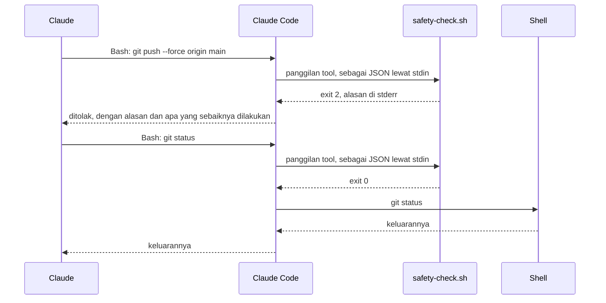
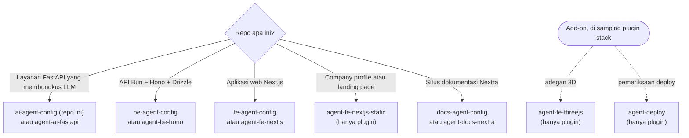
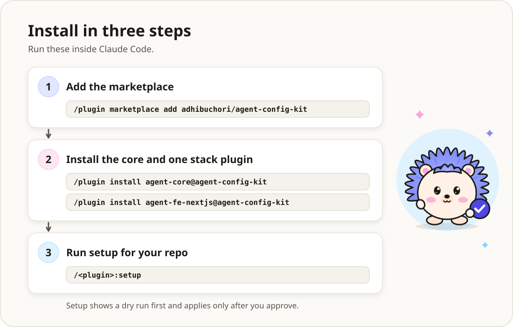
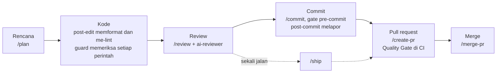
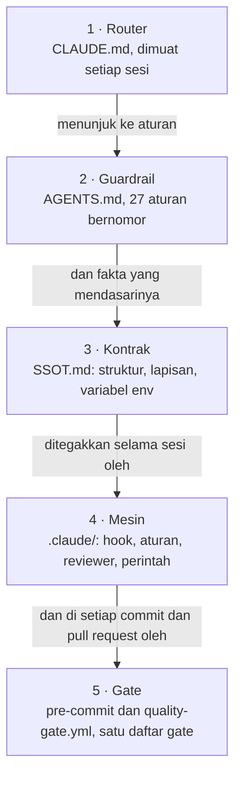

[English](README.md) | **Bahasa Indonesia**

<h1 align="center">
  <picture>
    <source media="(prefers-color-scheme: dark)" srcset="docs/assets/banner-ai-dark.svg">
    <source media="(prefers-color-scheme: light)" srcset="docs/assets/banner-ai-light.svg">
    
  </picture>
</h1>

<p align="center">
  <a href="LICENSE"></a>
  <a href="#cicd"></a>
  <a href="#kebutuhan"></a>
  <a href="#lebih-suka-plugin"></a>
</p>

<p align="center">
  <a href="SETUP.md">Setup</a> ·
  <a href="docs/RATIONALE.md">Alasan desain</a> ·
  <a href="docs/unlock.md">Membuka kunci</a> ·
  <a href="https://github.com/adhibuchori/be-agent-config">Backend</a> ·
  <a href="https://github.com/adhibuchori/fe-agent-config">Frontend</a> ·
  <a href="https://github.com/adhibuchori/docs-agent-config">Situs dokumentasi</a> ·
  <a href="https://github.com/adhibuchori/agent-config-kit">Plugin</a>
</p>

**ai-agent-config** adalah sekumpulan file yang Anda salin ke layanan Python yang membungkus LLM
atau API vendor lain (FastAPI, uv, Postgres). Dengannya, Claude Code bekerja seperti rekan setim
yang teliti. Hook menolak perintah yang akan Anda sesali, misalnya force-push ke `main` atau
`cat .env.production`. Aturan bernomor menjelaskan seperti apa kode yang baik di sini, dan
serangkaian pemeriksaan membuktikannya di setiap commit dan setiap pull request.

> [!TIP]
> **Singkatnya.** Salin lapisan (layer) ini ke repo Anda, isi placeholder-nya, commit, lalu
> jalankan `uv run pre-commit install`. Sejak itu, Claude tidak bisa push ke branch yang
> dilindungi, membaca file `.env`, atau menulis ke database produksi tanpa Anda. Setiap commit
> menjalankan 15 pemeriksaan dari satu daftar gate, dan CI menjalankannya lagi. `/plan`, `/review`,
> `/commit`, `/create-pr`, dan `/merge-pr` mengantar setiap perubahan dari ide sampai merge. Hook
> berjalan di mesin Anda dan tidak membuka koneksi jaringan. Lebih suka plugin daripada file
> salinan? Lihat [Lebih suka plugin?](#lebih-suka-plugin).

## Daftar isi

- [Mengapa template ini ada](#mengapa-template-ini-ada)
- [Lihat cara kerjanya](#lihat-cara-kerjanya)
- [Untuk siapa, dan bukan untuk siapa](#untuk-siapa-dan-bukan-untuk-siapa)
- [Template atau plugin yang mana?](#template-atau-plugin-yang-mana)
- [Lebih suka plugin?](#lebih-suka-plugin)
- [Mulai cepat](#mulai-cepat)
- [Sehari bekerja dengan lapisan ini](#sehari-bekerja-dengan-lapisan-ini)
- [Apa saja yang dipasang](#apa-saja-yang-dipasang)
- [Bagaimana bagian-bagiannya saling terhubung](#bagaimana-bagian-bagiannya-saling-terhubung)
- [Semua isi template ini](#semua-isi-template-ini): [hook](#hook) · [perintah](#perintah) ·
  [agen](#agen) · [skill](#skill) · [aturan](#aturan) ·
  [pemeriksaan dan gate](#pemeriksaan-dan-gate) · [workflow CI](#workflow-ci) ·
  [file konfigurasi](#file-konfigurasi)
- [Konfigurasi](#konfigurasi)
- [Apa yang diblokir](#apa-yang-diblokir)
- [Membuka kunci `.env` dan DB produksi](#membuka-kunci-env-dan-db-produksi)
- [CI/CD](#cicd)
- [Melayani request atau pipeline?](#melayani-request-atau-pipeline)
- [Contoh jadi: repo template](#contoh-jadi-repo-template)
- [Model keamanan](#model-keamanan)
- [Biaya dan beban tambahan](#biaya-dan-beban-tambahan)
- [Upgrade dan uninstall](#upgrade-dan-uninstall)
- [Resep kustomisasi](#resep-kustomisasi)
- [Kebutuhan](#kebutuhan)
- [FAQ dan pemecahan masalah](#faq-dan-pemecahan-masalah)
- [Glosarium, peta jalan, cakupan, dan lisensi](#glosarium-peta-jalan-cakupan-dan-lisensi)

## Mengapa template ini ada

Satu baris di `CLAUDE.md` hanyalah permintaan. Hook yang keluar dengan exit code 2 adalah tembok.
Setiap cerita di bawah adalah jenis kegagalan yang nyata, apa yang dilakukan lapisan ini
terhadapnya, dan bagian mana yang menanganinya.

1. **Agen melakukan force-push ke `main`.**
   *Masalahnya:* rebase berantakan, agen "memperbaikinya" dengan `git push --force origin main`,
   dan commit milik rekan setim hilang.
   *Solusinya:* push ke, atau penghapusan, `dev`, `prod`, `main`, atau `master` ditolak di shell,
   dan tool MCP GitHub juga tidak bisa menulis ke branch-branch itu. Perubahan masuk lewat pull
   request.
   *Ditangani oleh:* [`safety-check.sh`](#hook), [`mcp-guard.sh`](#hook), aturan `deny` di
   [`.claude/settings.json`](#file-konfigurasi).

2. **Rahasia masuk ke transkrip.**
   *Masalahnya:* "coba saya cek konfigurasinya" berubah menjadi `cat .env.production`, dan API key
   provider Anda kini ada di log percakapan.
   *Solusinya:* tidak ada perintah shell dari Claude yang boleh membaca atau menulis file `.env*`
   asli secara langsung. Claude melihat daftar key lewat helper yang menyamarkan setiap rahasia,
   dan baru boleh mengubah nilai setelah *Anda sendiri* membuka kunci `env`. Sandbox sistem operasi
   memblokir file yang sama sebagai lapisan kedua.
   *Ditangani oleh:* [`safety-check.sh`](#hook), [`scripts/env/`](#pemeriksaan-dan-gate),
   [membuka kunci](#membuka-kunci-env-dan-db-produksi), [sandbox](#lapisan-sandbox).

3. **Agen menulis ke produksi.**
   *Masalahnya:* `DELETE` untuk "bersih-bersih sebentar" berjalan ke database produksi lewat server
   MCP `db-prod`.
   *Solusinya:* server itu dimulai dalam mode baca-saja. Kalau Anda memberinya akses tulis, satu
   pernyataan baca-saja tetap lolos, dan setiap penulisan menunggu sampai Anda menjalankan
   `! ./scripts/ops/unlock.sh db`, yang menutup sendiri setelah 15 menit.
   *Ditangani oleh:* [`db-guard.sh`](#hook), [`.mcp.json`](#file-konfigurasi),
   [membuka kunci](#membuka-kunci-env-dan-db-produksi).

4. **Aturan di `CLAUDE.md` diabaikan.**
   *Masalahnya:* dokumentasi bilang "panggil vendor hanya lewat provider" dan "jangan lewati hook
   commit". Tiga jam dalam sesi, agen mengimpor SDK vendor langsung di dalam service dan melakukan
   commit dengan `--no-verify`.
   *Solusinya:* setiap aturan di `AGENTS.md` bernomor dan menyebut apa yang menegakkannya: sebuah
   pemeriksaan, atau `advisory` (code review) sampai pemeriksaannya ada. `--no-verify` ditolak,
   sehingga setiap commit melewati gate, dan kontrak import-linter menggagalkan gate itu saat
   sebuah modul melanggar urutan lapisan. Subagen `ai-reviewer` memeriksa aturan yang bersifat
   advisory, misalnya SDK vendor yang dipanggil langsung dari service (Rule 12). `CLAUDE.md` tetap
   kecil, sehingga benar-benar dibaca.
   *Ditangani oleh:* [`AGENTS.md`](#file-konfigurasi), [`ai-reviewer`](#agen),
   [gate](#pemeriksaan-dan-gate), [`ai-config.sh`](#pemeriksaan-dan-gate).

5. **Penolakan yang di-stream terlihat seperti jawaban.**
   *Masalahnya:* model berhenti di tengah jalan, karena batas panjang atau karena menolak. Service
   mengembalikan teks setengah jadi dengan status 200, dan pengguna membaca setengah jawaban seolah
   jawaban utuh.
   *Solusinya:* `AGENTS.md` Rule 15 mewajibkan status penyelesaian diperiksa sebelum teks hasil
   stream dipercaya. Aturan provider dimuat setiap kali Claude mengubah `src/app/providers/`, dan
   `ai-reviewer` memeriksanya.
   *Ditangani oleh:* [`backend/providers.md`](#aturan), [`ai-reviewer`](#agen),
   [RATIONALE § 6](docs/RATIONALE.md#6-check-the-completion-status-before-trusting-streamed-text).

6. **Pemeriksaan bergeser sementara CI tetap hijau.**
   *Masalahnya:* hook commit menjalankan satu set pemeriksaan dan CI menjalankan set lain. Salinan
   perintah di `.claude/commands/` yang disalin manual sudah tidak cocok dengan sumbernya, dan tidak
   ada yang sadar.
   *Solusinya:* satu daftar, `scripts/check/gates.list`, adalah yang dijalankan secara manual, di
   setiap commit, dan di CI. `workflows.sh --check` gagal jika ada salinan perintah yang basi.
   Untuk banyak repo sekaligus, [versi plugin](#lebih-suka-plugin) memanggil satu workflow bersama
   yang di-pin ke satu commit.
   *Ditangani oleh:* [pemeriksaan dan gate](#pemeriksaan-dan-gate), [workflow CI](#workflow-ci).

7. **Agen menghapus pekerjaan orang lain.**
   *Masalahnya:* dua sesi berbagi satu checkout. Salah satunya menjalankan `git reset --hard`, atau
   `rm -rf src` supaya "mulai bersih".
   *Solusinya:* perintah yang menghapus pekerjaan yang belum di-commit atau path yang dilindungi
   ditolak. Commit dilakukan per pathspec, dan setelah setiap commit Claude diperlihatkan file apa
   saja yang benar-benar ikut.
   *Ditangani oleh:* [`safety-check.sh`](#hook), [`post-commit.sh`](#hook), [`/commit`](#perintah),
   [`/checkpoint`](#perintah).

8. **Lapisan AI ikut terkirim ke produksi.**
   *Masalahnya:* `.claude/`, `CLAUDE.md`, dan `.mcp.json` ikut masuk ke branch produksi dan ke
   image.
   *Solusinya:* saat pull request ke `prod` di-merge, CI menghapus lapisan ini dari `prod`,
   me-merge `prod` kembali ke `dev`, lalu memeriksa keduanya. `.dockerignore` menjaga file env dan
   lapisan ini tetap di luar image mana pun.
   *Ditangani oleh:* [`strip-ai-on-pr.yml`](#workflow-ci), [`.dockerignore`](#file-konfigurasi).

<details>
<summary>Sebelum dan sesudah: lima menit yang sama, tanpa dan dengan lapisan ini</summary>

### Tanpa lapisan ini

```text
Anda:    Endpoint chat mengembalikan 500 di produksi. Cari penyebabnya dan kirim perbaikannya.
Claude:  Saya cek konfigurasinya.         $ cat .env.production   ← API key kini ada di chat
Claude:  REDIS_URL tidak ada. Saya tambah. $ echo "REDIS_URL=…" >> .env.production
Claude:  Saya push perbaikannya.          $ git push --force origin main
         (commit rekan setim dari sepuluh menit lalu hilang)
```

### Dengan lapisan ini

```text
Anda:    Endpoint chat mengembalikan 500 di produksi. Cari penyebabnya dan kirim perbaikannya.
Claude:  $ cat .env.production
         [safety] BLOCKED: .env.production holds secrets, and the shell never reads or writes a
         real .env* file directly: its values would land in the transcript. List its keys with
         `bash scripts/env/show.sh .env.production` (secret values masked). …
Claude:  $ bash scripts/env/show.sh .env.production
         .env.production: 3 keys
           ENVIRONMENT     production
           DATABASE_URL    postgresql+asyncpg://app:…(15 chars)@db.internal:5432/app
           OPENAI_API_KEY  sk-t…(30 chars)
         checked against .env.production.example: missing REDIS_URL
         env is locked: to change a value, the user first runs `! ./scripts/ops/unlock.sh env`.
Claude:  REDIS_URL tidak ada. File ini terkunci; tolong jalankan: ! ./scripts/ops/unlock.sh env
Anda:    ! ./scripts/ops/unlock.sh env
         🔓 .env unlocked until 16:35 (20 min) — lock now: ./scripts/ops/unlock.sh off env
Claude:  $ printf '%s' "$REDIS_URL" | bash scripts/env/set.sh .env.production REDIS_URL
         ✓ REDIS_URL added in .env.production: redis://cache.internal:6379/0 · backup …
Claude:  $ git push --force origin main
         [safety] BLOCKED: pushing to a protected branch (dev/prod/main/master) is not allowed.
         Push your work branch and open a PR; …
Claude:  Saya push branch kerja lalu membuka pull request dengan /create-pr.
```

Pesan hook dan keluaran helper di atas asli, diambil dari template ini dan dipersingkat dengan
`…`; pesannya tetap berbahasa Inggris seperti aslinya. Baris di sekitarnya menunjukkan di mana
pesan itu muncul dalam sebuah sesi.

</details>

## Lihat cara kerjanya

<picture>
  <source media="(prefers-color-scheme: dark)" srcset="docs/assets/demo-blocked-dark.svg">
  <source media="(prefers-color-scheme: light)" srcset="docs/assets/demo-blocked-light.svg">
  
</picture>

Sebelum tool apa pun berjalan, Claude Code mengirim panggilan itu ke hook `PreToolUse` sebagai
JSON lewat stdin. Hanya **exit code 2** yang menghentikan panggilan, dan apa yang ditulis hook ke
stderr menjadi alasan yang dibaca Claude. Anda bisa memerankan Claude Code sendiri, dari root repo
yang sudah berisi lapisan ini:

```bash
echo '{"tool_name":"Bash","tool_input":{"command":"git push --force origin main"}}' \
  | CLAUDE_PROJECT_DIR="$PWD" bash .claude/hooks/safety-check.sh; echo "exit $?"
```

```text
[safety] BLOCKED: pushing to a protected branch (dev/prod/main/master) is not allowed. Push your work branch and open a PR; when a release needs this push, the user runs it with `!`.
exit 2
```

Panggilan yang sama dengan `git status` hanya mencetak `exit 0`, dan perintahnya berjalan.
[Cek setiap hook sendiri](#cek-setiap-hook-sendiri) berisi satu baris seperti ini untuk setiap
hook.

<picture>
  <source media="(prefers-color-scheme: dark)" srcset="docs/assets/hook-flow-dark.svg">
  <source media="(prefers-color-scheme: light)" srcset="docs/assets/hook-flow-light.svg">
  
</picture>



Ilustrasinya dianimasikan dengan CSS di dalam SVG: landaknya berkedip, alur hook melangkah melewati
kedua perintah, dan demo terminal mengetik ulang dirinya setiap sembilan detik. Jika sistem Anda
meminta gerakan dikurangi (reduced motion), yang tampil adalah gambar diam.

## Untuk siapa, dan bukan untuk siapa

**Cocok jika Anda:**

- membangun layanan Python dengan FastAPI yang memanggil LLM, model embedding, atau API vendor
  lain, dikelola dengan uv, mungkin dengan Postgres;
- memakai Claude Code (CLI atau ekstensi IDE) di repo itu, sendiri atau bersama tim;
- menginginkan penolakan yang bisa diuji, aturan yang bisa dikutip reviewer berdasarkan nomornya,
  dan gate yang berjalan sama persis di laptop maupun di CI;
- ingin memiliki dan mengubah setiap file sendiri, alih-alih menerima pembaruan dari plugin.

**Tidak cocok jika Anda:**

- bekerja dengan TypeScript, atau di frontend, atau di situs dokumentasi: pilih
  [template atau plugin yang sesuai](#template-atau-plugin-yang-mana);
- hanya memakai Claude di claude.ai atau di Cowork: hook, perintah, dan pengaturan di sini adalah
  fitur Claude Code;
- menginginkan batas keamanan terhadap agen yang berniat jahat: hook membaca teks perintah dan
  merupakan pagar pengaman terhadap kekeliruan dan instruksi yang disusupkan
  ([Model keamanan](#model-keamanan));
- mencari generator proyek: tidak ada kode aplikasi di sini, hanya lapisan di sekelilingnya.

## Template atau plugin yang mana?

Setiap stack punya repo template (file yang Anda salin dan miliki) dan sebuah plugin di
[agent-config-kit](https://github.com/adhibuchori/agent-config-kit) (dipasang dan diperbarui per
versi). Pagar pengamannya sama.



| Repo Anda | Repo template | Plugin |
| :--- | :--- | :--- |
| Layanan FastAPI yang membungkus LLM | **ai-agent-config** (repo ini) | `agent-core` + `agent-ai-fastapi` |
| API Bun + Hono + Drizzle | [be-agent-config](https://github.com/adhibuchori/be-agent-config) | `agent-core` + `agent-be-hono` |
| Aplikasi web Next.js | [fe-agent-config](https://github.com/adhibuchori/fe-agent-config) | `agent-core` + `agent-fe-nextjs` |
| Company profile atau landing page | tidak ada | `agent-core` + `agent-fe-nextjs-static` |
| Situs dokumentasi Nextra | [docs-agent-config](https://github.com/adhibuchori/docs-agent-config) | `agent-core` + `agent-docs-nextra` |
| Add-on: three.js / React Three Fiber | tidak ada | `agent-fe-threejs`, di samping plugin stack |
| Add-on: pemeriksaan deploy, host apa pun | tidak ada | `agent-deploy`, di samping plugin stack |

Di dalam template ini masih ada satu pilihan lagi: layanan yang melayani request, atau pipeline
yang memiliki skemanya sendiri. [Melayani request atau pipeline?](#melayani-request-atau-pipeline)
menjelaskan keduanya.

## Lebih suka plugin?

<picture>
  <source media="(prefers-color-scheme: dark)" srcset="docs/assets/install-flow-dark.svg">
  <source media="(prefers-color-scheme: light)" srcset="docs/assets/install-flow-light.svg">
  :setup, yang
    menampilkan dry run sebelum menerapkan apa pun.">
</picture>

Hook, aturan, perintah, dan pemeriksaan yang sama tersedia sebagai plugin Claude Code di
[agent-config-kit](https://github.com/adhibuchori/agent-config-kit). Untuk stack ini, plugin-nya
adalah **`agent-ai-fastapi`**, yang dibangun di atas `agent-core`. Tiga langkah, masing-masing
tinggal salin dan tempel:

1. **Tambahkan marketplace** (sekali per mesin). Di terminal:

   ```bash
   claude plugin marketplace add adhibuchori/agent-config-kit
   ```

2. **Pasang kedua plugin.** Di dalam Claude Code:

   ```text
   /plugin install agent-core@agent-config-kit
   /plugin install agent-ai-fastapi@agent-config-kit
   ```

   Jika perintah barunya tidak muncul, mulai ulang Claude Code.

3. **Jalankan setup di repo Anda.** Di dalam Claude Code:

   ```text
   /agent-ai-fastapi:setup
   ```

   Setup mengajukan beberapa pertanyaan, satu per satu, menampilkan dry run dari setiap file yang
   akan ditulisnya, dan baru menulis setelah Anda membalas **go**. Commit file-file barunya bersama
   `.claude/agent-config-kit.lock`: lock itulah yang menyalakan hook untuk semua orang yang
   meng-clone repo.

**Berhasil jika** setup berakhir seperti yang dijelaskan [halaman dokumentasinya][setup-page], dan
`/agent-ai-fastapi:sync --check` sesudahnya tidak melaporkan pergeseran. Dengan plugin, setiap
perintah di README ini membawa nama plugin-nya: `/review` menjadi `/agent-core:review`, `/ship`
menjadi `/agent-core:ship`.

[setup-page]: https://github.com/adhibuchori/agent-config-kit/blob/main/docs/agent-ai-fastapi/setup.md#its-working-if

| | Template ini | Plugin |
| :--- | :--- | :--- |
| Yang Anda dapat | file di repo Anda, bebas Anda ubah | plugin berversi, diperbarui saat versinya dinaikkan |
| Hook berjalan | di repo ini, selalu | hanya di repo yang ikut serta lewat `.claude/agent-config.json` atau `.claude/agent-config-kit.lock` |
| Aturan izin | disertakan di `.claude/settings.json` | ditulis oleh perintah setup, karena plugin tidak bisa membawanya |
| Pembaruan | Anda bandingkan dan gabungkan sendiri | `claude plugin update`, lalu perintah sync plugin itu |

Pakai template jika Anda ingin mengubah aturannya sendiri; pakai plugin jika Anda ingin pagar
pengaman yang sama di banyak repo dan pembaruan per versi. Jangan pakai keduanya di satu repo: hook
akan berjalan dua kali. Untuk beralih, hapus entri `hooks` dari `.claude/settings.json` sebelum
memasang plugin.

## Mulai cepat

Setiap perintah di bawah sudah dijalankan di folder yang masih kosong; keluaran yang dikutip adalah
keluaran asli.

1. **Clone template ini** di samping proyek Anda.

   ```bash
   git clone https://github.com/adhibuchori/ai-agent-config.git
   ```

2. **Salin lapisannya**, dari root proyek Anda. Di proyek yang sudah punya `pyproject.toml`,
   `.gitignore`, atau workflow, gabungkan file-file itu alih-alih menimpanya
   ([SETUP § 1](SETUP.md#1-copy-the-layer-in)).

   ```bash
   CFG=../ai-agent-config
   cp -R "$CFG"/{.claude,.agent,_workflow-source,.github,scripts} .
   cp "$CFG"/{CLAUDE.md,AGENTS.md,SSOT.md,.mcp.json,pyproject.toml,.gitignore} .
   cp "$CFG"/{.pre-commit-config.yaml,.gitleaks.toml,.dockerignore,.skillspector-baseline.yaml} .
   mkdir -p docs && cp "$CFG"/docs/unlock.md docs/
   chmod +x .claude/hooks/*.sh .github/scripts/*.sh scripts/*/*.sh
   ```

3. **Isi placeholder-nya.** Semuanya bernama, tidak pernah kosong, misalnya `<repo-name>` dan
   `your-github-handle`. Perintah ini mendaftar semuanya di file yang perlu diisi lebih dulu;
   [SETUP § 2](SETUP.md#2-fill-in-every-placeholder) menjelaskan isi masing-masing. `uv` menolak
   berjalan sampai `pyproject.toml` punya nama yang sungguhan.

   ```bash
   grep -rn -e '<[A-Za-z]' -e 'your-github-handle' \
     CLAUDE.md AGENTS.md SSOT.md pyproject.toml .claude/agents .github
   ```

4. **Isi tabel Compliance Status** di bagian atas `AGENTS.md`: Enforced, Partial, atau Not met
   untuk setiap bagian. Agen yang mengikuti sebuah aturan ke file yang tidak ada akan berhenti
   memercayai aturan lainnya. Lalu [pilih bentuknya](#melayani-request-atau-pipeline).

5. **Commit lapisannya, lalu pasang gate commit.** Commit dulu: empat gate memeriksa kode aplikasi
   (batas impor, kode mati, kebersihan dependensi, tes dengan cakupan 100%), dan proyek tanpa
   `src/` dan `tests/` gagal di keempatnya. Di folder baru, jalankan `git init` terlebih dahulu.

   ```bash
   uv lock && uv sync
   git add .claude .agent _workflow-source .github scripts docs/unlock.md CLAUDE.md AGENTS.md \
     SSOT.md .mcp.json pyproject.toml uv.lock .gitignore .pre-commit-config.yaml .gitleaks.toml \
     .dockerignore .skillspector-baseline.yaml
   git commit -m "chore: add the claude code layer"
   uv run pre-commit install    # mulai sekarang, setiap commit menjalankan gate
   ```

6. **Beri gate modul pertamanya.** Keempat gate tadi lolos setelah `src/app/` berisi paket yang
   disebut kontrak impor, satu modul pertama beserta tesnya, dan impor untuk setiap dependensi
   runtime. [SETUP § 6](SETUP.md#what-the-code-gates-need-from-src-and-tests) mendaftar apa yang
   dibutuhkan setiap gate.

   ```bash
   bash scripts/check/gates.sh  # semua gate secara manual: "15 gate(s) ran, 0 failed"
   ```

7. **Buktikan hook-nya di mesin Anda.** Hasil akhirnya `hook probes: <n> passed, 0 failed`; di
   template ini sekarang jumlahnya 1.772 probe. [Lihat cara kerjanya](#lihat-cara-kerjanya)
   menunjukkan cara memberi satu hook satu perintah secara manual.

   ```bash
   bash scripts/check/hook-probes.sh
   ```

8. **Lanjutkan dengan [SETUP.md](SETUP.md)** untuk server MCP, pengaturan repositori, CI, dan
   pipeline strip.

## Sehari bekerja dengan lapisan ini

Perubahan yang umum berjalan dari rencana → kode → review → commit → pull request → merge. Setiap
langkah punya perintahnya sendiri, dan hook membantu di sepanjang jalan tanpa perlu diminta.



| Langkah | Yang Anda jalankan | Yang membantu dengan sendirinya |
| :--- | :--- | :--- |
| Rencana | `/plan stream the chat completion endpoint` | aturan per path dimuat saat rencana membaca file yang cocok; tidak ada yang ditulis |
| Kode | tidak ada: cukup minta | `post-edit.sh` memformat dan me-lint setiap file yang ditulis; `safety-check.sh` dan guard lain menolak yang tidak boleh berjalan |
| Review | `/review` | `ai-reviewer` memeriksa aturan `AGENTS.md` yang tidak terlihat oleh gate; checklist review menangani sisanya |
| Commit | `/commit`, lalu `git commit -m "feat: …" -- <paths>` | pre-commit menjalankan gate pada yang di-stage; `post-commit.sh` menunjukkan apa yang ikut masuk |
| Pull request | `/create-pr` | `quality-gate.yml`, `dependency-review.yml`, dan `codeql.yml` berjalan pada pull request |
| Komentar review | `/resolve-pr-review 42` | setiap komentar dinilai terhadap aturan bernomor sebelum ada yang diubah |
| Merge | `/merge-pr 42` | `scripts/ops/pr-ready.sh 42` membaca status check, kesiapan merge, dan thread yang masih terbuka lebih dulu |
| Rilis | `/promote`, lalu `/branch-cleanup` | `strip-ai-on-pr.yml` menghapus lapisan ini dari `prod`; `ci-cd.yml` memicu deploy |
| Debug | `/rca <gejala>` (atau `/debug <gejala>`) | `prompt-intent.sh` mengarahkan `/debug` ke `/rca` |
| Sesi panjang | `/checkpoint before refactor`, `/checkpoint-summary`, `/learn-session` | commit pengaman, catatan serah terima, dan pelajaran yang ditulis di tempat yang akan dimuat lagi |

## Apa saja yang dipasang

Ini repo Anda setelah mulai cepat. `README.md`, `README.id.md`, `SETUP.md`, `LICENSE`,
`docs/RATIONALE.md`, dan `docs/assets/` tetap di template: file-file itu menjelaskan lapisan ini
dan bukan bagian darinya.

```text
repo-anda/
├── CLAUDE.md                    Router: apa yang dibaca untuk tugas apa; dimuat setiap sesi
├── AGENTS.md                    27 aturan bernomor, masing-masing menyebut pemeriksaannya
├── SSOT.md                      Fakta: struktur modul, aturan lapisan, variabel lingkungan
├── .mcp.json                    Server MCP, di-pin; rahasia sebagai referensi ${VARIABLE}
├── pyproject.toml               Pengaturan ruff, mypy, pytest, coverage, import-linter, …
├── .pre-commit-config.yaml      Gate commit: set yang sama dengan scripts/check/gates.list
├── .gitignore                   Menjaga file .env asli, .claude/state/, pengaturan lokal di luar git
├── .gitleaks.toml               Allowlist pemindai rahasia: dua pola sempit, tanpa path pengecualian
├── .dockerignore                Menjaga setiap file .env dan lapisan AI di luar image
├── .skillspector-baseline.yaml  Triase SkillSpector: apa yang diterima pemindai skill, dan alasannya
├── docs/unlock.md               Cara Anda membuka file .env dan penulisan ke produksi
│
├── .claude/
│   ├── settings.json            Wiring hook, izin allow/ask/deny, sandbox Bash
│   ├── agent-config.example.json  Setiap pengaturan hook beserta nilai bawaannya
│   ├── hooks/                   8 hook, lib.sh (bersama) dan README.md (aturan, mode gagal)
│   ├── rules/                   12 aturan: common/ (5), python/ (3), backend/ (4)
│   ├── agents/                  ai-reviewer.md dan INDEX.md
│   ├── commands/                15 slash command (dihasilkan dari _workflow-source/)
│   ├── anti-patterns/           6 jebakan yang sudah dikenal dan INDEX.md
│   ├── docs/                    code-review-checklist.md, dibaca saat dibutuhkan
│   ├── examples/pipeline/       Aturan untuk layanan pemilik skema; tidak dimuat sebelum disalin
│   ├── mcp/                     Server deploy-platform, vps-provider, cloudflare; dimuat saat perlu
│   └── *.example.md             5 referensi sesuai kebutuhan: salin, isi, atau hapus
│
├── _workflow-source/            15 sumber perintah dan INDEX.md: ubah perintah di sini
├── .agent/workflows/            Perintah yang sama untuk tool agen kedua (dihasilkan)
│
├── scripts/
│   ├── check/                   gates.sh + gates.list, ai-config.sh + probe-nya,
│   │                            hook-probes.sh + .tsv, skills.sh, folder-shape.mjs,
│   │                            coverage-policy.mjs
│   ├── env/                     show.sh (tersamar), set.sh (hanya saat terbuka), envfile.py
│   ├── ops/                     unlock.sh (hanya Anda yang menjalankan), pr-ready.sh
│   ├── sync/workflows.sh        Menulis salinan perintah; --check mendeteksi pergeseran
│   └── vulture/whitelist.py     Apa yang harus dianggap terpakai oleh vulture, dan siapa pemakainya
│
└── .github/
    ├── workflows/               7 workflow yang hanya berjalan pada pull request
    ├── scripts/                 quality-gate.sh, skrip strip, trigger-deploy.sh, cek komentar
    ├── CODEOWNERS               Meminta review untuk hook, pengaturan, gate, dan workflow
    └── PULL_REQUEST_TEMPLATE/   dev.md dan promotion.md
```

Tidak ada kode aplikasi: tidak ada `src/`, tidak ada `Dockerfile`, tidak ada kerangka Alembic.
`pyproject.toml` hanya mendaftar dependensi runtime dan tooling yang diasumsikan aturan-aturannya.

## Bagaimana bagian-bagiannya saling terhubung

Lima lapisan, masing-masing dengan satu tugas. Lapisan yang belakangan tidak pernah mengulang
lapisan sebelumnya.



<picture>
  <source media="(prefers-color-scheme: dark)" srcset="docs/assets/layers-dark.svg">
  <source media="(prefers-color-scheme: light)" srcset="docs/assets/layers-light.svg">
  
</picture>

| Lapisan | File | Tugas | Ukuran |
| :--- | :--- | :--- | ---: |
| **Router** | `CLAUDE.md` | Apa yang dibaca untuk tugas apa. Dimuat setiap sesi, jadi pendek | 158 baris |
| **Guardrail** | `AGENTS.md` | Aturan bernomor, masing-masing menyebut penegaknya atau `advisory` | 294 baris |
| **Kontrak** | `SSOT.md` | Struktur modul, aturan lapisan, variabel lingkungan | 141 baris |
| **Mesin** | `.claude/`, `.mcp.json` | Hook, aturan per path, reviewer, perintah, anti-pattern | 63 file |
| **Gate** | `.pre-commit-config.yaml`, `.github/`, `scripts/check/` | Apa arti "lolos", di setiap commit dan pull request | 7 workflow |

Ukuran di atas adalah ukuran template yang belum diisi. Punya Anda akan bertambah saat tabel
Compliance Status diisi dan placeholder diganti dengan aturan sungguhan; jangan dipangkas agar
sama dengan template saudaranya.

## Semua isi template ini

Setiap tabel menjawab tiga pertanyaan untuk setiap bagian: apa fungsinya, bagaimana memakainya,
dan mengapa itu membantu. Setiap nama menautkan ke file-nya, yang header-nya menjelaskan secara
lengkap.

### Hook

Hook adalah skrip yang dijalankan Claude Code dengan sendirinya pada momen tertentu.
`.claude/settings.json` menyambungkannya; masing-masing berjalan sebagai
`bash "$CLAUDE_PROJECT_DIR/.claude/hooks/<name>.sh"` dengan batas waktu 10 detik (20 detik untuk
`post-commit.sh`, 60 detik untuk `post-edit.sh`). Empat **guard** bisa menolak panggilan dan gagal
dalam keadaan tertutup (fail closed); empat **hook umpan balik** hanya menambah konteks dan gagal
dalam keadaan terbuka (fail open). [`.claude/hooks/README.md`](.claude/hooks/README.md) berisi
setiap aturan, mode gagal setiap hook, dan pengaturannya.

| Nama | Fungsinya | Cara pakai | Manfaatnya |
| :--- | :--- | :--- | :--- |
| [`safety-check.sh`](.claude/hooks/safety-check.sh) | Membaca setiap perintah shell seperti shell membacanya, lalu menolak push ke branch yang dilindungi, penghapusan rekursif path yang dilindungi, perintah yang menghapus pekerjaan yang belum di-commit, upaya melewati gate commit, pembacaan atau penulisan file `.env*` asli lewat shell, `alembic downgrade`, menjalankan unlock, pengaturan git yang menjalankan kode, dan apa pun yang tidak bisa ia pahami | Berjalan sendiri sebelum setiap panggilan `Bash` | Perintah yang akan Anda sesali tidak pernah berjalan, dan Claude diberi tahu jalan yang lebih aman |
| [`db-guard.sh`](.claude/hooks/db-guard.sh) | Meloloskan satu pernyataan SQL baca-saja ke database produksi; menahan setiap penulisan sampai Anda membuka kunci `db` | Berjalan sendiri sebelum `mcp__db-prod__execute_sql` | Tidak ada `DELETE` atau `DROP` mendadak di produksi |
| [`mcp-guard.sh`](.claude/hooks/mcp-guard.sh) | Menolak penulisan lewat MCP GitHub (`push_files`, `create_or_update_file`, `delete_file`, `create_branch`) ke branch yang dilindungi | Berjalan sendiri sebelum keempat tool MCP GitHub itu | Menutup jalan memutar di sekitar guard shell |
| [`migration-guard.sh`](.claude/hooks/migration-guard.sh) | Menolak pengeditan manual pada revisi Alembic hasil generator | Berjalan sendiri sebelum penulisan file; tidak melakukan apa-apa sampai ada folder migrasi | Database, riwayat migrasi, dan model tetap selaras |
| [`post-edit.sh`](.claude/hooks/post-edit.sh) | Menjalankan `ruff format`, lalu `ruff check`, pada file yang baru ditulis, dan memberi tahu Claude temuan ruff | Berjalan sendiri setelah setiap penulisan file; tidak pernah memblokir | Temuan lint diperbaiki di edit berikutnya, bukan saat commit |
| [`post-commit.sh`](.claude/hooks/post-commit.sh) | Menunjukkan isi sebuah commit, dan memperingatkan path yang tidak disebut pathspec-nya | Berjalan sendiri setelah `git commit` | Pekerjaan sesi lain yang sudah di-stage tidak bisa ikut masuk tanpa terlihat |
| [`prompt-intent.sh`](.claude/hooks/prompt-intent.sh) | Mengarahkan `/debug` ke `/rca` milik repo ini, dan membersihkan state hook dari sesi yang menganggur selama dua hari | Ketik `/debug <gejala>` | Debug dimulai dari reproduksi, bukan dari skill debug bawaan Claude Code |
| [`session-start.sh`](.claude/hooks/session-start.sh) | Membuat zsh yang menjalankan perintah Claude berperilaku seperti bash dalam hal glob dan pemisahan kata | Berjalan sendiri saat sesi dimulai | Lebih sedikit kegagalan `no matches found` yang membingungkan |
| [`lib.sh`](.claude/hooks/lib.sh) | Bagian bersama yang dipakai setiap hook: pembaca payload, pemuat konfigurasi, dan penganalisis perintah shell | Tidak perlu dijalankan. Ubah dengan hati-hati: satu kesalahan sintaks di sini memblokir setiap panggilan tool | Satu parser, dibuktikan sekali, dipakai semua guard |

**Berhasil jika** Anda melihat tanda-tanda ini dalam sesi biasa. Halaman setiap hook di dokumentasi
plugin berisi pemeriksaan yang sama, apa yang ditolak hook itu, dan cara mematikannya; halaman itu
memakai nama perintah plugin, dan hook-nya berperilaku sama di sini.

| Hook | Berhasil jika | Halaman dokumentasi |
| :--- | :--- | :--- |
| `safety-check.sh` | `git status` berjalan tanpa komentar dari hook; `git push origin main` dari Claude ditolak dengan baris `[safety] BLOCKED:`, lalu Claude mem-push branch kerja | [safety-check](https://github.com/adhibuchori/agent-config-kit/blob/main/docs/agent-core/safety-check.md#its-working-if) |
| `db-guard.sh` | `SELECT` lewat `db-prod` berjalan; `DELETE` ditolak sampai Anda menjalankan `! ./scripts/ops/unlock.sh db`, dan berjalan setelah `db` terbuka | [db-guard](https://github.com/adhibuchori/agent-config-kit/blob/main/docs/agent-core/db-guard.md#its-working-if) |
| `mcp-guard.sh` | `push_files` MCP GitHub ke branch kerja lolos; panggilan yang sama ke `main` ditolak dengan `[mcp-guard] BLOCKED:` | [mcp-guard](https://github.com/adhibuchori/agent-config-kit/blob/main/docs/agent-core/mcp-guard.md#its-working-if) |
| `migration-guard.sh` | Untuk perubahan skema, Claude menjalankan `uv run alembic revision --autogenerate`; edit pada revisi yang sudah ada ditolak dengan `[migration-guard] BLOCKED:` | [migration-guard](https://github.com/adhibuchori/agent-config-kit/blob/main/docs/agent-ai-fastapi/migration-guard.md#its-working-if) |
| `post-edit.sh` | `git diff` menunjukkan file yang ditulis Claude sudah bergaya ruff, dan error lint yang tertinggal diperbaiki di edit berikutnya tanpa diminta | [post-edit](https://github.com/adhibuchori/agent-config-kit/blob/main/docs/agent-core/post-edit.md#its-working-if) |
| `post-commit.sh` | Setelah Claude commit, balasannya menyebut hash dan file commit itu, sama dengan `git show --stat HEAD`, dan menyebutkannya bila commit membawa file yang tidak disebut siapa pun | [post-commit](https://github.com/adhibuchori/agent-config-kit/blob/main/docs/agent-core/post-commit.md#its-working-if) |
| `prompt-intent.sh` | `/debug empty answer` memulai penelusuran yang diawali reproduksi lewat `/rca` | [prompt-intent](https://github.com/adhibuchori/agent-config-kit/blob/main/docs/agent-core/prompt-intent.md#its-working-if) |
| `session-start.sh` | `ls *.nothing` di shell Claude gagal seperti di bash, bukan berhenti di `no matches found` | [session-start](https://github.com/adhibuchori/agent-config-kit/blob/main/docs/agent-core/session-start.md#its-working-if) |

<details id="cek-setiap-hook-sendiri">
<summary>Cek setiap hook sendiri</summary>

Jalankan dari root repo yang sudah berisi lapisan ini. Masing-masing mengirim JSON yang akan
dikirim Claude Code; guard menjawab `exit 2` beserta alasannya, hook umpan balik mencetak catatannya
untuk Claude.

```bash
# safety-check.sh: exit 2
echo '{"tool_name":"Bash","tool_input":{"command":"git push --force origin main"}}' \
  | CLAUDE_PROJECT_DIR="$PWD" bash .claude/hooks/safety-check.sh; echo "exit $?"

# db-guard.sh: exit 2 ("a DELETE statement"); SELECT keluar dengan exit 0
echo '{"tool_name":"mcp__db-prod__execute_sql","tool_input":{"sql":"DELETE FROM sessions"}}' \
  | CLAUDE_PROJECT_DIR="$PWD" bash .claude/hooks/db-guard.sh; echo "exit $?"

# mcp-guard.sh: exit 2 ("writes straight to the protected branch main")
echo '{"tool_name":"mcp__github__push_files","tool_input":{"owner":"o","repo":"r","branch":"main","files":[],"message":"x"}}' \
  | CLAUDE_PROJECT_DIR="$PWD" bash .claude/hooks/mcp-guard.sh; echo "exit $?"

# prompt-intent.sh: mencetak catatan yang mengarahkan /debug ke /rca
echo '{"hook_event_name":"UserPromptSubmit","prompt":"/debug empty answer","session_id":"demo"}' \
  | CLAUDE_PROJECT_DIR="$PWD" bash .claude/hooks/prompt-intent.sh; echo "exit $?"
```

`post-edit.sh` membutuhkan ruff di `.venv` (setelah `uv sync`), dan `migration-guard.sh`
membutuhkan folder migrasi seperti `alembic/versions/`; harness probe membuktikan keduanya di
folder sementara.

</details>

### Perintah

Lima belas slash command. Ketik di Claude Code. Ubah sumbernya di `_workflow-source/`;
`bash scripts/sync/workflows.sh` menulis salinannya di `.claude/commands/` dan `.agent/workflows/`.

| Nama | Fungsinya | Cara pakai | Manfaatnya |
| :--- | :--- | :--- | :--- |
| [`/plan`](_workflow-source/plan.md) | Menulis rencana (cakupan, tugas, kontrak, risiko, pertanyaan terbuka) lalu berhenti menunggu persetujuan Anda; tidak menulis kode | `/plan stream the chat completion endpoint` | Cakupan dan risiko disepakati sebelum pekerjaan dimulai |
| [`/check-fix`](_workflow-source/check-fix.md) | Menjalankan gate dan memperbaiki temuannya; tidak pernah commit | `/check-fix` | Gate yang merah jadi hijau tanpa Anda membaca log |
| [`/review`](_workflow-source/review.md) | Me-review perubahan yang di-stage atau di branch terhadap aturan dan checklist review, berdasarkan tingkat keparahan; tidak mengubah apa pun | `/review` | Temuan yang mengutip aturan muncul sebelum commit, bukan di pull request |
| [`/rca`](_workflow-source/rca.md) | Mereproduksi bug lebih dulu, menemukan baris penyebabnya, lalu memperbaikinya dengan tes yang gagal tanpa perbaikan itu | `/rca empty answer on long prompts` | Perbaikan yang tidak kambuh |
| [`/checkpoint`](_workflow-source/checkpoint.md) | Commit pengaman lokal untuk file sesi ini, per pathspec; tidak pernah push | `/checkpoint before schema refactor` | Jalan pulang yang murah sebelum perubahan berisiko |
| [`/checkpoint-summary`](_workflow-source/checkpoint-summary.md) | Ringkasan serah terima: apa yang sudah selesai, apa yang tertunda, apa selanjutnya | `/checkpoint-summary chat-endpoint` | Sesi berikutnya mulai dari titik sesi ini berakhir |
| [`/learn-session`](_workflow-source/learn-session.md) | Menulis setiap pelajaran ke pemeriksaan, aturan, referensi, atau anti-pattern yang akan dimuat lagi | `/learn-session` | Jebakan yang sama tidak terulang |
| [`/commit`](_workflow-source/commit.md) | Menjalankan gate, memeriksa perubahan yang di-stage, dan menyusun draf pesannya; tidak pernah commit | `/commit` | Gate yang merah tidak pernah menjadi commit |
| [`/ship`](_workflow-source/ship.md) | Men-stage semuanya, menjalankan `/review` dan `/security-review`, memperbaiki setiap temuan Medium ke atas dan setiap temuan keamanan, menjalankan ulang gate, lalu commit dan push branch kerja; menolak berjalan di `dev` dan `prod` | `/ship` | Pekerjaan yang selesai keluar dari mesin dalam keadaan sudah di-review |
| [`/create-pr`](_workflow-source/create-pr.md) | Menjalankan gate, menyusun judul dan isi dari template PR, lalu membuka pull request ke `dev` setelah Anda setuju | `/create-pr` | Pull request yang konsisten, tidak pernah push ke branch yang dilindungi |
| [`/resolve-pr-review`](_workflow-source/resolve-pr-review.md) | Memilah komentar review terhadap aturan, menerapkan yang valid, membalas di setiap thread, dan menutup thread yang sudah selesai | `/resolve-pr-review 42` | Saran bot yang melanggar aturan ditolak dengan alasan |
| [`/merge-pr`](_workflow-source/merge-pr.md) | Memeriksa kesiapan, meminta konfirmasi, merge dengan merge commit, lalu menghapus head `internal/*` berdasarkan namanya | `/merge-pr 42` | Check yang dilewati dan thread yang masih terbuka ketahuan sebelum merge |
| [`/promote`](_workflow-source/promote.md) | Pull request ke `dev`, pull request promosi ke `prod`, audit env produksi dan migrasi, deploy yang diverifikasi lewat timestamp | `/promote` | "Sudah di-merge" dan "sudah live" tidak pernah tertukar |
| [`/promote-deploy`](_workflow-source/promote-deploy.md) | Promosi yang sama saat CI tidak bisa berjalan: gate berjalan lokal, Anda menjalankan setiap push, dan log berisi apa yang masih menjadi utang CI | `/promote-deploy` | Produksi tidak basi selama CI mati |
| [`/branch-cleanup`](_workflow-source/branch-cleanup.md) | Setelah promosi, menghapus branch yang sudah di-merge begitu Anda menyetujui daftarnya; branch yang belum di-merge disimpan | `/branch-cleanup` | Remote tetap rapi, dan tidak ada yang belum di-merge yang hilang |

### Agen

Subagen melakukan review dalam konteksnya sendiri dan hanya melapor. Tool-nya adalah `Read`,
`Grep`, `Glob`, dan `Bash` (untuk `git diff`), tanpa `Write` atau `Edit`.

| Nama | Fungsinya | Cara pakai | Manfaatnya |
| :--- | :--- | :--- | :--- |
| [`ai-reviewer`](.claude/agents/ai-reviewer.md) | Memeriksa perubahan terhadap aturan `AGENTS.md` yang tidak terlihat oleh gate: batas lapisan, amplop error, indireksi provider, mirror skema, streaming, tes, keamanan, typing, satu rumah untuk setiap identifier | `/review` menyerahkan pemeriksaan rinci kepadanya, atau minta langsung: "Use the ai-reviewer subagent on this branch" | Kesalahan khas layanan LLM yang tak terlihat linter tertangkap sebelum commit |

[`.claude/agents/INDEX.md`](.claude/agents/INDEX.md) mencantumkannya; subagen yang tidak ada di
tabel itu, dalam praktiknya, tidak pernah dipakai.

### Skill

Template ini tidak menyertakan skill. Jika Anda menambahkannya di `.claude/skills/` atau
`.agents/skills/`, pemindai skill di bawah (`scripts/check/skills.sh`) memeriksanya di setiap
commit yang menyentuhnya, bersama perintah, subagen, dan hook yang sudah dipindainya.

### Aturan

Aturan adalah file Markdown yang dimuat Claude Code sebagai instruksi. Semua kecuali satu dibuka
dengan daftar `paths:` dan hanya dimuat saat Claude membaca atau mengubah file yang cocok, sehingga
tidak memakan konteks di waktu lain. Versi bernomor yang ditegakkan ada di `AGENTS.md`; file-file
ini adalah rujukan yang lebih mendalam.

| Nama | Fungsinya | Cara pakai (dimuat saat Claude menyentuh) | Manfaatnya |
| :--- | :--- | :--- | :--- |
| [`common/working-agreements.md`](.claude/rules/common/working-agreements.md) | Cara bekerja: komunikasi, cakupan, bukti, urutan kerja, checkout bersama, sistem live, jebakan tool | setiap sesi (4.278 byte) | Koreksi cukup dilakukan sekali, bukan setiap sesi |
| [`common/coding-style.md`](.claude/rules/common/coding-style.md) | Kebiasaan Python di balik `AGENTS.md` §G (Rules 23–27): imutabilitas, typing, async, error, logging, satu rumah untuk setiap identifier | `src/**/*.py`, `tests/**/*.py`, `scripts/**/*.py` | Kode yang konsisten tanpa mengulanginya di `CLAUDE.md` |
| [`common/folder-shape.md`](.claude/rules/common/folder-shape.md) | SHAPE-1 sampai SHAPE-4: tidak ada file lepas di samping folder, tes mencerminkan sumbernya, tidak ada nama seperti `misc` | `src/**`, `tests/**`, `scripts/**`, `components/**`, `lib/**` | Path sebuah file bisa ditebak dari fungsinya |
| [`common/patterns.md`](.claude/rules/common/patterns.md) | Pola yang dipakai repo ini, pola yang sengaja tidak dipakai, dan memakai ulang sebelum menulis | `src/**/*.py` | Tidak ada cara kedua untuk hal yang sama |
| [`common/testing.md`](.claude/rules/common/testing.md) | Dua tingkat tes, cakupan 100%, cakupan event loop async, pemalsuan lewat parameter bawaan | `tests/**`, `pyproject.toml` | Tes yang membuktikan apa yang diklaimnya |
| [`python/types.md`](.claude/rules/python/types.md) | Tidak ada `Any` eksplisit, ditegakkan oleh ruff `TID251` dan `ANN401` | `**/*.py`, `**/*.pyi` | Tipe tetap bermakna |
| [`python/dead-code.md`](.claude/rules/python/dead-code.md) | Temuan vulture dan deptry diperbaiki, bukan dibungkam; whitelist menyebut siapa pembaca setiap entri | `**/*.py`, `pyproject.toml` | Kode dan dependensi yang tak terpakai tidak menumpuk |
| [`python/coverage.md`](.claude/rules/python/coverage.md) | 100% baris dan cabang untuk setiap modul yang berisi logika, dan daftar tertutup pengecualiannya | `src/**`, `tests/**`, `scripts/check/**`, `pyproject.toml`, `.pre-commit-config.yaml` | Cakupan tidak bisa turun diam-diam |
| [`backend/fastapi.md`](.claude/rules/backend/fastapi.md) | Pola FastAPI di balik §B (Rules 4–8) dan §C (Rules 9–11): route, handler, service, error, auth, pelajaran ASGI | `src/app/api/**`, `src/app/modules/**`, `src/app/core/**`, `src/app/main.py` | Satu cara menulis route dan error |
| [`backend/providers.md`](.claude/rules/backend/providers.md) | Lapisan provider di balik §D (Rules 12–15): `Protocol` beserta adapter, streaming, status penyelesaian, batas waktu | `src/app/providers/**` | Vendor bisa diganti, dan dipalsukan di tes |
| [`backend/performance.md`](.claude/rules/backend/performance.md) | Ke mana waktu habis di layanan yang terikat I/O: event loop, anggaran koneksi, streaming, batas waktu, caching | `src/app/**/*.py` | Tidak ada panggilan blocking yang menahan setiap request |
| [`backend/testing.md`](.claude/rules/backend/testing.md) | Cara menguji setiap lapisan di balik §E (Rules 16–18): palsukan `Protocol`-nya, tes route pada app sungguhan | `tests/**`, `pyproject.toml` | Setiap lapisan diuji di tingkat yang tepat |

Di samping aturan, ada empat jenis referensi yang hanya dimuat saat tugas membutuhkannya:

| Nama | Fungsinya | Cara pakai | Manfaatnya |
| :--- | :--- | :--- | :--- |
| [`.claude/anti-patterns/`](.claude/anti-patterns/INDEX.md) (6 + indeks) | Satu jebakan yang sudah dikenal per file: gejala, akar masalah, perbaikan, cakupan. `INDEX.md` mendaftar pemicunya | Claude memindai indeks sebelum debug; `/learn-session` menambah yang baru | Jebakan yang dulu makan satu sore hanya makan satu menit berikutnya |
| [`.claude/docs/code-review-checklist.md`](.claude/docs/code-review-checklist.md) | Checklist manusia di sekitar aturan bernomor: pemicu review keamanan, tingkat keparahan | `/review` membacanya; `/ship` memperbaiki temuannya sampai tingkat Medium | Yang tidak tercakup nomor aturan tetap diperiksa |
| [`.claude/examples/pipeline/`](.claude/examples/pipeline/README.md) | Aturan dan langkah gate untuk layanan yang memiliki skemanya sendiri (Alembic, worker, CLI) | Salin ke `.claude/rules/` hanya untuk [bentuk pipeline](#melayani-request-atau-pipeline) | Tidak pernah dimuat oleh layanan request yang tidak membutuhkannya |
| `.claude/*.example.md` (5) | Template untuk operasional, runner CI, database, analitik, dan workspace Serena multi-repo | Salin ke nama di `CLAUDE.md` § On-demand References, isi, atau hapus | Fakta yang dibutuhkan Claude, dimuat hanya untuk tugas yang membutuhkannya |

<details>
<summary>Setiap file referensi, masing-masing satu baris</summary>

| File | Isinya |
| :--- | :--- |
| [`a-check-that-matches-nothing-passes.md`](.claude/anti-patterns/a-check-that-matches-nothing-passes.md) | Pemeriksaan yang pemindainya tidak mencocokkan apa pun melaporkan sukses |
| [`git-apply-check-passes-then-deletes.md`](.claude/anti-patterns/git-apply-check-passes-then-deletes.md) | `git apply --check` lolos, lalu patch yang dibuat dengan `git diff --no-index` menghapus file-file itu |
| [`hooks-read-env-vars-never-set.md`](.claude/anti-patterns/hooks-read-env-vars-never-set.md) | Hook yang membaca `CLAUDE_TOOL_INPUT_*` tidak pernah terpicu |
| [`hooks-silent-noop-on-macos.md`](.claude/anti-patterns/hooks-silent-noop-on-macos.md) | Hook yang diam-diam tidak melakukan apa-apa di macOS |
| [`pythonpath-breaks-mypy-plugin.md`](.claude/anti-patterns/pythonpath-breaks-mypy-plugin.md) | `PYTHONPATH` warisan merusak plugin pydantic milik mypy |
| [`shared-git-index-across-sessions.md`](.claude/anti-patterns/shared-git-index-across-sessions.md) | Satu checkout, beberapa sesi, satu `.git/index` |
| [`pipeline/pipeline.md`](.claude/examples/pipeline/pipeline.md) | Kontrak setiap tahap dan anggaran waktu batch job, untuk pipeline, worker, dan CLI; salin ke `.claude/rules/backend/` |
| [`pipeline/alembic.md`](.claude/examples/pipeline/alembic.md) | Skema milik repo ini dan migrasi Alembic-nya; salin ke `.claude/rules/backend/` |
| [`pipeline/pipeline-testing.md`](.claude/examples/pipeline/pipeline-testing.md) | Cara menguji setiap tahap pipeline; salin ke `.claude/rules/backend/` |
| [`OPERATIONS.example.md`](.claude/OPERATIONS.example.md) | Hook, jebakan GitHub dan CI, review, pin MCP, deploy |
| [`CI-RUNNERS.example.md`](.claude/CI-RUNNERS.example.md) | Dua kelompok runner di balik variabel repositori |
| [`DATABASE.example.md`](.claude/DATABASE.example.md) | Postgres lewat server MCP `db-dev` dan `db-prod`: topologi, tunnel, aturan produksi |
| [`ANALYTICS.example.md`](.claude/ANALYTICS.example.md) | Akses baca ke API analitik; disalin menjadi `.claude/ANALYTICS.md` |
| [`SERENA-WORKSPACE.example.md`](.claude/SERENA-WORKSPACE.example.md) | Membatasi Serena di workspace yang mencakup beberapa repo |

</details>

### Pemeriksaan dan gate

`scripts/check/gates.list` adalah satu-satunya daftar gate. `bash scripts/check/gates.sh`
menjalankannya secara manual, `.pre-commit-config.yaml` menjalankan set yang sama di setiap commit,
dan `.github/scripts/quality-gate.sh` menjalankannya lagi di CI bersama pemeriksaan yang
membutuhkan runner.

| Nama | Fungsinya | Cara pakai | Manfaatnya |
| :--- | :--- | :--- | :--- |
| [`scripts/check/gates.list`](scripts/check/gates.list) | Set gate: satu baris per pemeriksaan, beserta jenis file yang di-stage yang membutuhkannya | Ubah untuk menambah atau membuang gate | Commit, jalankan manual, dan CI tidak pernah berbeda pendapat |
| [`scripts/check/gates.sh`](scripts/check/gates.sh) | Menjalankan setiap gate di `gates.list`, satu log per gate, tabel di akhir, dan ekor setiap kegagalan | `bash scripts/check/gates.sh` (`--only TEXT`, `--paths P…`, `--fail-fast`) | Satu perintah menjawab "sudah siap belum?" |
| [`scripts/check/ai-config.sh`](scripts/check/ai-config.sh) | Setiap nomor aturan yang dikutip ada di `AGENTS.md`; konteks yang selalu dimuat maksimal 15.000 byte; setiap hook yang disambungkan ada, berjalan lewat `$CLAUDE_PROJECT_DIR`, dan tidak membaca variabel `CLAUDE_TOOL_INPUT_*` (variabel itu tidak ada); setiap server MCP `npx`/`uvx` di-pin ke satu rilis | `bash scripts/check/ai-config.sh` | `CLAUDE.md` tetap cukup pendek untuk dibaca; tidak ada kutipan aturan yang basi |
| [`scripts/check/ai-config-probes.sh`](scripts/check/ai-config-probes.sh) | Membuktikan aturan pin MCP dari dua arah, di repo sementara | `bash scripts/check/ai-config-probes.sh` | Pemeriksaan pin tidak bisa diam-diam berhenti mendeteksi |
| [`scripts/check/hook-probes.sh`](scripts/check/hook-probes.sh) + [`.tsv`](scripts/check/hook-probes.tsv) | Memberi setiap hook JSON yang dikirim Claude Code lalu memeriksa exit code dan pesannya: 598 baris tabel untuk `safety-check.sh` (402 harus diblokir, 196 harus lolos), lalu hook lain, mode gagalnya, git worktree, dan mode plugin | `bash scripts/check/hook-probes.sh` | Hook yang diam-diam berhenti memblokir menggagalkan gate |
| [`scripts/check/skills.sh`](scripts/check/skills.sh) | Memindai perintah, subagen, hook, dan skill apa pun dengan SkillSpector yang di-pin ke satu commit; `.skillspector-baseline.yaml` adalah catatan triasenya | `bash scripts/check/skills.sh` (mencetak cara instal yang di-pin jika belum terpasang) | Baris prompt injection di sebuah perintah tertangkap seperti dependensi yang buruk |
| [`scripts/check/folder-shape.mjs`](scripts/check/folder-shape.mjs) | Melaporkan pelanggaran SHAPE-1 sampai SHAPE-4 | `node scripts/check/folder-shape.mjs` | Struktur tetap bisa ditebak seiring repo tumbuh |
| [`scripts/check/coverage-policy.mjs`](scripts/check/coverage-policy.mjs) | Gagal jika gate cakupan itu sendiri dilemahkan: ambang di bawah 100, folder logika keluar dari cakupan, pengecualian tanpa alasan | `node scripts/check/coverage-policy.mjs` | 100% tidak bisa diam-diam menjadi 80% |
| [`scripts/sync/workflows.sh`](scripts/sync/workflows.sh) | Menulis `.claude/commands/` dan `.agent/workflows/` dari `_workflow-source/`; `--check` gagal jika ada pergeseran atau perintah yang tidak tercantum di `INDEX.md` | `bash scripts/sync/workflows.sh --check` | Salinan perintah untuk dua tool tidak pernah berbeda |
| [`scripts/vulture/whitelist.py`](scripts/vulture/whitelist.py) | Menyebut apa yang harus dianggap terpakai oleh vulture, dan siapa pembaca setiap entri | Tambah entri beserta pembacanya; jangan pernah kode mati sungguhan | Temuan kode mati diperbaiki, bukan dibungkam |
| [`scripts/ops/unlock.sh`](scripts/ops/unlock.sh) | Membuka `env` atau `db` selama beberapa menit; `status` dan `off` | `! ./scripts/ops/unlock.sh env` (hanya Anda) | Rahasia dan penulisan ke produksi terbuka hanya saat Anda bilang begitu |
| [`scripts/env/show.sh`](scripts/env/show.sh) | Mendaftar key file `.env` dengan setiap rahasia disamarkan, dan key yang kurang dibanding template `.example`-nya | `bash scripts/env/show.sh .env.production` | Claude bisa men-debug konfigurasi tanpa melihat rahasia |
| [`scripts/env/set.sh`](scripts/env/set.sh) | Mengisi satu key dari stdin selama `env` terbuka; mencadangkan file dan mencatat nama key, tidak pernah nilainya | `printf '%s' "$VALUE" \| bash scripts/env/set.sh .env.production KEY` | Perbaikan konfigurasi tanpa rahasia di transkrip |
| [`scripts/env/envfile.py`](scripts/env/envfile.py) | Parser yang dipakai bersama oleh `show.sh` dan `set.sh`; hanya pustaka standar | Tidak perlu dijalankan | Satu parser dan satu set aturan penyamaran |
| [`scripts/ops/pr-ready.sh`](scripts/ops/pr-ready.sh) | Membaca status check, kesiapan merge, thread yang belum selesai, dan head yang diharapkan dari sebuah pull request sekaligus; tidak pernah merge | `bash scripts/ops/pr-ready.sh 42` | Keputusan merge berdasarkan fakta; check yang dilewati memblokir sampai Anda menerimanya |

<details>
<summary>Setiap pemeriksaan di gate, dan di mana ia berjalan</summary>

| Pemeriksaan | Perintah | Commit | Manual | CI |
| :--- | :--- | :---: | :---: | :---: |
| Format dan lint (`Any` eksplisit dilarang) | `ruff format --check .`, `ruff check .` | ✓ | ✓ | ✓ |
| Tipe, seluruh repo, strict | `env -u PYTHONPATH uv run mypy .` | ✓ | ✓ | ✓ |
| Batas impor (`AGENTS.md` §B) | `uv run lint-imports` | ✓ | ✓ | ✓ |
| Kode mati | `uv run vulture` | ✓ | ✓ | ✓ |
| Kebersihan dependensi | `uv run deptry src` | ✓ | ✓ | ✓ |
| Bentuk folder dan kebijakan cakupan | `node scripts/check/{folder-shape,coverage-policy}.mjs` | ✓ | ✓ | ✓ |
| Tes unit, 100% baris dan cabang | `env -u PYTHONPATH uv run pytest tests -q --cov` | ✓ | ✓ | ✓ |
| Pemindaian rahasia | `gitleaks` | yang di-stage | riwayat | riwayat, build yang di-pin |
| Konfigurasi AI: kutipan, anggaran, wiring, pin | `bash scripts/check/ai-config.sh` | ✓ | ✓ | ✓ |
| Salinan perintah sinkron | `bash scripts/sync/workflows.sh --check` | ✓ | ✓ | ✓ |
| Aturan pin MCP, dibuktikan dari dua arah | `bash scripts/check/ai-config-probes.sh` | ✓ | ✓ | ✓ |
| Probe hook | `bash scripts/check/hook-probes.sh` | ✓ | ✓ | ✓ |
| SkillSpector untuk perintah, agen, dan hook | `bash scripts/check/skills.sh` | ✓ | ✓ | saat salah satunya berubah |
| Audit keamanan | `uv run pip-audit --skip-editable` | | | ✓ |
| Tidak ada file `.env` yang di-commit | `git diff` terhadap branch dasar | | | ✓ |
| Komentar di `.github/` maksimal dua baris | `.github/scripts/check-comment-blocks.sh` | | | ✓ |
| Build produksi | `docker build` | | | ✓ |
| Tes integrasi | `pytest -m integration` | | | saat `DATABASE_URL` diisi |

Saat commit, pre-commit menjalankan sebuah pemeriksaan jika ada file yang dicakupnya di-stage;
bentuk folder dan kebijakan cakupan selalu berjalan. Di CI, pemeriksaan yang tidak bisa berjalan
menggagalkan gate alih-alih dilewati. Repo yang memiliki skemanya sendiri menambah Migration Drift
Check dan Docs Drift Check ([Melayani request atau pipeline?](#melayani-request-atau-pipeline)).

</details>

### Workflow CI

Setiap workflow dimulai dari pull request: dibuka, diperbarui, di-merge, atau dikomentari dengan
`/ask-deepseek`. Tidak ada yang berjalan saat push atau terjadwal, dan tidak ada bot yang membuka
pull request pembaruan. [CI/CD](#cicd) berisi aturan yang dipegang setiap workflow.

| Nama | Fungsinya | Cara pakai (kapan berjalan) | Manfaatnya |
| :--- | :--- | :--- | :--- |
| [`quality-gate.yml`](.github/workflows/quality-gate.yml) | Menjalankan `.github/scripts/quality-gate.sh` dalam mode ketat: pemeriksaan yang tidak bisa berjalan dianggap gagal | pull request ke `dev` atau `prod`; jadikan `Quality Gate` required check | Tidak ada yang di-merge jika gate commit akan menolaknya |
| [`dependency-review.yml`](.github/workflows/dependency-review.yml) | Gagal jika ada dependensi baru atau yang naik versi dengan advisory tingkat tinggi atau kritis; tidak menjalankan kode proyek | setiap pull request (repo privat juga butuh `CODE_SECURITY=true`) | Pembaruan dependensi diperiksa tanpa bot |
| [`codeql.yml`](.github/workflows/codeql.yml) | CodeQL untuk `actions`, ditambah `python` begitu repo melacak file `.py`; tidak ada yang dikompilasi atau dijalankan | setiap pull request (aturan `CODE_SECURITY` yang sama) | Pemindaian kode tanpa pemindaian terjadwal mingguan |
| [`workflows-lint.yml`](.github/workflows/workflows-lint.yml) | actionlint dengan ShellCheck, zizmor, dan pinact pada file workflow | pull request yang mengubah `.github/`; jangan jadikan required check | Action yang tidak di-pin dan langkah `run:` yang bisa disusupi tertangkap saat review |
| [`deepseek-review.yml`](.github/workflows/deepseek-review.yml) | Memasang komentar review AI di pull request | pull request ke `dev` dibuka, atau kolaborator berkomentar `/ask-deepseek` | Pendapat kedua untuk setiap perubahan, sesuai permintaan; opsional |
| [`strip-ai-on-pr.yml`](.github/workflows/strip-ai-on-pr.yml) | Menghapus lapisan AI dari `prod`, me-merge `prod` kembali ke `dev`, dan memverifikasi keduanya | pull request ke `prod` di-merge | Lapisan ini tidak pernah terkirim, dan `dev` tetap menyimpannya |
| [`ci-cd.yml`](.github/workflows/ci-cd.yml) | Memicu webhook deploy platform Anda lewat `trigger-deploy.sh`, dengan percobaan ulang | pull request ke `prod` di-merge; butuh `DEPLOY_WEBHOOK_URL` | Hanya merge yang sudah di-review yang men-deploy, dan platform membangun dari git |
| [`PULL_REQUEST_TEMPLATE/`](.github/PULL_REQUEST_TEMPLATE/dev.md) | `dev.md` (ringkasan, cara verifikasi, checklist) dan `promotion.md` (commit yang dipromosikan, pemeriksaan sebelum dan sesudah merge) | `/create-pr` dan `/promote` mengisinya | Setiap pull request menjawab pertanyaan yang sama |

Logika workflow disimpan di `.github/scripts/`, sehingga `/promote-deploy` bisa menjalankan
langkah yang sama secara manual saat CI tidak bisa:

| Nama | Fungsinya | Cara pakai | Manfaatnya |
| :--- | :--- | :--- | :--- |
| [`quality-gate.sh`](.github/scripts/quality-gate.sh) | Setiap pemeriksaan gate ditambah yang khusus CI: audit keamanan, tidak ada `.env` yang di-commit, aturan komentar, build produksi, tes integrasi saat `DATABASE_URL` diisi. Mendaftar setiap pemeriksaan yang tidak berjalan | `bash .github/scripts/quality-gate.sh origin/dev` sebelum membuka pull request; `--strict` mengubah pemeriksaan yang dilewati menjadi kegagalan, seperti di runner | Pull request gagal di laptop Anda lebih dulu |
| [`check-comment-blocks.sh`](.github/scripts/check-comment-blocks.sh) | Gagal jika ada blok komentar lebih dari dua baris di `.github/` | `bash .github/scripts/check-comment-blocks.sh` | Penjelasan tinggal di dokumentasi, tempat ia tetap diperbarui |
| [`strip-paths.sh`](.github/scripts/strip-paths.sh) | Satu-satunya daftar apa yang dihapus strip dari `prod` | Di-source oleh tiga skrip strip; ubah file ini untuk mengubah apa yang dikirim | Ketiga skrip tidak pernah berbeda pendapat |
| [`strip-ai.sh`](.github/scripts/strip-ai.sh) | Menghapus lapisan AI dari `prod`, lalu commit dan push | Dijalankan `strip-ai-on-pr.yml`; oleh Anda dengan `!` saat `/promote-deploy` | Lapisan ini tidak pernah sampai ke produksi |
| [`back-merge-prod.sh`](.github/scripts/back-merge-prod.sh) | Me-merge `prod` kembali ke `dev` dan memasang lagi lapisannya | Sama dengan `strip-ai.sh` | `dev` tetap menyimpan lapisan ini setelah setiap rilis |
| [`verify-strip.sh`](.github/scripts/verify-strip.sh) | Memeriksa bahwa `prod` kehilangan setiap path yang di-strip dan `dev` masih memilikinya; hanya membaca | Dijalankan setelah dua skrip di atas | Strip yang setengah jalan gagal dengan jelas, bukan diam-diam |
| [`trigger-deploy.sh`](.github/scripts/trigger-deploy.sh) | Mengirim request ke `DEPLOY_WEBHOOK_URL`, mencoba ulang selama build menolak koneksi | Dijalankan `ci-cd.yml`; `/promote-deploy` menyebutnya untuk deploy manual | Satu hook deploy netral-vendor untuk platform apa pun |

### File konfigurasi

| Nama | Fungsinya | Cara pakai | Manfaatnya |
| :--- | :--- | :--- | :--- |
| [`CLAUDE.md`](CLAUDE.md) | Router: gambaran proyek, gate kualitas, file mana yang dibaca untuk tugas apa. Dimuat setiap sesi | Isi placeholder-nya; jaga tetap pendek | Konteks yang selalu dimuat tetap cukup kecil untuk dibaca |
| [`AGENTS.md`](AGENTS.md) | 27 aturan bernomor dalam tujuh bagian, masing-masing menyebut pemeriksaannya atau `advisory`, serta tabel Compliance Status | Isi tabelnya; tambahkan aturan di akhir, jangan pernah mengubah nomor | Review mengutip "Rule 15", dan pemeriksaan menegakkannya |
| [`SSOT.md`](SSOT.md) | Fakta yang mendasari aturan: struktur modul, aturan lapisan, variabel lingkungan | Jaga tetap benar seiring kode berubah | Satu tempat untuk fakta, sehingga aturan tidak mengulanginya |
| [`.claude/settings.json`](.claude/settings.json) | Wiring hook, daftar izin `allow`/`ask`/`deny`, dan sandbox Bash. Daftar `deny` mencegah Claude membaca atau mengedit file `.env*` asli dan mengedit `AGENTS.md`, `SSOT.md`, serta `.claude/state/` | Ubah seperti kode; pengaturan pribadi masuk ke `.claude/settings.local.json` | Sistem izin dan sandbox menopang hook, dan buku aturan hanya berubah saat Anda mengubahnya |
| [`.claude/agent-config.example.json`](.claude/agent-config.example.json) | Setiap pengaturan hook beserta nilai bawaan dan penjelasannya | Salin key yang Anda ubah ke `.claude/agent-config.json` | Menyetel satu aturan tanpa mengubah hook |
| [`.mcp.json`](.mcp.json) | Server Serena, GitHub, Context7, dan dua Postgres; setiap server `uvx`/`npx` di-pin ke satu rilis (Serena ke commit rilisnya), rahasia sebagai `${VARIABLE}` | Isi variabelnya; hapus server yang tidak Anda pakai | Tool yang diharapkan perintah-perintahnya, tanpa versi yang mengambang |
| [`.claude/mcp/*.example.json`](.claude/mcp/) | Server deploy-platform, VPS-provider, dan Cloudflare, tidak dimuat di setiap sesi | `claude --mcp-config .claude/mcp/<name>.json` saat sebuah tugas membutuhkannya | Server yang jarang dipakai tidak memakan apa-apa sampai dipakai |
| [`pyproject.toml`](pyproject.toml) | Dependensi dan setiap pengaturan tool: ruff, mypy strict, pytest, coverage 100%, kontrak import-linter, vulture, deptry | Isi namanya; tambahkan modul Anda ke kontrak impor | Aturan dan tool sepakat dalam satu file |
| [`.pre-commit-config.yaml`](.pre-commit-config.yaml) | Gate commit, semuanya `repo: local`, jadi tidak ada yang diunduh | `uv run pre-commit install` sekali per clone | Setiap commit memenuhi standar, di setiap mesin |
| [`.gitignore`](.gitignore) | Menjaga file `.env*` asli, `.claude/state/`, `.claude/settings.local.json`, dan cache tool di luar git | Gabungkan dengan milik Anda sebelum commit pertama | Rahasia dan state unlock tidak pernah ter-commit |
| [`.dockerignore`](.dockerignore) | Menjaga setiap file `.env*`, `.git`, `.github`, dan seluruh lapisan AI di luar build context | Letakkan di samping `Dockerfile` Anda | `COPY . .` tidak bisa memanggang rahasia atau lapisan ini ke dalam image |
| [`.gitleaks.toml`](.gitleaks.toml) | Mempertahankan aturan bawaan gitleaks dan hanya mengizinkan dua pola sempit; tidak ada path yang dikecualikan | Tambah pola hanya untuk false positive yang terbukti | Pemindaian rahasia tetap berfungsi, bukan sekadar hiasan |
| [`.skillspector-baseline.yaml`](.skillspector-baseline.yaml) | Catatan triase pemindai skill: setiap temuan yang diterima beserta alasannya | Review setiap perubahannya secara manual | Daftar temuan yang diabaikan tetap pendek dan terlihat |
| [`.github/CODEOWNERS`](.github/CODEOWNERS) | Meminta review untuk hook, pengaturan, gate, workflow, dan file yang menentukan apa yang sampai ke produksi | Ganti `your-github-handle` | Perubahan satu baris yang mematikan guard mendapat pemeriksaan kedua |
| [`docs/unlock.md`](docs/unlock.md) | Kunci `env` dan `db`: apa yang dihentikannya, cara Anda membukanya, apa yang tidak dihentikannya | Baca sekali; Claude membacanya saat kunci menghalangi | Anda tahu persis arti "terkunci" |
| [`.markdownlint-cli2.jsonc`](.markdownlint-cli2.jsonc) | Pengaturan lint untuk dokumentasi template ini sendiri; tidak disalin ke repo Anda | `markdownlint-cli2` | Dokumentasi tetap mudah dibaca |

## Konfigurasi

Hook membaca `.claude/agent-config.json`, yang Anda buat sendiri. Setiap key bersifat opsional:
key yang tidak Anda tulis memakai nilai bawaannya, dan key yang Anda tulis menggantikan nilai
bawaannya secara utuh, jadi cantumkan juga nilai bawaan yang masih Anda inginkan. File atau key
yang rusak kembali ke nilai bawaan, dan Claude diberi peringatan.
[`.claude/agent-config.example.json`](.claude/agent-config.example.json) menjelaskan setiap key.

| Key | Dibaca oleh | Bawaan |
| :--- | :--- | :--- |
| `protectedBranches` | `safety-check.sh`, `mcp-guard.sh` | `dev`, `prod`, `main`, `master` |
| `protectedPaths` | `safety-check.sh` | `src`, `app`, `components`, `content`, `tests`, `scripts`, `.claude`, `.agent`, `.agents`, `_workflow-source`, `.github`, `.git`, `AGENTS.md`, `SSOT.md`, `CLAUDE.md`, `PRODUCT.md`, `DESIGN.md` |
| `migrationsDirs` | `migration-guard.sh` | `src/db/migrations`, `drizzle`, `src/app/db/migrations/versions`, `alembic/versions`, `migrations/versions` |
| `commandWrappers` | `safety-check.sh` | tidak ada selain wrapper dan package runner bawaan |
| `dbWriteGuard` | `db-guard.sh` | `{ "toolPattern": "mcp__db-prod__execute_sql" }` |
| `localePairs` | `post-edit.sh` | tidak ada, jadi pemeriksaannya mati |
| `generatedPaths` | `generated-guard.sh` | hanya dibaca hook milik template frontend dan docs, yang tidak disertakan di template ini |

Dua variabel lingkungan bersifat opsional: `AGENT_WORKSPACE_ROOT` (folder berisi beberapa repo,
masing-masing dilindungi seperti repo ini) dan `AGENT_HOOK_STATE_DIR` (tempat state hook per sesi
disimpan).

Wiring hook, daftar izin, dan sandbox ada di `.claude/settings.json`
([file konfigurasi](#file-konfigurasi)). [Resep kustomisasi](#resep-kustomisasi) berisi contoh
yang sudah diuji untuk mengubah keduanya.

## Apa yang diblokir

`safety-check.sh` menolak hal-hal ini siapa pun yang meminta, lewat setiap jalur yang bisa
dibacanya ([batasan yang diketahui](#batasan-yang-diketahui) mendaftar jalur yang tidak bisa):

- **Pekerjaan yang tidak bisa dikembalikan.** Penghapusan rekursif path yang dilindungi atau repo
  itu sendiri, perintah yang menghapus pekerjaan yang belum di-commit (hard reset, `clean` yang
  dipaksa, `checkout .`, `stash` tanpa pathspec), `git stash clear`, dan melewati gate commit
  (`--no-verify`, `HUSKY=0`, `core.hooksPath` yang diarahkan ulang).
- **Branch yang dilindungi.** Push ke, atau penghapusan, `dev`, `prod`, `main`, atau `master`, dan
  `gh pr merge --delete-branch`.
- **Rahasia.** Setiap pembacaan atau penulisan file `.env*` asli atau cadangan `.env` lewat shell:
  lewat nama, glob, redirect, variabel, `$( )`, `xargs`, `find -exec`, `grep` rekursif, atau kode
  inline seperti `python -c`, termasuk yang sama di dalam wrapper atau package runner. Mencetak apa
  yang dibaca loader (`bun -e`, `dotenv list`) juga termasuk. Template `.env*.example` tetap
  terbuka, dan `scripts/env/show.sh` mendaftar sebuah file dengan rahasianya disamarkan.
- **Kuncinya sendiri.** Claude menjalankan `unlock.sh` atau alias `package.json`-nya secara
  langsung, lewat shell, `source`, salinan atau link, glob, wrapper, package runner, alias git,
  atau `find -exec`; menulis, menautkan, atau menghapus apa pun di `.claude/state/unlock/`; mengubah
  helper di `scripts/env/`.
- **Pengaturan git yang mengubah apa yang dijalankan atau dimuat git**, apa pun nilainya: alias,
  include, key yang membawa perintah (`core.sshCommand`, `core.fsmonitor`, pager atau editor yang
  bukan penampil biasa, credential helper), `protocol.*.allow`, proxy, `url.*.insteadOf`,
  `safe.directory`, atau `core.worktree`. Ini berlaku untuk `-c`, `--config-env`, dan
  `GIT_CONFIG_*`, serta untuk key yang sama yang ditulis dengan `git config`. `user.*`, `color.*`,
  pager `less` atau `cat`, `core.fsmonitor=false`, dan pembacaan konfigurasi tetap terbuka.
- **Rollback skema.** `alembic downgrade`, di repo yang punya `alembic.ini`.

| Apa | Diblokir oleh | Lakukan ini sebagai gantinya | Cara mematikannya |
| :--- | :--- | :--- | :--- |
| Push ke atau menghapus `dev`, `prod`, `main`, `master` | `safety-check.sh`, `mcp-guard.sh`, aturan deny | push branch kerja, `/create-pr`; push rilis adalah urusan Anda dengan `!` | `protectedBranches` |
| `rm -r` pada path yang dilindungi atau repo | `safety-check.sh` | `git rm -r <path>`; file buangan bernama `zz-*` atau `*-probe` yang tidak berisi apa pun yang dilacak git boleh dihapus | `protectedPaths` |
| `reset --hard`, `clean -f`, `checkout .`, `stash` tanpa pathspec | `safety-check.sh` | sebutkan path milik Anda | tidak ada: jalankan sendiri dengan `!` |
| `--no-verify`, `HUSKY=0`, `core.hooksPath` yang diarahkan ulang | `safety-check.sh` | perbaiki temuan gate | tidak ada |
| Pembacaan atau penulisan file `.env*` asli lewat shell | `safety-check.sh`, sandbox, aturan deny | `scripts/env/show.sh`; `set.sh` setelah Anda membuka kunci `env` | tidak ada; sandbox bisa dimatikan |
| Claude menjalankan unlock | `safety-check.sh` | Anda menjalankan `! ./scripts/ops/unlock.sh env` | tidak ada |
| Penulisan SQL ke produksi | `db-guard.sh` | Anda menjalankan `! ./scripts/ops/unlock.sh db`, atau menjalankan pernyataannya sendiri | `dbWriteGuard`, atau biarkan server tetap baca-saja |
| Pengeditan manual revisi Alembic | `migration-guard.sh` | buat revisi baru | `"migrationsDirs": []` |
| `alembic downgrade` | `safety-check.sh` | migrasi maju yang baru | tidak ada: jalankan sendiri dengan `!` |

**Wrapper dan package runner dibuka lapisannya.** `env`, `sudo`, `timeout`, `nice`, `xargs`, dan
wrapper umum lainnya dikupas, begitu juga `npx`, `bunx`, `pnpx`, serta bentuk `exec`, `dlx`, dan `x`
dari `npm`, `pnpm`, `yarn`, dan `bun`. Perintah di dalamnya dinilai sebagai perintah, dan teks
shell yang dijalankannya (string `-c`, atau kata-kata yang digabung `bun exec` dan `yarn exec`
menjadi satu skrip) dinilai sebagai skrip. Daftarkan wrapper milik Anda di `commandWrappers` pada
`.claude/agent-config.json`.

**Gagal tertutup, dengan `!` sebagai jalan keluarnya.** Saat penganalisis tidak bisa memastikan apa
yang disentuh sebuah perintah, ia keluar dengan exit 2 beserta alasan dan saran untuk menjalankan
perintah itu sendiri dengan `!` jika memang itu maksud Anda, baik ada `.env` atau unlock di teksnya
maupun tidak. Payload yang bukan JSON, penganalisis yang crash, dan analisis yang lebih dari 8
detik ditolak dengan cara yang sama. `!` menjalankan perintah sebagai Anda, dengan akses Anda
sendiri, di luar hook dan (di sesi biasa) di luar sandbox:

| Kategori | Contoh |
| :--- | :--- |
| Kode yang dihitung atau di-decode | `eval`, men-source teks hasil hitungan, payload base64 yang di-decode, `curl … \| bash`, `bash < <(…)` |
| Perintah yang dijalankan git atau editor karena sebuah variabel | `GIT_PAGER`, `EDITOR`, `GIT_SSH_COMMAND`: diperiksa sebagai perintah itu, ditolak jika tidak terbaca |
| Substitusi sebagai perintah atau file | `$( )` atau backtick sebagai nama perintah, atau sebagai file yang dibuka pembaca atau penulis |
| Path yang dibangun saat berjalan | pemisahan `IFS`, `shopt -s dotglob`, array bash, substitusi `printf` |
| Perintah runner yang dibangun saat berjalan | `npx "$(…)"`, `bun exec "$CMD"` dengan variabel yang tidak diketahui, `make -f /dev/stdin`, resep `just` atau `task` dari stdin |
| Kode inline yang menyentuh file | kode `python -c` atau `node -e` yang membuka, mendaftar, atau membangun path |
| Salinan ke tempat yang dilindungi | salinan, pemindahan, link, atau arsip yang berakhir di `.claude/state/` atau file `.env*` |
| `xargs` yang mengumpan pembaca file | `ls \| xargs cat` |

Menolak terlalu banyak memang disengaja, jadi beberapa perintah biasa juga berhenti di sini
(`head $(ls -t …)`, `git ls-files | xargs cat`); jalankan perintah seperti itu dengan `!`.
`git ls-files '<pathspec>'` yang literal di dalam `$( )` tetap diizinkan, jadi
`cat $(git ls-files '*.md')` berjalan.

**Tanpa python3** hanya beberapa aturan teks biasa yang menggantikan: push ke branch yang
dilindungi, penghapusan rekursif, hard reset atau clean yang dipaksa, gate yang dilewati, nama
`.env*`, unlock, dan `scripts/env/`. Claude diberi tahu soal ini, dan semua hal lain berjalan tanpa
diperiksa di mesin itu, jadi pasanglah python3.

### Lapisan sandbox

`.claude/settings.json` juga menyalakan
[sandbox Bash Claude Code](https://code.claude.com/docs/en/sandboxing), aktif secara bawaan
(`sandbox.enabled: true`). Sistem operasi menegakkannya untuk setiap perintah yang di-sandbox
beserta proses turunannya, di tempat yang tidak terjangkau pemeriksaan teks:

- `sandbox.filesystem.denyRead` mencakup setiap bentuk `.env*` di kedalaman mana pun (termasuk
  `.envrc`) dan cadangan `.env`; `allowRead` membuka kembali template `*.example`.
- `sandbox.filesystem.denyWrite` mencakup `.claude/state/unlock/`, sehingga tidak ada perintah yang
  di-sandbox yang bisa memalsukan unlock.
- `sandbox.excludedCommands` hanya mengizinkan `scripts/env/show.sh` dan `scripts/env/set.sh`
  berjalan di luarnya, karena keduanya harus menjangkau file `.env`.

Batasannya, dan cara mematikannya:

- **Di mana ia berjalan.** macOS tidak butuh apa-apa; Linux dan WSL2 butuh `bubblewrap` dan
  `socat`. WSL1 dan Windows native tidak didukung. Jika sandbox tidak bisa dimulai, Claude Code
  memberi peringatan dan menjalankan perintah tanpanya, kecuali `sandbox.failIfUnavailable`
  bernilai `true`; hook tetap berlaku dalam kedua keadaan.
- **Percobaan ulang di luarnya.** Perintah yang gagal di dalam sandbox bisa dicoba ulang di luarnya
  lewat prompt izin Claude Code, dan begitulah aplikasi itu sendiri membaca `.env`. Setel
  `sandbox.allowUnsandboxedCommands` ke `false` untuk melarangnya.
- **Perintah `!` Anda** berjalan di luarnya, kecuali di sesi latar belakang dengan
  `allowUnsandboxedCommands: false` dan di Linux dengan `CLAUDE_CODE_SUBPROCESS_ENV_SCRUB` terisi.
  Di sana sandbox juga menolak penulisan Anda sendiri ke `.claude/state/unlock/`: jalankan `unlock`
  di terminal Anda sendiri.
- **Mematikannya.** Setel `"sandbox": {"enabled": false}` di `.claude/settings.json`, atau di
  `.claude/settings.local.json` milik Anda. Hook tetap berjalan.

### Batasan yang diketahui

- **Aplikasi membaca `.env` saat berjalan.** Perintah yang menjalankannya dicoba ulang di luar
  sandbox lewat prompt milik Claude Code, dan log atau keluaran server masih bisa menampilkan
  sebuah nilai.
- **File skrip yang ditulis Claude lalu dijalankan berdasarkan namanya dieksekusi, bukan dibaca.**
  Hook memeriksa baris perintah, bukan isi file-nya, dan hal yang sama berlaku untuk file
  konfigurasi yang kemudian dibaca git.
- **Program yang tidak dikenal hook dan menjalankan perintahnya sendiri** (`watch`, `script`,
  `flock`, `parallel`, atau `dotenvx` sampai Anda mendaftarkannya) hanya dinilai dari namanya. Di
  tempat sandbox berjalan, sandbox tetap menjaga file `.env*` dan file unlock darinya.
- **Tanpa python3** hanya aturan teks biasa di atas yang berjalan.
- **Hook adalah file di dalam repo.** Mengubahnya berarti mengubah apa yang ditolaknya, jadi
  review perubahan di bawah `.claude/` seperti kode lainnya.
- **Server produksi dengan akses tulis** bisa menjalankan fungsi SQL milik Anda sendiri yang
  menulis padahal terlihat seperti query baca. Mode server baca-saja adalah lapisan yang
  menghentikannya.

[`docs/unlock.md`](docs/unlock.md) berisi daftar lengkapnya, dan
[RATIONALE § 20](docs/RATIONALE.md#20-refuse-what-the-analyzer-cannot-resolve) menjelaskan
pilihannya.

## Membuka kunci `.env` dan DB produksi

Dua hal terkunci secara bawaan, dan hanya Anda yang bisa membukanya. Claude mendaftar isi file
`.env*` dengan `bash scripts/env/show.sh <file>` (rahasia disamarkan, key yang kurang
dicantumkan) dan hanya boleh mengubah nilai dengan `scripts/env/set.sh` selama `env` terbuka. `db`
menahan setiap penulisan SQL ke database produksi; kunci ini baru berarti setelah Anda memberi
server itu akses tulis, karena ia dimulai dalam mode baca-saja. Setiap kunci menutup dengan
sendirinya.

Jalankan perintahnya sendiri: ketik `!` di depannya di Claude Code, atau pakai terminal Anda
sendiri. `!` menjalankannya sebagai Anda, di luar hook dan (di sesi biasa) di luar sandbox. Hook
menolaknya jika datang dari Claude, dan meminta lewat chat tidak membuka apa pun.

| Repo Anda | Buka `.env*` (20 menit) | Buka penulisan DB (15 menit) | Apa yang terbuka · kunci semua sekarang |
| :--- | :--- | :--- | :--- |
| **Template ini** (tanpa `package.json`) | `! ./scripts/ops/unlock.sh env` | `! ./scripts/ops/unlock.sh db` | `status` · `off`, skrip yang sama |
| bun | `! bun unlock env` | `! bun unlock db` | `! bun unlock status` · `off` |
| npm | `! npm run unlock env` | `! npm run unlock db` | `! npm run unlock status` · `off` |
| pnpm | `! pnpm unlock env` | `! pnpm unlock db` | `! pnpm unlock status` · `off` |
| yarn | `! yarn unlock env` | `! yarn unlock db` | `! yarn unlock status` · `off` |

Tambahkan angka menit untuk memilih lamanya (`env 5`, dari 1 sampai 240); `off env` mengunci satu
target saja. Baris package manager membutuhkan `"unlock": "bash scripts/ops/unlock.sh"` di
`scripts` pada `package.json`, yang tidak disertakan template ini. Skripnya sendiri hanya butuh
bash dan python3.

```text
$ ./scripts/ops/unlock.sh status
🔒 env  .env locked
🔒 db   db writes locked
$ ./scripts/ops/unlock.sh env
🔓 .env unlocked until 16:35 (20 min) — lock now: ./scripts/ops/unlock.sh off env
$ ./scripts/ops/unlock.sh off
🔒 everything locked (env, db)
```

<picture>
  <source media="(prefers-color-scheme: dark)" srcset="docs/assets/unlock-flow-dark.svg">
  <source media="(prefers-color-scheme: light)" srcset="docs/assets/unlock-flow-light.svg">
  
</picture>

Gambar di atas memakai bentuk `bun`. Di template ini, langkah yang sama adalah
`! ./scripts/ops/unlock.sh env`. [`docs/unlock.md`](docs/unlock.md) menjelaskan apa persisnya yang
dikunci, bagaimana kunci bekerja, dan apa yang tidak dihentikannya. Hook adalah pagar pengaman
terhadap kekeliruan dan terhadap instruksi yang disembunyikan di dalam file. Di bawahnya, sandbox
Bash Claude Code, yang aktif secara bawaan, menjauhkan perintah yang di-sandbox dari file `.env*`
dan file unlock di tingkat sistem operasi ([lapisan sandbox](#lapisan-sandbox)).

## CI/CD

Workflow-nya sendiri tercantum di [Workflow CI](#workflow-ci). Bagian ini berisi kebijakan yang
mereka pegang bersama, dan hal-hal yang butuh penjelasan lebih panjang daripada komentar dua baris.

**Yang dipegang setiap workflow.** `permissions: contents: read` di tingkat atas, dan job yang
menulis meminta izinnya di tingkat job. `persist-credentials: false` di setiap checkout kecuali job
strip, yang melakukan push dengan token itu. Setiap `uses:` adalah SHA commit lengkap dengan
versinya di komentar, dan image service membawa digest. Data event masuk ke langkah `run:` lewat
`env:`, tidak pernah sebagai ekspresi di dalam skrip. Setiap job punya `timeout-minutes`.

**Pembaruan tanpa bot.** Perbarui dengan sengaja, di pull request biasa yang kemudian diperiksa
`dependency-review.yml`: `pinact run -u --min-age 7` untuk action (umur minimum itu adalah jeda
pendingin terhadap rilis yang baru saja dibobol) dan `uv lock --upgrade` untuk paket Python.
[RATIONALE § 12](docs/RATIONALE.md#12-ci-starts-only-from-pull-requests) menjelaskan
pertimbangannya.

<details>
<summary>Pipeline strip, concurrency, dan aturan komentar dua baris</summary>

- **Satu daftar, di-source.** `.github/scripts/strip-paths.sh` adalah satu-satunya daftar apa yang
  dihapus strip; `strip-ai.sh`, `verify-strip.sh`, dan `back-merge-prod.sh` men-source-nya.
  `verify-strip.sh` memeriksa dua arah: hilang dari `prod`, masih ada di `dev`.
- **Grup concurrency yang terpisah.** Strip mengantre di `prod-strip-ai` dan deploy di
  `deploy-prod`, dan tidak ada yang membatalkan run yang sedang berjalan. Dalam satu grup bersama,
  GitHub bisa membatalkan run strip yang mengantre tanpa jejak dan meninggalkan lapisan AI di
  `prod`.
- **Tidak ada penanda skip-CI di mana pun.** Commit strip di `prod` maupun commit back-merge di
  `dev` tidak membawanya. Tidak ada workflow yang dimulai saat push, jadi penanda itu tidak
  mencegah apa pun, sedangkan commit back-merge bisa menjadi head promosi berikutnya, tempat GitHub
  melewati setiap check dari pull request yang head-nya membawa penanda itu. Tidak ada perintah
  yang menulisnya juga, termasuk `/promote-deploy`.
- **Komentar di `.github/` maksimal dua baris.** `check-comment-blocks.sh` menegakkannya dan
  alasannya ada di dokumentasi. `workflows-lint.yml`, `dependency-review.yml`, dan `codeql.yml`
  dikecualikan berdasarkan path: ketiganya workflow yang dipasang plugin agent-core, dan
  masing-masing menjelaskan dirinya di header-nya sendiri.

</details>

### Konfigurasi repositori GitHub

Tidak ada yang di sini diperlukan untuk membaca lapisan ini; bagian ini untuk menyambungkan gate ke
repositori sungguhan. [SETUP § 6](SETUP.md#6-make-the-gate-runnable) membahas setiap pengaturannya.

| Pengaturan | Di mana | Nilai |
| :--- | :--- | :--- |
| Squash merging | Settings → General → Pull Requests | **Mati.** `/merge-pr` dan `/promote` melakukan merge dengan `--merge` |
| `DEEPSEEK_CODE_REVIEW_TOKEN` | secret, opsional | hanya jika Anda mempertahankan `deepseek-review.yml` |
| `DEPLOY_WEBHOOK_URL` | secret, opsional | webhook deploy platform Anda, hanya jika Anda mempertahankan `ci-cd.yml` |
| `CODE_SECURITY` | variabel, repositori privat | `true` setelah repositori punya GitHub Code Security; sebelum itu dependency review dan CodeQL dilewati, dan `/merge-pr` bertanya dulu sebelum menerima check yang dilewati |
| `CI_RUNNER`, `CI_RUNNER_FAST` | variabel, opsional | label runner; jika kosong berarti `ubuntu-latest` |
| Required check | ruleset branch untuk `dev` dan `prod` | `Quality Gate`; `Dependency Review` dan `Analyze (<language>)` hanya di tempat keduanya berjalan; jangan `Workflows Lint` |

Semua yang dibutuhkan lapisan ini gratis di repositori publik. Di repositori privat, ruleset dan
GitHub Code Security adalah fitur berbayar; cek halaman harga GitHub, karena paketnya bisa
berubah.

## Melayani request atau pipeline?

Layanan Python yang membungkus LLM hadir dalam dua bentuk, dan template ini memilih satu sebagai
dasarnya alih-alih membuat keduanya generik:

- **Melayani request** (dasar). Ia melayani API HTTP dan membaca skema database yang dimiliki repo
  lain, atau tidak punya database. Pertahankan `AGENTS.md` Rule 13 seperti tertulis dan hapus
  `.claude/examples/pipeline/`.
- **Pipeline.** Ia memiliki skemanya sendiri, menjalankan migrasi Alembic, dan punya worker serta
  CLI. Ikuti [`.claude/examples/pipeline/README.md`](.claude/examples/pipeline/README.md): salin
  aturan per path-nya ke `.claude/rules/`, tulis ulang Rule 13, dan tambahkan dua langkah gate-nya.
  Migration guard dan penolakan `alembic downgrade` menyala dengan sendirinya begitu `alembic.ini`
  dan folder migrasi ada.

Layanan TypeScript lebih cocok di
[`be-agent-config`](https://github.com/adhibuchori/be-agent-config): memindahkan isi aturan
antarbahasa lebih mahal daripada berganti bentuk di sini.

## Contoh jadi: repo template

Setiap repo template adalah contoh lengkap dan berfungsi dari lapisan ini untuk satu stack: hasil
yang sama dengan yang dibuat perintah setup plugin yang sesuai, dalam bentuk file biasa yang bisa
Anda baca sebelum mengadopsi apa pun.

| Repo template | Stack | Plugin yang sesuai |
| :--- | :--- | :--- |
| **ai-agent-config** (repo ini) | Layanan FastAPI yang membungkus LLM | `agent-ai-fastapi` |
| [be-agent-config](https://github.com/adhibuchori/be-agent-config) | API Bun + Hono + Drizzle | `agent-be-hono` |
| [fe-agent-config](https://github.com/adhibuchori/fe-agent-config) | Aplikasi web Next.js | `agent-fe-nextjs` |
| [docs-agent-config](https://github.com/adhibuchori/docs-agent-config) | Situs dokumentasi Nextra | `agent-docs-nextra` |

## Model keamanan

- **Semuanya berjalan di mesin Anda.** Hook adalah skrip bash dengan penganalisis python3 yang
  membaca input JSON-nya dan file di repo Anda. Tidak ada hook yang membuka koneksi jaringan,
  mengirim telemetri, atau mengunduh tool. Jaringan hanya dipakai oleh perintah yang Anda jalankan
  sendiri (`uv sync`, `gh`), oleh server MCP yang Anda konfigurasi, dan oleh CI.
- **Guard gagal tertutup; hook umpan balik gagal terbuka.** Hanya exit 2 yang memblokir, dan crash
  atau timeout akan meloloskan panggilan. Karena itu setiap guard menolak apa yang tidak bisa
  diperiksanya (payload yang bukan JSON, python3 yang tidak ada atau macet), dan setiap hook umpan
  balik diam saja saat tidak bisa membantu. [Tabel mode gagal](.claude/hooks/README.md#fail-modes)
  mendaftar setiap kasusnya.
- **Setiap aturan dibuktikan dari dua arah.** Tabel di
  [`scripts/check/hook-probes.tsv`](scripts/check/hook-probes.tsv) berisi 598 baris yang menyatakan
  apa yang harus diblokir (402) dan diloloskan (196) oleh `safety-check.sh`.
  [`scripts/check/hook-probes.sh`](scripts/check/hook-probes.sh) menjalankan tabel itu dan probe
  untuk semua hal lain: hook lainnya, key konfigurasi, helper env dan unlock, mode gagal setiap
  hook, git worktree yang tertaut, dan mode plugin. Totalnya 1.772 probe, semuanya lolos di
  `/bin/bash` 3.2 macOS. Gate commit menjalankannya setiap kali hook, `settings.json`, atau
  probe-nya berubah.
- **Berlapis, bukan satu tembok.** Hook membaca teks perintah. Aturan `deny` di
  `.claude/settings.json` dan sandbox Bash yang ditegakkan sistem operasi menopangnya, sementara
  `.dockerignore` dan strip menjaga lapisan ini dan rahasia Anda di luar produksi.
- **Bisa dibaca, bisa di-review.** Setiap hook adalah skrip biasa di repo Anda, dan
  `.github/CODEOWNERS` meminta review untuk setiap perubahannya.
  [Batasan yang diketahui](#batasan-yang-diketahui) mendaftar apa yang tidak dihentikannya.
- **Laporkan celah secara privat.** Jalan memutar melewati sebuah guard adalah bug keamanan. Skrip
  hook yang sama disertakan di plugin agent-config-kit, jadi laporkan di sana, sesuai
  [SECURITY.md](https://github.com/adhibuchori/agent-config-kit/blob/main/SECURITY.md) miliknya.

## Biaya dan beban tambahan

| Apa | Biaya |
| :--- | :--- |
| Konteks yang dimuat di setiap sesi | 11.705 byte: `CLAUDE.md` (7.427) dan `working-agreements.md` (4.278); `ai-config.sh` gagal di atas 15.000 |
| Konteks yang dimuat sesuai kebutuhan | 11 aturan per path (total 37.469 byte), masing-masing hanya saat file yang cocok sedang dikerjakan |
| Deskripsi perintah dan subagen yang didaftar Claude Code | 3.309 byte untuk 15 perintah dan satu subagen |
| `safety-check.sh` untuk satu perintah | sekitar 110 md (median): `git status`, force-push yang ditolak, dan test run yang di-pipe semuanya di kisaran 108–110 md |
| Hook lainnya | `db-guard.sh`, `mcp-guard.sh`, `migration-guard.sh`, `post-edit.sh` dengan ruff: sekitar 75–105 md; `post-commit.sh` setelah commit: sekitar 145 md; `prompt-intent.sh`, `session-start.sh`: sekitar 45–70 md |
| Probe hook pada commit yang menyentuh sebuah hook | 1.772 probe dalam sekitar empat setengah menit (256 detik dalam satu run gate penuh); job CI memberi batas 20 menit |
| CI | hanya pull request; tidak ada saat push, tidak ada yang terjadwal, tidak ada bot pembaruan |

Diukur di Apple M5 dengan `/bin/bash` 3.2 macOS dan python3 3.14, median dari 25 kali jalan per
hook, dengan load average antara 3 dan 4. Hook pada event yang sama berjalan berdampingan, dan
panggilan `Bash` hanya diperiksa oleh `safety-check.sh`.

## Upgrade dan uninstall

**Upgrade.** Template tidak punya versi dan CHANGELOG: file-file itu milik Anda begitu disalin,
dan riwayat git repo ini adalah catatan perubahannya. Untuk mengambil versi lapisan yang lebih
baru, tarik template-nya lalu bandingkan dengan salinan Anda, kemudian gabungkan secara manual
bagian yang Anda inginkan:

```bash
git -C ../ai-agent-config pull
git -C ../ai-agent-config log --oneline -20                 # apa yang berubah di upstream
diff -ru ../ai-agent-config/.claude/hooks .claude/hooks     # ulangi untuk rules, scripts, workflows
```

Setelah menggabungkan, jalankan `bash scripts/check/hook-probes.sh` dan
`bash scripts/check/gates.sh`. Commit yang pesannya diawali `fix:` di sebuah hook atau gate adalah
yang paling layak diambil lebih dulu. Jika Anda ingin upgrade per versi, beralihlah ke
[plugin](#lebih-suka-plugin).

**Rollback.** Semua yang ditambahkan lapisan ini ada di riwayat git Anda, jadi
`git revert <commit>` atau `git checkout <commit> -- <paths>` membatalkan perubahan padanya.

**Uninstall.** Dari root repo Anda:

```bash
uv run pre-commit uninstall
git rm -r -q .claude .agent _workflow-source scripts/check scripts/env scripts/ops scripts/sync \
  scripts/vulture CLAUDE.md AGENTS.md SSOT.md .mcp.json .pre-commit-config.yaml \
  .skillspector-baseline.yaml docs/unlock.md
git commit -m "chore: remove the claude code layer"
```

Lalu periksa secara manual apa yang pernah Anda gabungkan ke file yang tetap Anda simpan:
`.github/` (workflow dan skrip), `pyproject.toml` (bagian tool dan dependensi dev), `.gitignore`,
`.dockerignore`, dan `.gitleaks.toml`. Tanpa `.claude/settings.json`, tidak ada hook yang
berjalan.

## Resep kustomisasi

Setiap resep di bawah sudah dijalankan, dan hasil yang ditampilkan asli.
[Konfigurasi](#konfigurasi) mendaftar setiap key yang dibaca hook.

**Lindungi branch lain.** Pertahankan nilai bawaan dan tambahkan milik Anda di
`.claude/agent-config.json`:

```json
{ "protectedBranches": ["dev", "prod", "main", "master", "release"] }
```

`git push origin release` dari Claude kemudian ditolak: `[safety] BLOCKED: pushing to a protected
branch (dev/prod/main/master/release) is not allowed.` Push branch kerja Anda tetap lolos.

**Matikan satu hook.** Hapus entrinya di bawah `hooks` di `.claude/settings.json`, secara manual
atau dengan jq (yang juga memformat ulang file-nya). Perintah ini menghapus `post-edit.sh`:

```bash
jq '.hooks.PostToolUse |= map(select(any(.hooks[]; .command | contains("post-edit.sh")) | not))' \
  .claude/settings.json > settings.tmp && mv settings.tmp .claude/settings.json
```

Dua guard juga bisa dimatikan lewat konfigurasi: `"migrationsDirs": []` mematikan
`migration-guard.sh`, dan mengarahkan `dbWriteGuard.toolPattern` ke tool yang tidak Anda punya
berlaku sama untuk `db-guard.sh`. `safety-check.sh` tidak punya sakelar mati selain menghapus
entrinya.

**Tambahkan path hasil generator.** File hasil generator di template ini adalah revisi Alembic,
yang dilindungi `migration-guard.sh`. Jika milik Anda ada di tempat lain, tambahkan foldernya:

```json
{ "migrationsDirs": ["src/app/db/migrations/versions", "alembic/versions", "migrations/versions", "db/revisions"] }
```

`Edit` pada `db/revisions/0001_init.py` kemudian ditolak: `[migration-guard] BLOCKED:
db/revisions/0001_init.py is a generated migration (db/revisions in migrationsDirs).`

**Loloskan wrapper ke perintah yang dijalankannya.** Program yang tidak dikenal hanya dinilai dari
namanya, jadi tanpa ini `dotenvx run -f .env.local -- git push origin main` lolos:

```json
{ "commandWrappers": ["dotenvx run -f= --env-file="] }
```

Baris yang sama kemudian dinilai sebagai `git push origin main`, dan ditolak.

**Jaga tool SQL produksi yang namanya berbeda.** Isi polanya, dan ubah matcher `db-guard.sh` di
`.claude/settings.json` agar mencakup tool yang sama:

```json
{ "dbWriteGuard": { "toolPattern": "mcp__analytics-prod__query" } }
```

**Tulis aturan Anda sendiri.** Tambahkan file Markdown di `.claude/rules/` dengan daftar `paths:`,
supaya hanya dimuat untuk file yang cocok dan tidak memakan konteks di sesi lain:

```markdown
---
paths:
  - 'src/app/modules/billing/**'
---

# Billing

- Amounts are integers in the smallest currency unit. Never floats.
```

Setelah itu `bash scripts/check/ai-config.sh` tetap melaporkan 11.705 byte yang selalu dimuat.
Tanpa daftar `paths:`, aturan itu akan dimuat di setiap sesi dan dihitung ke anggaran 15.000 byte.
Aturan yang wajib diikuti tim juga perlu masuk ke `AGENTS.md`, dengan nomor dan pemeriksaan yang
menegakkannya.

**Tambahkan anti-pattern.** Salin template entri di akhir
[`.claude/anti-patterns/INDEX.md`](.claude/anti-patterns/INDEX.md) ke
`.claude/anti-patterns/<scope>-<short-description>.md`, isi gejala, akar masalah, perbaikan, dan
cakupannya, lalu tambahkan satu baris ke Loading Guide di indeks. Atau jalankan `/learn-session`
di akhir sesi yang menemukan jebakan itu. Tambahkan hanya untuk jebakan yang benar-benar menyita
waktu di sini.

**Tambahkan slash command.** Tulis `_workflow-source/<name>.md` dengan baris `description:`,
tambahkan barisnya ke `_workflow-source/INDEX.md`, lalu tulis salinannya dan periksa:

```bash
bash scripts/sync/workflows.sh && bash scripts/sync/workflows.sh --check
```

`--check` gagal dengan `not listed in INDEX.md: /<name>` sampai barisnya ada.

## Kebutuhan

| Tool | Dibutuhkan untuk |
| :--- | :--- |
| Python 3.12+ dan [uv](https://docs.astral.sh/uv/) | layanannya, gate, dan setiap perintah `uv run` |
| python3 3.8+ | penganalisis perintah di hook, `db-guard.sh`, unlock, dan helper env |
| bash 3.2+ dan git | hook dan skrip (termasuk `/bin/bash` di macOS) |
| macOS, Linux, atau WSL2 | sandbox Bash; Linux dan WSL2 juga butuh `bubblewrap` dan `socat`, sedangkan WSL1 atau Windows native tidak punya sandbox. Tanpanya Claude Code memberi peringatan dan menjalankan perintah tanpa sandbox; hook tetap berlaku |
| Node.js 20+ | `folder-shape.mjs` dan `coverage-policy.mjs` |
| gitleaks | pemindaian rahasia di hook commit |
| SkillSpector | pemindai skill; `bash scripts/check/skills.sh` mencetak cara instal yang di-pin |
| Docker | build produksi di gate |
| `gh` | `pr-ready.sh` dan perintah yang membuka, me-merge, dan mempromosikan PR |
| jq (opsional) | pembacaan payload hook yang lebih cepat, dan pembaca cadangan tanpa python3 |

## FAQ dan pemecahan masalah

<details>
<summary>Sebuah hook memblokir sesuatu yang sah. Lalu bagaimana?</summary>

Baca baris `BLOCKED:` yang dikutip Claude: baris itu menjelaskan alasannya dan apa yang sebaiknya
dilakukan, dan jalan yang lebih aman biasanya berhasil. Jika perintahnya memang benar, jalankan
sendiri dengan `!` di depannya. Untuk melihat persis keputusan sebuah hook, kirim panggilan yang
sama kepadanya ([Cek setiap hook sendiri](#cek-setiap-hook-sendiri)). Jika sebuah aturan terlalu
luas untuk repo Anda, persempit di `.claude/agent-config.json` ([Konfigurasi](#konfigurasi)).
Jangan pernah melonggarkan `settings.json` hanya untuk melewati satu penolakan.

</details>

<details>
<summary>Apakah bisa jalan di bash 3.2 bawaan macOS yang sudah tua?</summary>

Bisa. Setiap hook dan skrip ditulis untuk bash 3.2, dan harness probe meloloskan ke-1.772 probe di
`/bin/bash` 3.2.57 macOS. macOS tidak punya perintah `timeout`; hook menghentikan pekerjaan yang
lambat dengan sendirinya. Jalankan `/bin/bash scripts/check/hook-probes.sh` untuk membuktikannya di
mesin Anda.

</details>

<details>
<summary>jq atau python3 tidak terpasang.</summary>

jq bersifat opsional: hook membaca input-nya dengan python3 jika jq tidak ada. python3 tidak
opsional: tanpanya `safety-check.sh` hanya menyisakan beberapa aturan teks biasa, `db-guard.sh`
menolak setiap panggilan, serta unlock dan helper env tidak bisa berjalan. Claude diberi tahu saat
itu terjadi. Pasang python3 3.8 atau yang lebih baru.

</details>

<details>
<summary>Saya sudah menjalankan unlock tapi Claude masih ditolak.</summary>

- Pastikan kuncinya terbuka: `! ./scripts/ops/unlock.sh status`.
- Unlock-nya sudah kedaluwarsa (20 menit untuk `env`, 15 untuk `db`); jalankan lagi.
- `.claude/state/` harus ada di gitignore; `set.sh` menolak berjalan sampai itu terpenuhi.
- Di sesi latar belakang dengan `allowUnsandboxedCommands: false`, atau di Linux dengan
  `CLAUDE_CODE_SUBPROCESS_ENV_SCRUB` terisi, perintah `!` Anda berjalan di dalam sandbox, yang
  menolak penulisannya: jalankan `unlock` di terminal Anda sendiri.
- `cat .env` tetap ditolak walaupun kunci terbuka: unlock membuka `set.sh`, bukan shell.

</details>

<details>
<summary>Gate langsung gagal setelah saya menyalin lapisannya.</summary>

Itu wajar sampai modul pertama Anda ada: batas impor, kode mati, kebersihan dependensi, dan tes
100% membutuhkan `src/` dan `tests/`.
[SETUP § 6](SETUP.md#what-the-code-gates-need-from-src-and-tests) menjelaskan kebutuhan
masing-masing. `uv` sendiri berhenti dengan `Not a valid package or extra name` sampai
`<repo-name>` di `pyproject.toml` diisi. Gate CI, `.github/scripts/quality-gate.sh`, juga
menjalankan `docker build`, yang membutuhkan `Dockerfile` Anda dan placeholder `<repo-name>` di
skrip itu sudah diisi.

</details>

<details>
<summary>Apakah saya harus mengadopsi semuanya?</summary>

Tidak. Hook, subagen reviewer, dan slash command masing-masing bisa dihapus sendiri-sendiri. Bagian
yang layak dipertahankan walaupun sisanya Anda buang adalah pola provider berbasis `Protocol`:
itulah yang membuat layanan yang bergantung pada vendor bisa diuji tanpa me-mock SDK vendor.

</details>

<details>
<summary>Apakah meng-clone repo ini akan menjalankan GitHub Actions?</summary>

Tidak saat push: tidak ada yang dipicu oleh push di sini. Workflow gate, deploy, strip, dan review
menunggu pull request ke `dev` atau `prod`, yang belum ada di repo baru. Dependency review dan
CodeQL dimulai di pull request mana pun dan melewati dirinya sendiri di repositori privat sampai
`CODE_SECURITY` diisi; Workflows Lint hanya dimulai saat pull request mengubah `.github/`.

</details>

<details>
<summary>Mengapa penomoran aturan tidak boleh berubah?</summary>

Review, subagen reviewer, dan perintah-perintah mengutip aturan berdasarkan nomornya, dan
`scripts/check/ai-config.sh` gagal jika ada nomor yang dikutip tetapi tidak didefinisikan di
`AGENTS.md`. Tambahkan aturan baru di akhir; jangan pernah mengubah nomor aturan lama.

</details>

<details>
<summary>Mengapa autentikasi service token, bukan autentikasi pengguna akhir?</summary>

Asumsi bawaannya adalah layanan yang dipanggil oleh backend lain, diperiksa dengan header
`<SERVICE>_SERVICE_TOKEN` (`AGENTS.md` §F). Jika layanan Anda dipanggil browser, tulis itu di
`AGENTS.md` §F dan `SSOT.md`: itu keputusan desain, bukan kekurangan.

</details>

<details>
<summary>Layanan saya memakai framework web atau ORM yang berbeda.</summary>

Batas lapisan dan kontrak error tetap berlaku; pemanggilan framework-nya tidak. Bersiaplah menulis
ulang `AGENTS.md` §B sampai §D dan `.claude/rules/backend/fastapi.md`, bukan sekadar mengganti
nama. Aturan-aturannya sengaja ditulis untuk stack yang konkret: aturan yang dibuat generik menjadi
`{{FRAMEWORK}}` tidak bisa dipakai sampai ada yang mengisinya, dan kebanyakan orang tidak pernah
melakukannya.

</details>

<details>
<summary>Bagaimana dengan situs dokumentasi?</summary>

Pakai [`docs-agent-config`](https://github.com/adhibuchori/docs-agent-config), yang dibuat khusus
untuk itu.

</details>

## Glosarium, peta jalan, cakupan, dan lisensi

- **Istilah.** Hook, guard, gate, aturan (rule), anti-pattern, unlock: setiap kata punya satu arti,
  seperti yang didefinisikan di
  [glosarium](https://github.com/adhibuchori/agent-config-kit/blob/main/CONTEXT.md) kit plugin.
- **Mengapa bagian yang terlihat aneh dibentuk seperti itu:** [docs/RATIONALE.md](docs/RATIONALE.md).
- **Peta jalan.** Tidak ada peta jalan bertanggal. Pekerjaan baru masuk lebih dulu ke
  [agent-config-kit](https://github.com/adhibuchori/agent-config-kit), sebagai plugin berversi, dan
  template ini mengikutinya; riwayat git-nya adalah catatan perubahannya.
- **Sengaja di luar cakupan:** kode aplikasi, generator proyek, layanan TypeScript (lihat
  [be-agent-config](https://github.com/adhibuchori/be-agent-config)), dan CI terjadwal dalam bentuk
  apa pun. Apa yang diputuskan kit untuk tidak dilakukan, dan alasannya:
  [.out-of-scope](https://github.com/adhibuchori/agent-config-kit/blob/main/.out-of-scope/README.md).
- **Lisensi:** MIT. Lihat [LICENSE](LICENSE).

<p align="center">
  <picture>
    <source media="(prefers-color-scheme: dark)" srcset="docs/assets/mascot-dark.svg">
    <source media="(prefers-color-scheme: light)" srcset="docs/assets/mascot-light.svg">
    
  </picture>
</p>
