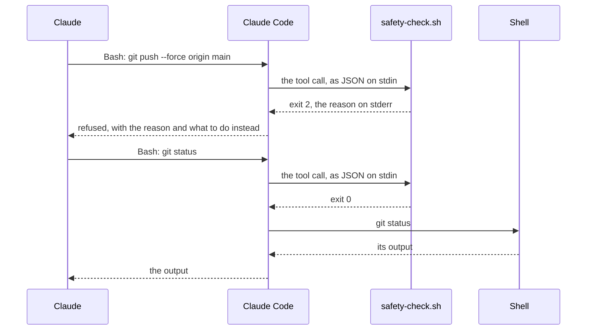
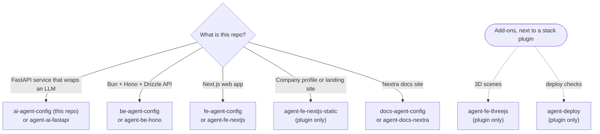
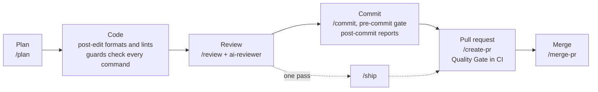
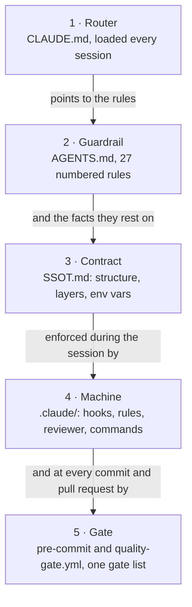

**English** | [Bahasa Indonesia](README.id.md)

<h1 align="center">
  <picture>
    <source media="(prefers-color-scheme: dark)" srcset="docs/assets/banner-ai-dark.svg">
    <source media="(prefers-color-scheme: light)" srcset="docs/assets/banner-ai-light.svg">
    
  </picture>
</h1>

<p align="center">
  <a href="LICENSE"></a>
  <a href="#cicd"></a>
  <a href="#requirements"></a>
  <a href="#prefer-plugins"></a>
</p>

<p align="center">
  <a href="SETUP.md">Setup</a> ·
  <a href="docs/RATIONALE.md">Rationale</a> ·
  <a href="docs/unlock.md">Unlocking</a> ·
  <a href="https://github.com/adhibuchori/be-agent-config">Backend</a> ·
  <a href="https://github.com/adhibuchori/fe-agent-config">Frontend</a> ·
  <a href="https://github.com/adhibuchori/docs-agent-config">Docs site</a> ·
  <a href="https://github.com/adhibuchori/agent-config-kit">Plugins</a>
</p>

**ai-agent-config** is a set of files you copy into a Python service that wraps an LLM or another
vendor API (FastAPI, uv, Postgres). It makes Claude Code work the way a careful teammate would.
Hooks refuse the commands you would regret, such as a force-push to `main` or
`cat .env.production`. Numbered rules say what good code looks like here, and checks prove it at
every commit and on every pull request.

> [!TIP]
> **TL;DR.** Copy the layer into your repo, fill in the placeholders, commit, and run
> `uv run pre-commit install`. From then on, Claude cannot push to a protected branch, read a
> `.env` file or write to the production database without you. Every commit runs the 15 checks
> of one gate list, and CI runs them again. `/plan`, `/review`, `/commit`, `/create-pr` and
> `/merge-pr` walk each change from idea to merge. The hooks run on your machine and open no
> network connection. Prefer a plugin to copied files? See [Prefer plugins?](#prefer-plugins).

## Contents

- [Why this exists](#why-this-exists)
- [See it in action](#see-it-in-action)
- [Who it is for, and who it is not for](#who-it-is-for-and-who-it-is-not-for)
- [Which template, or which plugin?](#which-template-or-which-plugin)
- [Prefer plugins?](#prefer-plugins)
- [Quick start](#quick-start)
- [A normal day with the layer](#a-normal-day-with-the-layer)
- [What gets installed](#what-gets-installed)
- [How the pieces fit](#how-the-pieces-fit)
- [Everything this template ships](#everything-this-template-ships): [hooks](#hooks) ·
  [commands](#commands) · [agents](#agents) · [skills](#skills) · [rules](#rules) ·
  [checks and gates](#checks-and-gates) · [CI workflows](#ci-workflows) ·
  [config files](#config-files)
- [Configuration](#configuration)
- [What gets blocked](#what-gets-blocked)
- [Unlocking `.env` and the production DB](#unlocking-env-and-the-production-db)
- [CI/CD](#cicd)
- [Request-serving or pipeline?](#request-serving-or-pipeline)
- [Finished examples: the template repos](#finished-examples-the-template-repos)
- [Security model](#security-model)
- [Cost and overhead](#cost-and-overhead)
- [Upgrade and uninstall](#upgrade-and-uninstall)
- [Customize recipes](#customize-recipes)
- [Requirements](#requirements)
- [FAQ and troubleshooting](#faq-and-troubleshooting)
- [Glossary, roadmap, scope and license](#glossary-roadmap-scope-and-license)

## Why this exists

A line in `CLAUDE.md` is a request. A hook that exits with code 2 is a wall. Each story below is a
real kind of failure, what this layer does about it, and which pieces do the work.

1. **The agent force-pushes to `main`.**
   *The problem:* a rebase goes wrong, the agent "fixes" it with `git push --force origin main`,
   and a teammate's commits are gone.
   *The fix:* a push to, or the deletion of, `dev`, `prod`, `main` or `master` is refused in the
   shell, and GitHub's MCP tools cannot write to those branches either. Work reaches them through a
   pull request.
   *Handled by:* [`safety-check.sh`](#hooks), [`mcp-guard.sh`](#hooks), the `deny` rules in
   [`.claude/settings.json`](#config-files).

2. **A secret lands in the transcript.**
   *The problem:* "let me check your config" becomes `cat .env.production`, and your provider API
   key is now in the chat log.
   *The fix:* no shell command Claude runs may read or write a real `.env*` file directly. Claude
   lists the keys through a helper that masks every secret, and may change a value only after *you*
   unlock `env`. The operating system's sandbox blocks the same files as a second layer.
   *Handled by:* [`safety-check.sh`](#hooks), [`scripts/env/`](#checks-and-gates),
   [unlocking](#unlocking-env-and-the-production-db), the [sandbox](#the-sandbox-layer).

3. **The agent writes to production.**
   *The problem:* a "quick cleanup" `DELETE` runs against the production database through the
   `db-prod` MCP server.
   *The fix:* that server starts read-only. If you give it write access, one read-only statement
   still passes, and every write waits until you run `! ./scripts/ops/unlock.sh db`, which closes
   itself after 15 minutes.
   *Handled by:* [`db-guard.sh`](#hooks), [`.mcp.json`](#config-files),
   [unlocking](#unlocking-env-and-the-production-db).

4. **A rule in `CLAUDE.md` is ignored.**
   *The problem:* the docs say "call vendors only through a provider" and "never skip the commit
   hook". Three hours into a session, the agent imports the vendor SDK inside a service and commits
   with `--no-verify`.
   *The fix:* every rule in `AGENTS.md` has a number and names what enforces it: a check, or
   `advisory` (code review) until one exists. `--no-verify` is refused, so every commit meets the
   gate, and import-linter contracts fail it when a module breaks the layer order. The `ai-reviewer`
   subagent checks the advisory rules, such as a vendor SDK called straight from a service
   (Rule 12). `CLAUDE.md` stays small, so it gets read.
   *Handled by:* [`AGENTS.md`](#config-files), [`ai-reviewer`](#agents),
   [the gate](#checks-and-gates), [`ai-config.sh`](#checks-and-gates).

5. **A streamed refusal looks like an answer.**
   *The problem:* the model stops early, on a length limit or a refusal. The service returns the
   half-finished text with status 200, and a user reads half an answer as if it were whole.
   *The fix:* `AGENTS.md` Rule 15 says to check the completion status before trusting streamed
   text. The provider rule loads whenever Claude edits `src/app/providers/`, and `ai-reviewer`
   checks it.
   *Handled by:* [`backend/providers.md`](#rules), [`ai-reviewer`](#agents),
   [RATIONALE § 6](docs/RATIONALE.md#6-check-the-completion-status-before-trusting-streamed-text).

6. **The checks drift while CI stays green.**
   *The problem:* the commit hook runs one set of checks and CI another. A hand-copied command in
   `.claude/commands/` no longer matches its source, and nobody notices.
   *The fix:* one list, `scripts/check/gates.list`, is what runs by hand, at every commit and in
   CI. `workflows.sh --check` fails on a stale command copy. For many repos at once, the
   [plugin version](#prefer-plugins) calls one shared workflow pinned to a commit.
   *Handled by:* [checks and gates](#checks-and-gates), [CI workflows](#ci-workflows).

7. **The agent wipes someone else's work.**
   *The problem:* two sessions share a checkout. One runs `git reset --hard`, or `rm -rf src` to
   "start clean".
   *The fix:* commands that wipe uncommitted work or delete protected paths are refused. Commits go
   by pathspec, and after every commit Claude is shown exactly which files it carried.
   *Handled by:* [`safety-check.sh`](#hooks), [`post-commit.sh`](#hooks), [`/commit`](#commands),
   [`/checkpoint`](#commands).

8. **The AI layer ships to production.**
   *The problem:* `.claude/`, `CLAUDE.md` and `.mcp.json` end up on the production branch and in
   the image.
   *The fix:* when a pull request into `prod` merges, CI removes the layer from `prod`, merges
   `prod` back into `dev` and checks both. `.dockerignore` keeps env files and the layer out of any
   image.
   *Handled by:* [`strip-ai-on-pr.yml`](#ci-workflows), [`.dockerignore`](#config-files).

<details>
<summary>Before and after: the same five minutes, without and with the layer</summary>

### Without the layer

```text
You:     The chat endpoint returns 500 in production. Find out why and ship the fix.
Claude:  Let me check the config.       $ cat .env.production   ← the API key is now in the chat
Claude:  REDIS_URL is missing. Adding.  $ echo "REDIS_URL=…" >> .env.production
Claude:  Pushing the fix.               $ git push --force origin main
         (a teammate's commit from ten minutes ago is gone)
```

### With the layer

```text
You:     The chat endpoint returns 500 in production. Find out why and ship the fix.
Claude:  $ cat .env.production
         [safety] BLOCKED: .env.production holds secrets, and the shell never reads or writes a
         real .env* file directly: its values would land in the transcript. List its keys with
         `bash scripts/env/show.sh .env.production` (secret values masked). …
Claude:  $ bash scripts/env/show.sh .env.production
         .env.production: 3 keys
           ENVIRONMENT     production
           DATABASE_URL    postgresql+asyncpg://app:…(15 chars)@db.internal:5432/app
           OPENAI_API_KEY  sk-t…(30 chars)
         checked against .env.production.example: missing REDIS_URL
         env is locked: to change a value, the user first runs `! ./scripts/ops/unlock.sh env`.
Claude:  REDIS_URL is missing. It is locked; please run: ! ./scripts/ops/unlock.sh env
You:     ! ./scripts/ops/unlock.sh env
         🔓 .env unlocked until 16:35 (20 min) — lock now: ./scripts/ops/unlock.sh off env
Claude:  $ printf '%s' "$REDIS_URL" | bash scripts/env/set.sh .env.production REDIS_URL
         ✓ REDIS_URL added in .env.production: redis://cache.internal:6379/0 · backup …
Claude:  $ git push --force origin main
         [safety] BLOCKED: pushing to a protected branch (dev/prod/main/master) is not allowed.
         Push your work branch and open a PR; …
Claude:  I'll push the work branch and open a pull request with /create-pr.
```

The hook messages and helper output above are real, captured from this template and shortened
with `…`. The lines around them show where they appear in a session.

</details>

## See it in action

<picture>
  <source media="(prefers-color-scheme: dark)" srcset="docs/assets/demo-blocked-dark.svg">
  <source media="(prefers-color-scheme: light)" srcset="docs/assets/demo-blocked-light.svg">
  
</picture>

Before any tool runs, Claude Code sends the call to the `PreToolUse` hooks as JSON on stdin. Only
**exit code 2** stops the call, and what the hook writes to stderr is the reason Claude reads. You
can play Claude Code's part yourself, from the root of a repo with the layer in it:

```bash
echo '{"tool_name":"Bash","tool_input":{"command":"git push --force origin main"}}' \
  | CLAUDE_PROJECT_DIR="$PWD" bash .claude/hooks/safety-check.sh; echo "exit $?"
```

```text
[safety] BLOCKED: pushing to a protected branch (dev/prod/main/master) is not allowed. Push your work branch and open a PR; when a release needs this push, the user runs it with `!`.
exit 2
```

The same call with `git status` prints only `exit 0`, and the command runs.
[Check each hook yourself](#check-each-hook-yourself) has a line like this for every hook.

<picture>
  <source media="(prefers-color-scheme: dark)" srcset="docs/assets/hook-flow-dark.svg">
  <source media="(prefers-color-scheme: light)" srcset="docs/assets/hook-flow-light.svg">
  
</picture>



The illustrations are animated with CSS inside the SVG: the hedgehog blinks, the hook flow steps
through both commands, and the terminal demo types itself again every nine seconds. If your system
asks for reduced motion, they show a still picture instead.

## Who it is for, and who it is not for

**A good fit if you:**

- build a Python service with FastAPI that calls an LLM, an embedding model or another vendor API,
  managed with uv, maybe with Postgres;
- use Claude Code (the CLI or an IDE extension) on that repo, alone or in a team;
- want refusals you can test, rules a reviewer can cite by number, and a gate that runs the same way
  on your laptop and in CI;
- want to own and edit every file, rather than take updates from a plugin.

**Not a fit if you:**

- work in TypeScript, or on a frontend or a docs site: pick the
  [matching template or plugin](#which-template-or-which-plugin) instead;
- use Claude only on claude.ai or in Cowork: the hooks, commands and settings here are Claude Code
  features;
- want a security boundary against a hostile agent: the hooks read command text and are a guardrail
  against slips and injected instructions ([Security model](#security-model));
- want a project generator: there is no application code here, only the layer around it.

## Which template, or which plugin?

Each stack has a template repo (files you copy and own) and a plugin in
[agent-config-kit](https://github.com/adhibuchori/agent-config-kit) (installed and updated by
version). The guardrails are the same.



| Your repo | Template repo | Plugin |
| :--- | :--- | :--- |
| FastAPI service that wraps an LLM | **ai-agent-config** (this repo) | `agent-core` + `agent-ai-fastapi` |
| Bun + Hono + Drizzle API | [be-agent-config](https://github.com/adhibuchori/be-agent-config) | `agent-core` + `agent-be-hono` |
| Next.js web app | [fe-agent-config](https://github.com/adhibuchori/fe-agent-config) | `agent-core` + `agent-fe-nextjs` |
| Company profile or landing site | none | `agent-core` + `agent-fe-nextjs-static` |
| Nextra docs site | [docs-agent-config](https://github.com/adhibuchori/docs-agent-config) | `agent-core` + `agent-docs-nextra` |
| Add-on: three.js / React Three Fiber | none | `agent-fe-threejs`, next to a stack plugin |
| Add-on: deploy checks, any host | none | `agent-deploy`, next to a stack plugin |

Inside this template there is one more choice: a service that serves requests, or a pipeline that
owns its schema. [Request-serving or pipeline?](#request-serving-or-pipeline) explains both.

## Prefer plugins?

<picture>
  <source media="(prefers-color-scheme: dark)" srcset="docs/assets/install-flow-dark.svg">
  <source media="(prefers-color-scheme: light)" srcset="docs/assets/install-flow-light.svg">
  :setup, which shows a dry run before it
    applies anything.">
</picture>

The same hooks, rules, commands and checks ship as Claude Code plugins in
[agent-config-kit](https://github.com/adhibuchori/agent-config-kit). For this stack that is
**`agent-ai-fastapi`**, which builds on `agent-core`. Three steps, each one copy and paste:

1. **Add the marketplace** (once per machine). In a terminal:

   ```bash
   claude plugin marketplace add adhibuchori/agent-config-kit
   ```

2. **Install the two plugins.** Inside Claude Code:

   ```text
   /plugin install agent-core@agent-config-kit
   /plugin install agent-ai-fastapi@agent-config-kit
   ```

   If the new commands do not show up, restart Claude Code.

3. **Run setup in your repo.** Inside Claude Code:

   ```text
   /agent-ai-fastapi:setup
   ```

   Setup asks a few questions, one at a time, shows a dry run of every file it would write, and
   writes only when you reply **go**. Commit the new files together with
   `.claude/agent-config-kit.lock`: the lock turns the hooks on for everyone who clones the repo.

**It's working if** setup ends the way its [docs page][setup-page] describes, and
`/agent-ai-fastapi:sync --check` then reports no drift. With the plugins, every command in this
README carries its plugin's name: `/review` becomes `/agent-core:review`, `/ship` becomes
`/agent-core:ship`.

[setup-page]: https://github.com/adhibuchori/agent-config-kit/blob/main/docs/agent-ai-fastapi/setup.md#its-working-if

| | This template | The plugin |
| :--- | :--- | :--- |
| What you get | files in your repo, yours to edit | a versioned plugin, updated when its version is bumped |
| Hooks run | in this repo, always | only in a repo that opted in with `.claude/agent-config.json` or `.claude/agent-config-kit.lock` |
| Permission rules | shipped in `.claude/settings.json` | written by the setup command, since a plugin cannot carry them |
| Updates | you compare and merge by hand | `claude plugin update`, then the plugin's sync command |

Use the template when you want to change the rules themselves; use the plugin when you want the
same guardrails in many repos and updates by version. Do not use both in one repo: the hooks would
run twice. To switch, delete the `hooks` entries from `.claude/settings.json` before you install
the plugin.

## Quick start

Every command below was run on a fresh folder; the outputs quoted are real.

1. **Clone this template** next to your project.

   ```bash
   git clone https://github.com/adhibuchori/ai-agent-config.git
   ```

2. **Copy the layer in**, from your project's root. In a project that already has a
   `pyproject.toml`, `.gitignore` or workflows, merge those files instead of overwriting them
   ([SETUP § 1](SETUP.md#1-copy-the-layer-in)).

   ```bash
   CFG=../ai-agent-config
   cp -R "$CFG"/{.claude,.agent,_workflow-source,.github,scripts} .
   cp "$CFG"/{CLAUDE.md,AGENTS.md,SSOT.md,.mcp.json,pyproject.toml,.gitignore} .
   cp "$CFG"/{.pre-commit-config.yaml,.gitleaks.toml,.dockerignore,.skillspector-baseline.yaml} .
   mkdir -p docs && cp "$CFG"/docs/unlock.md docs/
   chmod +x .claude/hooks/*.sh .github/scripts/*.sh scripts/*/*.sh
   ```

3. **Fill in the placeholders.** They are named, never blank, like `<repo-name>` and
   `your-github-handle`. This lists every one in the files to fill first;
   [SETUP § 2](SETUP.md#2-fill-in-every-placeholder) says what goes in each. `uv` refuses to run
   until `pyproject.toml` has a real name.

   ```bash
   grep -rn -e '<[A-Za-z]' -e 'your-github-handle' \
     CLAUDE.md AGENTS.md SSOT.md pyproject.toml .claude/agents .github
   ```

4. **Fill in the Compliance Status table** at the top of `AGENTS.md`: Enforced, Partial or Not met
   for each section. An agent that follows a rule to a file that does not exist stops trusting
   every other rule. Then [pick a shape](#request-serving-or-pipeline).

5. **Commit the layer, then install the commit gate.** Commit first: four gates check application
   code (import boundaries, dead code, dependency hygiene, tests at 100% coverage), and a project
   without `src/` and `tests/` fails all four. Run `git init` first in a new folder.

   ```bash
   uv lock && uv sync
   git add .claude .agent _workflow-source .github scripts docs/unlock.md CLAUDE.md AGENTS.md \
     SSOT.md .mcp.json pyproject.toml uv.lock .gitignore .pre-commit-config.yaml .gitleaks.toml \
     .dockerignore .skillspector-baseline.yaml
   git commit -m "chore: add the claude code layer"
   uv run pre-commit install    # from here on, every commit runs the gate
   ```

6. **Give the gate its first module.** Those four gates pass once `src/app/` has the packages the
   import contracts name, a first module with its tests, and an import of each runtime dependency.
   [SETUP § 6](SETUP.md#what-the-code-gates-need-from-src-and-tests) lists what each gate needs.

   ```bash
   bash scripts/check/gates.sh  # every gate by hand: "15 gate(s) ran, 0 failed"
   ```

7. **Prove the hooks on your machine.** It ends with `hook probes: <n> passed, 0 failed`; on this
   template today that is 2,256 probes. [See it in action](#see-it-in-action) shows how to feed one
   hook a single command by hand.

   ```bash
   bash scripts/check/hook-probes.sh
   ```

8. **Continue with [SETUP.md](SETUP.md)** for MCP servers, repository settings, CI and the strip
   pipeline.

## A normal day with the layer

A typical change goes plan → code → review → commit → pull request → merge. Each step has a
command, and hooks help along the way without being asked.



| Step | You run | What helps by itself |
| :--- | :--- | :--- |
| Plan | `/plan stream the chat completion endpoint` | path-scoped rules load as the plan reads matching files; nothing is written |
| Code | nothing: just ask | `post-edit.sh` formats and lints each written file; `safety-check.sh` and the other guards refuse what should not run |
| Review | `/review` | `ai-reviewer` checks the `AGENTS.md` rules no gate can see; the review checklist covers the rest |
| Commit | `/commit`, then `git commit -m "feat: …" -- <paths>` | pre-commit runs the gate on what is staged; `post-commit.sh` shows what landed |
| Pull request | `/create-pr` | `quality-gate.yml`, `dependency-review.yml` and `codeql.yml` run on the pull request |
| Review comments | `/resolve-pr-review 42` | each comment is judged against the numbered rules before anything changes |
| Merge | `/merge-pr 42` | `scripts/ops/pr-ready.sh 42` reads checks, mergeability and open threads first |
| Release | `/promote`, then `/branch-cleanup` | `strip-ai-on-pr.yml` removes the layer from `prod`; `ci-cd.yml` fires the deploy |
| Debug | `/rca <symptom>` (or `/debug <symptom>`) | `prompt-intent.sh` points `/debug` at `/rca` |
| Long session | `/checkpoint before refactor`, `/checkpoint-summary`, `/learn-session` | a safety commit, a handover note, and lessons written where they will load again |

## What gets installed

This is your repo after the quick start. `README.md`, `README.id.md`, `SETUP.md`, `LICENSE`,
`docs/RATIONALE.md` and `docs/assets/` stay in the template: they explain the layer and are not part
of it.

```text
your-repo/
├── CLAUDE.md                    Router: what to read for which task; loaded every session
├── AGENTS.md                    27 numbered rules, each naming its check; Compliance Status
├── SSOT.md                      Facts: module structure, layer rules, environment variables
├── .mcp.json                    MCP servers, pinned; secrets as ${VARIABLE} references
├── pyproject.toml               Settings for ruff, mypy, pytest, coverage, import-linter, …
├── .pre-commit-config.yaml      The commit gate: the same set as scripts/check/gates.list
├── .gitignore                   Keeps real .env files, .claude/state/ and local settings out
├── .gitleaks.toml               Secret-scan allowlist: two narrow patterns, no path exempt
├── .dockerignore                Keeps every .env file and the AI layer out of the image
├── .skillspector-baseline.yaml  SkillSpector triage: what the skill scan accepts, and why
├── docs/unlock.md               How you open .env files and production writes
│
├── .claude/
│   ├── settings.json            Hook wiring, allow/ask/deny permissions, the Bash sandbox
│   ├── agent-config.example.json  Every hook setting with its default
│   ├── hooks/                   8 hooks, lib.sh (shared) and README.md (rules, fail modes)
│   ├── rules/                   12 rules: common/ (5), python/ (3), backend/ (4)
│   ├── agents/                  ai-reviewer.md and INDEX.md
│   ├── commands/                15 slash commands (generated from _workflow-source/)
│   ├── anti-patterns/           6 known traps and INDEX.md
│   ├── docs/                    code-review-checklist.md, read on demand
│   ├── examples/pipeline/       Rules for a schema-owning service; not loaded until copied
│   ├── mcp/                     deploy-platform, vps-provider and cloudflare, loaded on demand
│   └── *.example.md             5 on-demand references: copy, fill in, or delete
│
├── _workflow-source/            15 command sources and INDEX.md: edit commands here
├── .agent/workflows/            The same commands for a second agent tool (generated)
│
├── scripts/
│   ├── check/                   gates.sh + gates.list, ai-config.sh + its probes,
│   │                            hook-probes.sh + .tsv, skills.sh, folder-shape.mjs,
│   │                            coverage-policy.mjs
│   ├── env/                     show.sh (masked), set.sh (only while unlocked), envfile.py
│   ├── ops/                     unlock.sh (only you run it), pr-ready.sh (merge readiness)
│   ├── sync/workflows.sh        Writes the command copies; --check finds drift
│   └── vulture/whitelist.py     What vulture must count as used, and who uses it
│
└── .github/
    ├── workflows/               7 pull-request-only workflows
    ├── scripts/                 quality-gate.sh, strip scripts, trigger-deploy.sh, comment check
    ├── CODEOWNERS               Asks for review on hooks, settings, gates and workflows
    └── PULL_REQUEST_TEMPLATE/   dev.md and promotion.md
```

No application source: no `src/`, no `Dockerfile`, no Alembic scaffold. `pyproject.toml` lists the
runtime and tooling dependencies the rules assume, nothing more.

## How the pieces fit

Five layers, each with one job. A later layer never restates an earlier one.



<picture>
  <source media="(prefers-color-scheme: dark)" srcset="docs/assets/layers-dark.svg">
  <source media="(prefers-color-scheme: light)" srcset="docs/assets/layers-light.svg">
  
</picture>

| Layer | Files | Job | Size |
| :--- | :--- | :--- | ---: |
| **Router** | `CLAUDE.md` | What to read for which task. Loaded every session, so short | 158 lines |
| **Guardrail** | `AGENTS.md` | Numbered rules, each naming its enforcement or `advisory` | 294 lines |
| **Contract** | `SSOT.md` | Module structure, layer rules, environment variables | 141 lines |
| **Machine** | `.claude/`, `.mcp.json` | Hooks, path-scoped rules, reviewer, commands, anti-patterns | 63 files |
| **Gate** | `.pre-commit-config.yaml`, `.github/`, `scripts/check/` | What "passing" means, at every commit and pull request | 7 workflows |

The sizes are the unfilled template's. Yours grow as you fill in the Compliance Status table and
replace placeholders with real rules; do not trim them to match a sibling template.

## Everything this template ships

Each table answers three questions for every piece: what it does, how you use it, and why it
helps. Each name links to the file, whose header explains it in full.

### Hooks

Hooks are scripts Claude Code runs by itself at fixed moments. `.claude/settings.json` wires them;
each runs as `bash "$CLAUDE_PROJECT_DIR/.claude/hooks/<name>.sh"` with a 10-second timeout (20 s
for `post-commit.sh`, 60 s for `post-edit.sh`). The four **guards** can refuse a call and fail
closed; the four **feedback hooks** only add context and fail open.
[`.claude/hooks/README.md`](.claude/hooks/README.md) has every rule, each hook's fail mode and its
settings.

| Name | What it does | How to use | Why it helps |
| :--- | :--- | :--- | :--- |
| [`safety-check.sh`](.claude/hooks/safety-check.sh) | Reads each shell command the way a shell does, then refuses protected pushes, recursive deletes of protected paths, commands that wipe uncommitted work, skipping the commit gate, any shell read or write of a real `.env*` file, `alembic downgrade`, running the unlock, git settings that run code, and anything it cannot resolve | Runs by itself before every `Bash` call | The command you would regret never runs, and Claude is told the safer route |
| [`db-guard.sh`](.claude/hooks/db-guard.sh) | Lets one read-only SQL statement through to the production database; holds every write until you unlock `db` | Runs by itself before `mcp__db-prod__execute_sql` | No surprise `DELETE` or `DROP` in production |
| [`mcp-guard.sh`](.claude/hooks/mcp-guard.sh) | Refuses GitHub MCP writes (`push_files`, `create_or_update_file`, `delete_file`, `create_branch`) onto a protected branch | Runs by itself before those four GitHub MCP tools | Closes the route around the shell guard |
| [`migration-guard.sh`](.claude/hooks/migration-guard.sh) | Refuses hand edits to generated Alembic revisions | Runs by itself before file writes; does nothing until a migrations folder exists | The database, the migration history and the models keep agreeing |
| [`post-edit.sh`](.claude/hooks/post-edit.sh) | Runs `ruff format`, then `ruff check`, on the file just written, and tells Claude what ruff found | Runs by itself after every file write; never blocks | Lint findings are fixed in the next edit, not at commit time |
| [`post-commit.sh`](.claude/hooks/post-commit.sh) | Shows what a commit carried, and warns about paths its pathspec did not name | Runs by itself after a `git commit` | Another session's staged work cannot ride along unseen |
| [`prompt-intent.sh`](.claude/hooks/prompt-intent.sh) | Points `/debug` at this repo's `/rca`, and prunes the hook state of sessions idle for two days | Type `/debug <symptom>` | Debugging starts from a reproduction, not from Claude Code's own debug skill |
| [`session-start.sh`](.claude/hooks/session-start.sh) | Makes the zsh that runs Claude's commands behave like bash on globs and word splitting | Runs by itself when a session starts | Fewer confusing `no matches found` failures |
| [`lib.sh`](.claude/hooks/lib.sh) | The shared part every hook sources: the payload reader, the config loader and the shell-command analyzer | Nothing to run. Edit with care: a syntax error here blocks every tool call | One parser, proven once, used by every guard |

**It's working if** you see these signs in an ordinary session. Each hook's page in the plugin docs
has the same check, what the hook refuses and how to turn it off; the pages use the plugin's
command names, and the hooks behave the same here.

| Hook | It's working if | Docs page |
| :--- | :--- | :--- |
| `safety-check.sh` | `git status` runs without a word from the hook; `git push origin main` from Claude is refused with a `[safety] BLOCKED:` line, and Claude pushes a work branch instead | [safety-check](https://github.com/adhibuchori/agent-config-kit/blob/main/docs/agent-core/safety-check.md#its-working-if) |
| `db-guard.sh` | A `SELECT` through `db-prod` runs; a `DELETE` is refused until you run `! ./scripts/ops/unlock.sh db`, and runs once `db` is open | [db-guard](https://github.com/adhibuchori/agent-config-kit/blob/main/docs/agent-core/db-guard.md#its-working-if) |
| `mcp-guard.sh` | A GitHub MCP `push_files` to a work branch goes through; the same call to `main` is refused with `[mcp-guard] BLOCKED:` | [mcp-guard](https://github.com/adhibuchori/agent-config-kit/blob/main/docs/agent-core/mcp-guard.md#its-working-if) |
| `migration-guard.sh` | For a schema change Claude runs `uv run alembic revision --autogenerate`; an edit to an existing revision is refused with `[migration-guard] BLOCKED:` | [migration-guard](https://github.com/adhibuchori/agent-config-kit/blob/main/docs/agent-ai-fastapi/migration-guard.md#its-working-if) |
| `post-edit.sh` | `git diff` shows a file Claude wrote already in ruff's style, and a lint error it left is fixed in its next edit without being asked | [post-edit](https://github.com/adhibuchori/agent-config-kit/blob/main/docs/agent-core/post-edit.md#its-working-if) |
| `post-commit.sh` | After Claude commits, its reply names the commit's hash and files, matching `git show --stat HEAD`, and says so when the commit carried a file nobody named | [post-commit](https://github.com/adhibuchori/agent-config-kit/blob/main/docs/agent-core/post-commit.md#its-working-if) |
| `prompt-intent.sh` | `/debug empty answer` starts a reproduction-first pass through `/rca` | [prompt-intent](https://github.com/adhibuchori/agent-config-kit/blob/main/docs/agent-core/prompt-intent.md#its-working-if) |
| `session-start.sh` | `ls *.nothing` in Claude's shell fails the way it would in bash, instead of stopping at `no matches found` | [session-start](https://github.com/adhibuchori/agent-config-kit/blob/main/docs/agent-core/session-start.md#its-working-if) |

<details id="check-each-hook-yourself">
<summary>Check each hook yourself</summary>

Run these from the root of a repo with the layer in it. Each pipes the JSON Claude Code would send;
a guard answers `exit 2` with its reason, a feedback hook prints its note for Claude.

```bash
# safety-check.sh: exit 2
echo '{"tool_name":"Bash","tool_input":{"command":"git push --force origin main"}}' \
  | CLAUDE_PROJECT_DIR="$PWD" bash .claude/hooks/safety-check.sh; echo "exit $?"

# db-guard.sh: exit 2 ("a DELETE statement"); a SELECT exits 0
echo '{"tool_name":"mcp__db-prod__execute_sql","tool_input":{"sql":"DELETE FROM sessions"}}' \
  | CLAUDE_PROJECT_DIR="$PWD" bash .claude/hooks/db-guard.sh; echo "exit $?"

# mcp-guard.sh: exit 2 ("writes straight to the protected branch main")
echo '{"tool_name":"mcp__github__push_files","tool_input":{"owner":"o","repo":"r","branch":"main","files":[],"message":"x"}}' \
  | CLAUDE_PROJECT_DIR="$PWD" bash .claude/hooks/mcp-guard.sh; echo "exit $?"

# prompt-intent.sh: prints the note that sends /debug to /rca
echo '{"hook_event_name":"UserPromptSubmit","prompt":"/debug empty answer","session_id":"demo"}' \
  | CLAUDE_PROJECT_DIR="$PWD" bash .claude/hooks/prompt-intent.sh; echo "exit $?"
```

`post-edit.sh` needs ruff in `.venv` (after `uv sync`), and `migration-guard.sh` needs a
migrations folder such as `alembic/versions/`; the probe harness proves both in a temp folder.

</details>

### Commands

Fifteen slash commands. Type them in Claude Code. Edit the sources in `_workflow-source/`;
`bash scripts/sync/workflows.sh` writes the copies in `.claude/commands/` and `.agent/workflows/`.

| Name | What it does | How to use | Why it helps |
| :--- | :--- | :--- | :--- |
| [`/plan`](_workflow-source/plan.md) | Writes a plan (scope, tasks, contracts, risks, open questions) and stops for your yes; writes no code | `/plan stream the chat completion endpoint` | Scope and risks are agreed before work starts |
| [`/check-fix`](_workflow-source/check-fix.md) | Runs the gates and fixes what they report; never commits | `/check-fix` | A red gate turns green without you reading logs |
| [`/review`](_workflow-source/review.md) | Reviews staged or branch changes against the rules and the review checklist, by severity; changes nothing | `/review` | Rule-cited findings before the commit, not in the pull request |
| [`/rca`](_workflow-source/rca.md) | Reproduces the bug first, finds the line that causes it, fixes it with a test that fails without the fix | `/rca empty answer on long prompts` | Fixes that stay fixed |
| [`/checkpoint`](_workflow-source/checkpoint.md) | A local safety commit of this session's files, by pathspec; never pushes | `/checkpoint before schema refactor` | A cheap way back before a risky change |
| [`/checkpoint-summary`](_workflow-source/checkpoint-summary.md) | A handover summary: what was done, what is pending, what comes next | `/checkpoint-summary chat-endpoint` | The next session starts where this one ended |
| [`/learn-session`](_workflow-source/learn-session.md) | Writes each lesson into the check, rule, reference or anti-pattern that will load again | `/learn-session` | The same trap is not hit twice |
| [`/commit`](_workflow-source/commit.md) | Runs the gates, inspects the staged change and drafts the message; never commits | `/commit` | A red gate never becomes a commit |
| [`/ship`](_workflow-source/ship.md) | Stages everything, runs `/review` and `/security-review`, fixes every Medium-or-higher and every security finding, re-runs the gates, commits and pushes the work branch; refuses on `dev` and `prod` | `/ship` | Finished work leaves the machine reviewed |
| [`/create-pr`](_workflow-source/create-pr.md) | Runs the gates, drafts the title and body from the PR template, and opens the pull request into `dev` once you confirm | `/create-pr` | Consistent pull requests, never a push to a protected branch |
| [`/resolve-pr-review`](_workflow-source/resolve-pr-review.md) | Triages review comments against the rules, applies what holds up, replies in each thread and resolves the settled ones | `/resolve-pr-review 42` | A bot suggestion that breaks a rule is declined with a reason |
| [`/merge-pr`](_workflow-source/merge-pr.md) | Checks readiness, confirms, merges with a merge commit, and deletes the `internal/*` head by name | `/merge-pr 42` | Skipped checks and open threads are caught before the merge |
| [`/promote`](_workflow-source/promote.md) | Pull request into `dev`, promotion pull request into `prod`, production env and migration audit, deploy verified by timestamp | `/promote` | "Merged" and "live" are never confused |
| [`/promote-deploy`](_workflow-source/promote-deploy.md) | The same promotion when CI cannot run: the gate runs locally, you run every push, and a run log lists what CI still owes | `/promote-deploy` | Production does not go stale during a CI outage |
| [`/branch-cleanup`](_workflow-source/branch-cleanup.md) | After a promotion, deletes merged branches once you confirm the list; keeps unmerged ones | `/branch-cleanup` | A tidy remote, and nothing unmerged is lost |

### Agents

A subagent reviews in its own context and only reports. Its tools are `Read`, `Grep`, `Glob` and
`Bash` (for `git diff`), with no `Write` or `Edit`.

| Name | What it does | How to use | Why it helps |
| :--- | :--- | :--- | :--- |
| [`ai-reviewer`](.claude/agents/ai-reviewer.md) | Checks a change against the `AGENTS.md` rules no gate can see: layer boundaries, the error envelope, provider indirection, the schema mirror, streaming, tests, security, typing, one home per identifier | `/review` hands it the detailed pass, or ask: "Use the ai-reviewer subagent on this branch" | LLM-service mistakes that no linter sees are caught before the commit |

[`.claude/agents/INDEX.md`](.claude/agents/INDEX.md) lists it; a subagent missing from that table
is, in practice, never used.

### Skills

This template ships no skills. If you add one under `.claude/skills/` or `.agents/skills/`, the
skill scan below (`scripts/check/skills.sh`) checks it at every commit that touches it, together
with the commands, the subagent and the hooks it already scans.

### Rules

Rules are Markdown files Claude Code loads as instructions. All but one open with a `paths:` list
and load only while Claude reads or edits a matching file, so they cost nothing the rest of the
time. The numbered, enforced versions live in `AGENTS.md`; these are the deeper reference.

| Name | What it does | How to use (loads when Claude touches) | Why it helps |
| :--- | :--- | :--- | :--- |
| [`common/working-agreements.md`](.claude/rules/common/working-agreements.md) | How work is done: communication, scope, evidence, order of work, shared checkouts, live systems, tool traps | every session (4,278 bytes) | A correction is made once, not every session |
| [`common/coding-style.md`](.claude/rules/common/coding-style.md) | Python habits behind `AGENTS.md` §G (Rules 23–27): immutability, typing, async, errors, logging, one home per identifier | `src/**/*.py`, `tests/**/*.py`, `scripts/**/*.py` | Consistent code without restating it in `CLAUDE.md` |
| [`common/folder-shape.md`](.claude/rules/common/folder-shape.md) | SHAPE-1 to SHAPE-4: no loose files next to folders, tests mirror their source, no names like `misc` | `src/**`, `tests/**`, `scripts/**`, `components/**`, `lib/**` | A file's path is guessable from what it does |
| [`common/patterns.md`](.claude/rules/common/patterns.md) | The patterns this repo uses, the ones it deliberately does not, and reuse before writing | `src/**/*.py` | No second way of doing the same thing |
| [`common/testing.md`](.claude/rules/common/testing.md) | The two test tiers, 100% coverage, the async loop scope, faking through default parameters | `tests/**`, `pyproject.toml` | Tests that prove what they claim |
| [`python/types.md`](.claude/rules/python/types.md) | No explicit `Any`, enforced by ruff `TID251` and `ANN401` | `**/*.py`, `**/*.pyi` | Types stay meaningful |
| [`python/dead-code.md`](.claude/rules/python/dead-code.md) | vulture and deptry findings are fixed, not silenced; the whitelist names who reads each entry | `**/*.py`, `pyproject.toml` | Unused code and unused dependencies do not pile up |
| [`python/coverage.md`](.claude/rules/python/coverage.md) | 100% of lines and branches for every module with logic, and the closed list of exemptions | `src/**`, `tests/**`, `scripts/check/**`, `pyproject.toml`, `.pre-commit-config.yaml` | Coverage cannot quietly drop |
| [`backend/fastapi.md`](.claude/rules/backend/fastapi.md) | FastAPI patterns behind §B (Rules 4–8) and §C (Rules 9–11): routes, handlers, services, errors, auth, ASGI lessons | `src/app/api/**`, `src/app/modules/**`, `src/app/core/**`, `src/app/main.py` | One way to write a route and an error |
| [`backend/providers.md`](.claude/rules/backend/providers.md) | The provider layer behind §D (Rules 12–15): a `Protocol` plus adapters, streaming, the completion status, timeouts | `src/app/providers/**` | Vendors can be swapped, and faked in tests |
| [`backend/performance.md`](.claude/rules/backend/performance.md) | Where time goes in an I/O-bound service: the event loop, connection budget, streaming, timeouts, caching | `src/app/**/*.py` | No blocking call stalls every request |
| [`backend/testing.md`](.claude/rules/backend/testing.md) | How to test each layer behind §E (Rules 16–18): fake the `Protocol`, route tests on the real app | `tests/**`, `pyproject.toml` | Each layer is tested at the right level |

Next to the rules, four kinds of reference load only when a task needs them:

| Name | What it does | How to use | Why it helps |
| :--- | :--- | :--- | :--- |
| [`.claude/anti-patterns/`](.claude/anti-patterns/INDEX.md) (6 + index) | One known trap per file: symptom, root cause, fix, scope. `INDEX.md` lists the triggers | Claude scans the index before debugging; `/learn-session` adds new ones | A trap that cost an afternoon costs a minute the next time |
| [`.claude/docs/code-review-checklist.md`](.claude/docs/code-review-checklist.md) | The human checklist around the numbered rules: security triggers, severity levels | `/review` reads it; `/ship` fixes what it finds down to Medium | What no rule number covers still gets checked |
| [`.claude/examples/pipeline/`](.claude/examples/pipeline/README.md) | Rules and gate steps for a service that owns its schema (Alembic, worker, CLI) | Copy into `.claude/rules/` only for the [pipeline shape](#request-serving-or-pipeline) | Never loaded by a request-serving service that does not need it |
| `.claude/*.example.md` (5) | Templates for operations, CI runners, the database, analytics and a multi-repo Serena workspace | Copy to the name in `CLAUDE.md` § On-demand References, fill in, or delete | Facts Claude needs, loaded only for the task that needs them |

<details>
<summary>Every reference file, one line each</summary>

| File | What it holds |
| :--- | :--- |
| [`a-check-that-matches-nothing-passes.md`](.claude/anti-patterns/a-check-that-matches-nothing-passes.md) | A check whose scanner matches nothing reports success |
| [`git-apply-check-passes-then-deletes.md`](.claude/anti-patterns/git-apply-check-passes-then-deletes.md) | `git apply --check` passes, then a patch built with `git diff --no-index` deletes the files |
| [`hooks-read-env-vars-never-set.md`](.claude/anti-patterns/hooks-read-env-vars-never-set.md) | A hook that reads `CLAUDE_TOOL_INPUT_*` never fires |
| [`hooks-silent-noop-on-macos.md`](.claude/anti-patterns/hooks-silent-noop-on-macos.md) | Hooks that silently do nothing on macOS |
| [`pythonpath-breaks-mypy-plugin.md`](.claude/anti-patterns/pythonpath-breaks-mypy-plugin.md) | An inherited `PYTHONPATH` breaks mypy's pydantic plugin |
| [`shared-git-index-across-sessions.md`](.claude/anti-patterns/shared-git-index-across-sessions.md) | One checkout, several sessions, one `.git/index` |
| [`pipeline/pipeline.md`](.claude/examples/pipeline/pipeline.md) | Each stage's contract and the batch job's runtime budget, for the pipeline, worker and CLI; copy to `.claude/rules/backend/` |
| [`pipeline/alembic.md`](.claude/examples/pipeline/alembic.md) | The schema this repo owns and its Alembic migrations; copy to `.claude/rules/backend/` |
| [`pipeline/pipeline-testing.md`](.claude/examples/pipeline/pipeline-testing.md) | How to test each pipeline stage; copy to `.claude/rules/backend/` |
| [`OPERATIONS.example.md`](.claude/OPERATIONS.example.md) | Hooks, GitHub and CI traps, reviews, MCP pins, deploys |
| [`CI-RUNNERS.example.md`](.claude/CI-RUNNERS.example.md) | Two runner pools behind repository variables |
| [`DATABASE.example.md`](.claude/DATABASE.example.md) | Postgres through the `db-dev` and `db-prod` MCP servers: topology, tunnel, production rules |
| [`ANALYTICS.example.md`](.claude/ANALYTICS.example.md) | Read access to an analytics API; copied to `.claude/ANALYTICS.md` |
| [`SERENA-WORKSPACE.example.md`](.claude/SERENA-WORKSPACE.example.md) | Scoping Serena in a workspace that spans several repos |

</details>

### Checks and gates

`scripts/check/gates.list` is the one list of gates. `bash scripts/check/gates.sh` runs it by hand,
`.pre-commit-config.yaml` runs the same set at every commit, and `.github/scripts/quality-gate.sh`
runs it again in CI with the checks that need a runner.

| Name | What it does | How to use | Why it helps |
| :--- | :--- | :--- | :--- |
| [`scripts/check/gates.list`](scripts/check/gates.list) | The gate set: one line per check, with the kinds of staged file that need it | Edit it to add or drop a gate | Commit, hand run and CI never disagree |
| [`scripts/check/gates.sh`](scripts/check/gates.sh) | Runs every gate in `gates.list`, one log each, a table at the end and the tail of every failure | `bash scripts/check/gates.sh` (`--only TEXT`, `--paths P…`, `--fail-fast`) | One command answers "is this ready?" |
| [`scripts/check/ai-config.sh`](scripts/check/ai-config.sh) | Every cited rule number exists in `AGENTS.md`; always-loaded context within 15,000 bytes; every wired hook exists, runs through `$CLAUDE_PROJECT_DIR` and reads no `CLAUDE_TOOL_INPUT_*` variable (they do not exist); every `npx`/`uvx` MCP server pinned to one release | `bash scripts/check/ai-config.sh` | `CLAUDE.md` stays short enough to be read; no stale rule citations |
| [`scripts/check/ai-config-probes.sh`](scripts/check/ai-config-probes.sh) | Proves the MCP pin rule both ways, in a temp repo | `bash scripts/check/ai-config-probes.sh` | The pin check cannot quietly stop matching |
| [`scripts/check/hook-probes.sh`](scripts/check/hook-probes.sh) + [`.tsv`](scripts/check/hook-probes.tsv) | Feeds every hook the JSON Claude Code sends and checks the exit code and message: 808 table rows for `safety-check.sh` (540 must block, 268 must pass), then the other hooks, their fail modes, a git worktree and plugin mode | `bash scripts/check/hook-probes.sh` | A hook that silently stopped blocking fails the gate |
| [`scripts/check/skills.sh`](scripts/check/skills.sh) | Scans commands, the subagent, hooks and any skills with SkillSpector pinned to one commit; `.skillspector-baseline.yaml` is its triage record | `bash scripts/check/skills.sh` (prints the pinned install if missing) | A prompt-injection line in a command is caught like a bad dependency |
| [`scripts/check/folder-shape.mjs`](scripts/check/folder-shape.mjs) | Reports SHAPE-1 to SHAPE-4 violations | `node scripts/check/folder-shape.mjs` | Structure stays guessable as the repo grows |
| [`scripts/check/coverage-policy.mjs`](scripts/check/coverage-policy.mjs) | Fails when the coverage gate itself was weakened: a threshold under 100, a logic folder out of scope, an exemption without a reason | `node scripts/check/coverage-policy.mjs` | 100% cannot quietly become 80% |
| [`scripts/sync/workflows.sh`](scripts/sync/workflows.sh) | Writes `.claude/commands/` and `.agent/workflows/` from `_workflow-source/`; `--check` fails on drift or a command missing from `INDEX.md` | `bash scripts/sync/workflows.sh --check` | Command copies for two tools never drift apart |
| [`scripts/vulture/whitelist.py`](scripts/vulture/whitelist.py) | Names what vulture must count as used, and who reads each entry | Add an entry with its reader; never real dead code | Dead-code findings are fixed, not silenced |
| [`scripts/ops/unlock.sh`](scripts/ops/unlock.sh) | Opens `env` or `db` for a few minutes; `status` and `off` | `! ./scripts/ops/unlock.sh env` (you only) | Secrets and production writes open only when you say so |
| [`scripts/env/show.sh`](scripts/env/show.sh) | Lists a `.env` file's keys with every secret masked, and the keys it lacks compared with its `.example` template | `bash scripts/env/show.sh .env.production` | Claude can debug configuration without seeing a secret |
| [`scripts/env/set.sh`](scripts/env/set.sh) | Sets one key from stdin while `env` is unlocked; backs the file up and logs the key name, never the value | `printf '%s' "$VALUE" \| bash scripts/env/set.sh .env.production KEY` | A configuration fix without a secret in the transcript |
| [`scripts/env/envfile.py`](scripts/env/envfile.py) | The parser `show.sh` and `set.sh` share; standard library only | Nothing to run | One parser and one set of masking rules |
| [`scripts/ops/pr-ready.sh`](scripts/ops/pr-ready.sh) | Reads a pull request's checks, mergeability, unresolved threads and expected head in one go; never merges | `bash scripts/ops/pr-ready.sh 42` | Merge decisions from facts; a skipped check blocks until you accept it |

<details>
<summary>Every check in the gate, and where it runs</summary>

| Check | Command | Commit | By hand | CI |
| :--- | :--- | :---: | :---: | :---: |
| Format and lint (explicit `Any` banned) | `ruff format --check .`, `ruff check .` | ✓ | ✓ | ✓ |
| Types, whole repo, strict | `env -u PYTHONPATH uv run mypy .` | ✓ | ✓ | ✓ |
| Import boundaries (`AGENTS.md` §B) | `uv run lint-imports` | ✓ | ✓ | ✓ |
| Dead code | `uv run vulture` | ✓ | ✓ | ✓ |
| Dependency hygiene | `uv run deptry src` | ✓ | ✓ | ✓ |
| Folder shape and coverage policy | `node scripts/check/{folder-shape,coverage-policy}.mjs` | ✓ | ✓ | ✓ |
| Unit tests, 100% of lines and branches | `env -u PYTHONPATH uv run pytest tests -q --cov` | ✓ | ✓ | ✓ |
| Secret scan | `gitleaks` | staged | history | history, pinned build |
| AI config: citations, budget, wiring, pins | `bash scripts/check/ai-config.sh` | ✓ | ✓ | ✓ |
| Command mirrors in sync | `bash scripts/sync/workflows.sh --check` | ✓ | ✓ | ✓ |
| MCP pin rule, proven both ways | `bash scripts/check/ai-config-probes.sh` | ✓ | ✓ | ✓ |
| Hook probes | `bash scripts/check/hook-probes.sh` | ✓ | ✓ | ✓ |
| SkillSpector on commands, agents and hooks | `bash scripts/check/skills.sh` | ✓ | ✓ | when one changed |
| Security audit | `uv run pip-audit --skip-editable` | | | ✓ |
| No `.env` file committed | `git diff` against the base branch | | | ✓ |
| Comments under `.github/` at two lines | `.github/scripts/check-comment-blocks.sh` | | | ✓ |
| Production build | `docker build` | | | ✓ |
| Integration tests | `pytest -m integration` | | | when `DATABASE_URL` is set |

At a commit, pre-commit runs a check when a file it covers is staged; folder shape and coverage
policy run every time. In CI a check that cannot run fails the gate instead of being skipped. A
repo that owns its schema adds a Migration Drift Check and a Docs Drift Check
([Request-serving or pipeline?](#request-serving-or-pipeline)).

</details>

### CI workflows

Every workflow starts from a pull request: opened, updated, merged, or commented on with
`/ask-deepseek`. Nothing runs on a push or on a schedule, and no bot opens update pull requests.
[CI/CD](#cicd) has the rules every workflow keeps to.

| Name | What it does | How to use (runs when) | Why it helps |
| :--- | :--- | :--- | :--- |
| [`quality-gate.yml`](.github/workflows/quality-gate.yml) | Runs `.github/scripts/quality-gate.sh` in strict mode: a check that cannot run fails | a pull request into `dev` or `prod`; make `Quality Gate` a required check | Nothing merges that the commit gate would have refused |
| [`dependency-review.yml`](.github/workflows/dependency-review.yml) | Fails on a new or bumped dependency with a high or critical advisory; runs no project code | every pull request (a private repo also needs `CODE_SECURITY=true`) | Dependency updates are checked without a bot |
| [`codeql.yml`](.github/workflows/codeql.yml) | CodeQL for `actions`, plus `python` once the repo tracks `.py` files; nothing compiled or run | every pull request (same `CODE_SECURITY` rule) | Code scanning with no weekly scheduled scan |
| [`workflows-lint.yml`](.github/workflows/workflows-lint.yml) | actionlint with ShellCheck, zizmor and pinact on the workflow files | a pull request that changes `.github/`; never a required check | Unpinned actions and injectable `run:` steps are caught in review |
| [`deepseek-review.yml`](.github/workflows/deepseek-review.yml) | Posts an AI review comment on the pull request | a pull request into `dev` opens, or a collaborator comments `/ask-deepseek` | A second opinion on every change, on demand; optional |
| [`strip-ai-on-pr.yml`](.github/workflows/strip-ai-on-pr.yml) | Removes the AI layer from `prod`, merges `prod` back into `dev`, and verifies both | a pull request into `prod` is merged | The layer never ships, and `dev` keeps it |
| [`ci-cd.yml`](.github/workflows/ci-cd.yml) | Fires your platform's deploy webhook through `trigger-deploy.sh`, with retries | a pull request into `prod` is merged; needs `DEPLOY_WEBHOOK_URL` | Only a reviewed merge deploys, and the platform builds from git |
| [`PULL_REQUEST_TEMPLATE/`](.github/PULL_REQUEST_TEMPLATE/dev.md) | `dev.md` (summary, how to verify, checklist) and `promotion.md` (the commits being promoted, checks before and after the merge) | `/create-pr` and `/promote` fill them in | Every pull request answers the same questions |

The workflows keep their logic in `.github/scripts/`, so `/promote-deploy` can run the same steps
by hand when CI cannot:

| Name | What it does | How to use | Why it helps |
| :--- | :--- | :--- | :--- |
| [`quality-gate.sh`](.github/scripts/quality-gate.sh) | Every gate check plus the CI-only ones: the security audit, no committed `.env`, the comment rule, the production build, integration tests when `DATABASE_URL` is set. Lists every check that did not run | `bash .github/scripts/quality-gate.sh origin/dev` before a pull request; `--strict` turns a skipped check into a failure, as on a runner | A pull request fails on your laptop first |
| [`check-comment-blocks.sh`](.github/scripts/check-comment-blocks.sh) | Fails on a comment block longer than two lines under `.github/` | `bash .github/scripts/check-comment-blocks.sh` | Explanations live in the docs, where they are kept up to date |
| [`strip-paths.sh`](.github/scripts/strip-paths.sh) | The one list of what the strip removes from `prod` | Sourced by the three strip scripts; edit it to change what ships | The three scripts can never disagree |
| [`strip-ai.sh`](.github/scripts/strip-ai.sh) | Removes the AI layer from `prod`, commits and pushes | Run by `strip-ai-on-pr.yml`; by you with `!` during `/promote-deploy` | The layer never reaches production |
| [`back-merge-prod.sh`](.github/scripts/back-merge-prod.sh) | Merges `prod` back into `dev` and puts the layer back | Same as `strip-ai.sh` | `dev` keeps the layer after every release |
| [`verify-strip.sh`](.github/scripts/verify-strip.sh) | Checks that `prod` lost every stripped path and `dev` still has them; reads only | Run after the two above | A strip that half-landed fails loudly instead of silently |
| [`trigger-deploy.sh`](.github/scripts/trigger-deploy.sh) | Posts to `DEPLOY_WEBHOOK_URL`, retrying while a build refuses connections | Run by `ci-cd.yml`; `/promote-deploy` names it for a manual deploy | One vendor-neutral deploy hook for any platform |

### Config files

| Name | What it does | How to use | Why it helps |
| :--- | :--- | :--- | :--- |
| [`CLAUDE.md`](CLAUDE.md) | The router: project snapshot, quality gates, which file to read for which task. Loaded every session | Fill in the placeholders; keep it short | Always-loaded context stays small enough to be read |
| [`AGENTS.md`](AGENTS.md) | 27 numbered rules in seven sections, each naming its check or `advisory`, and the Compliance Status table | Fill in the table; append rules, never renumber | Reviews cite "Rule 15", and the checks enforce it |
| [`SSOT.md`](SSOT.md) | The facts the rules rest on: module structure, layer rules, environment variables | Keep it true as the code changes | One place for facts, so rules never restate them |
| [`.claude/settings.json`](.claude/settings.json) | Hook wiring, `allow`/`ask`/`deny` permission lists, and the Bash sandbox. The `deny` list keeps Claude from reading or editing real `.env*` files and from editing `AGENTS.md`, `SSOT.md` and `.claude/state/` | Edit it like code; personal overrides go in `.claude/settings.local.json` | The permission system and the sandbox back up the hooks, and the rulebook changes only when you change it |
| [`.claude/agent-config.example.json`](.claude/agent-config.example.json) | Every hook setting with its default and an explanation | Copy the keys you change to `.claude/agent-config.json` | Tune one rule without editing a hook |
| [`.mcp.json`](.mcp.json) | Serena, GitHub, Context7 and two Postgres servers; every `uvx`/`npx` one pinned to one release (Serena to its release commit), secrets as `${VARIABLE}` | Set the variables; delete the servers you do not use | The tools the commands expect, with nothing floating |
| [`.claude/mcp/*.example.json`](.claude/mcp/) | A deploy-platform, a VPS-provider and a Cloudflare server, kept out of every session | `claude --mcp-config .claude/mcp/<name>.json` when a task needs it | Rarely used servers cost nothing until used |
| [`pyproject.toml`](pyproject.toml) | Dependencies and every tool setting: ruff, mypy strict, pytest, coverage at 100%, import-linter contracts, vulture, deptry | Fill in the name; add your module to the import contracts | The rules and the tools agree on one file |
| [`.pre-commit-config.yaml`](.pre-commit-config.yaml) | The commit gate, all `repo: local`, so nothing is downloaded | `uv run pre-commit install` once per clone | Every commit meets the bar, on every machine |
| [`.gitignore`](.gitignore) | Keeps real `.env*` files, `.claude/state/`, `.claude/settings.local.json` and tool caches out of git | Merge with yours before the first commit | Secrets and unlock state are never committed |
| [`.dockerignore`](.dockerignore) | Keeps every `.env*` file, `.git`, `.github` and the whole AI layer out of the build context | Keep it next to your `Dockerfile` | `COPY . .` cannot bake a secret or the layer into an image |
| [`.gitleaks.toml`](.gitleaks.toml) | Keeps gitleaks' default rules and allows only two narrow patterns; no path is exempt | Add a pattern only for a proven false positive | The secret scan stays a scan, not decoration |
| [`.skillspector-baseline.yaml`](.skillspector-baseline.yaml) | The skill scan's triage record: each accepted finding with its reason | Review every change to it by hand | The list of ignored findings is short and visible |
| [`.github/CODEOWNERS`](.github/CODEOWNERS) | Asks for a review on hooks, settings, gates, workflows and the files that decide what reaches production | Replace `your-github-handle` | A one-line change that switches a guard off gets a second look |
| [`docs/unlock.md`](docs/unlock.md) | The `env` and `db` locks: what they stop, how you open them, what they do not stop | Read it once; Claude reads it when a lock is in the way | You know exactly what "locked" means |
| [`.markdownlint-cli2.jsonc`](.markdownlint-cli2.jsonc) | Lint settings for this template's own docs; not copied into your repo | `markdownlint-cli2` | The docs stay readable |

## Configuration

The hooks read `.claude/agent-config.json`, which you create. Every key is optional: a key you
leave out keeps its default, and a key you set replaces its default whole, so list the defaults
you still want. A malformed file or key falls back to the defaults, and Claude is warned.
[`.claude/agent-config.example.json`](.claude/agent-config.example.json) documents each one.

| Key | Read by | Default |
| :--- | :--- | :--- |
| `protectedBranches` | `safety-check.sh`, `mcp-guard.sh` | `dev`, `prod`, `main`, `master` |
| `protectedPaths` | `safety-check.sh` | `src`, `app`, `components`, `content`, `tests`, `scripts`, `.claude`, `.agent`, `.agents`, `_workflow-source`, `.github`, `.git`, `AGENTS.md`, `SSOT.md`, `CLAUDE.md`, `PRODUCT.md`, `DESIGN.md` |
| `migrationsDirs` | `migration-guard.sh` | `src/db/migrations`, `drizzle`, `src/app/db/migrations/versions`, `alembic/versions`, `migrations/versions` |
| `commandWrappers` | `safety-check.sh` | none beyond the built-in wrappers and package runners |
| `dbWriteGuard` | `db-guard.sh` | `{ "toolPattern": "mcp__db-prod__execute_sql" }` |
| `localePairs` | `post-edit.sh` | none, so the check is off |
| `generatedPaths` | `generated-guard.sh` | read only by the frontend and docs templates' hook, which this template does not ship |

Two environment variables are optional: `AGENT_WORKSPACE_ROOT` (a folder of several repos, each
protected like this one) and `AGENT_HOOK_STATE_DIR` (where per-session hook state lives).

The hook wiring, the permission lists and the sandbox live in `.claude/settings.json`
([config files](#config-files)). [Customize recipes](#customize-recipes) has tested examples of
changing both.

## What gets blocked

`safety-check.sh` refuses these whoever asks, by every route it can read (the
[known limits](#known-limits) list the routes it cannot):

- **Work you cannot get back.** A recursive delete of a protected path or of the repo, a command
  that wipes uncommitted work (a hard reset, a forced `clean`, `checkout .`, `stash` without a
  pathspec), `git stash clear`, and skipping the commit gate (`--no-verify`, `HUSKY=0`, a
  repointed `core.hooksPath`).
- **Protected branches.** A push to, or the deletion of, `dev`, `prod`, `main` or `master`, and
  `gh pr merge --delete-branch`.
- **Secrets.** Any shell read or write of a real `.env*` file or of the `.env` backups: by name,
  glob, redirect, variable, `$( )`, `xargs`, `find -exec`, a recursive `grep`, or inline code such
  as `python -c`, and the same inside a wrapper or a package runner. Printing what a loader read
  (`bun -e`, `dotenv list`) counts too. The `.env*.example` templates stay open, and
  `scripts/env/show.sh` lists a file with its secrets masked.
- **The lock itself.** Claude running `unlock.sh` or its `package.json` alias directly, through a
  shell, `source`, a copy or link, a glob, a wrapper, a package runner, a git alias or `find -exec`;
  writing, linking or deleting anything in `.claude/state/unlock/`; changing the `scripts/env/`
  helpers.
- **The guards themselves.** Any shell change to the hooks in `.claude/hooks/`, the probes that
  prove them (`scripts/check/hook-probes.*`), `scripts/ops/unlock.sh`, the `scripts/env/` helpers
  or the files that turn the guards on (`.claude/settings.json`, `settings.local.json`,
  `agent-config.json`): deleting, moving, linking, overwriting, truncating, `chmod`, editing in
  place (`sed -i`, `perl -i`, a `sed` `w`, an `awk` `print >`, inline code) or checking out over
  them, and the same for a folder that holds them. Reading, running and copying them out stay
  open; a change goes through the Edit tool, which asks you first, or your own `!`.
- **Git settings that change what git runs or loads**, whatever their value: an alias, an include,
  a key that carries a command (`core.sshCommand`, `core.fsmonitor`, a pager or editor that is not
  a plain viewer, a credential helper), `protocol.*.allow`, a proxy, `url.*.insteadOf`,
  `safe.directory` or `core.worktree`. It holds for `-c`, `--config-env` and `GIT_CONFIG_*`, and
  for the same keys written with `git config`. `user.*`, `color.*`, a `less` or `cat` pager,
  `core.fsmonitor=false` and config reads stay open.
- **A schema rollback.** `alembic downgrade`, where `alembic.ini` exists.

| What | Blocked by | Do this instead | How to turn it off |
| :--- | :--- | :--- | :--- |
| Push to or delete `dev`, `prod`, `main`, `master` | `safety-check.sh`, `mcp-guard.sh`, deny rules | push a work branch, `/create-pr`; a release push is yours with `!` | `protectedBranches` |
| `rm -r` of a protected path or the repo | `safety-check.sh` | `git rm -r <path>`; throwaways named `zz-*` or `*-probe` that hold nothing git tracks go freely | `protectedPaths` |
| `reset --hard`, `clean -f`, `checkout .`, bare `stash` | `safety-check.sh` | name the paths you own | none: run it yourself with `!` |
| `--no-verify`, `HUSKY=0`, a repointed `core.hooksPath` | `safety-check.sh` | fix what the gate reports | none |
| A shell read or write of a real `.env*` file | `safety-check.sh`, sandbox, deny rules | `scripts/env/show.sh`; `set.sh` after you unlock `env` | none; the sandbox can be turned off |
| Claude running the unlock | `safety-check.sh` | you run `! ./scripts/ops/unlock.sh env` | none |
| A shell change to a hook, the probes, `unlock.sh`, `scripts/env/` or the settings that turn the guards on | `safety-check.sh`, sandbox | the Edit tool, which asks you first; or you run it with `!` | none |
| A production SQL write | `db-guard.sh` | you run `! ./scripts/ops/unlock.sh db`, or run the statement yourself | `dbWriteGuard`, or keep the server read-only |
| A hand edit of an Alembic revision | `migration-guard.sh` | generate a new revision | `"migrationsDirs": []` |
| `alembic downgrade` | `safety-check.sh` | a new forward migration | none: run it yourself with `!` |

**Wrappers and package runners are unwrapped.** `env`, `sudo`, `timeout`, `nice`, `xargs` and the
other common wrappers are peeled, and so are `npx`, `bunx`, `pnpx` and the `exec`, `dlx` and `x`
forms of `npm`, `pnpm`, `yarn` and `bun`. The command inside is judged as a command, and the shell
text they run (a `-c` string, or the words `bun exec` and `yarn exec` join into one script) as a
script. List a wrapper of your own under `commandWrappers` in `.claude/agent-config.json`.

**Fail-closed, with `!` as the way through.** When the analyzer cannot tell what a command touches,
it exits 2 with the reason and the hint to run the command yourself with `!` if you mean it, whether
or not `.env` or the unlock appears in the text. A payload that is not JSON, an analyzer crash and
an analysis past 8 seconds are refused the same way. `!` runs the command as you, with your own
access, outside the hooks and (in an ordinary session) outside the sandbox:

| Category | For example |
| :--- | :--- |
| Computed or decoded code | `eval`, sourcing computed text, a decoded base64 payload, `curl … \| bash`, `bash < <(…)` |
| A command a variable makes git or an editor run | `GIT_PAGER`, `EDITOR`, `GIT_SSH_COMMAND`: checked as that command, refused when unreadable |
| A substitution as the command or a file | `$( )` or backticks as the command name, or as a file a reader or writer opens |
| A path built at run time | `IFS` splitting, `shopt -s dotglob`, a bash array, a `printf` substitution |
| A runner's command built at run time | `npx "$(…)"`, `bun exec "$CMD"` with an unknown variable, `make -f /dev/stdin`, a `just` or `task` recipe from stdin |
| Inline code that touches files | `python -c` or `node -e` code that opens, lists, builds, changes or deletes a path, or runs a command |
| A program that names its file inside its code | a `sed` `w`, `r` or `e`, an `awk` `print >`, `getline <` or `system()` whose file or command is only known at run time, or that cannot be read |
| A copy onto a protected place | a copy, move, link or archive that lands on `.claude/state/` or a `.env*` file |
| `xargs` feeding a file reader | `ls \| xargs cat` |
| Paths handed to a command that changes files | `find . -name '*.sh' \| xargs chmod 000`, `f=$(find …); rm "$f"`, `find -exec` running a changer over a guarded tree |

Refusing too much is the point, so some ordinary commands stop here too (`head $(ls -t …)`,
`git ls-files | xargs cat`); run those with `!`. A literal `git ls-files '<pathspec>'` inside
`$( )` stays allowed, so `cat $(git ls-files '*.md')` works.

**Without python3** only a few plain-text rules stand in: protected pushes, recursive deletes, a
hard reset or forced clean, a skipped gate, `.env*` names, the unlock, `scripts/env/`, the files
that turn the guards on and the guard scripts. Claude is told so, and everything else runs
unchecked on that machine, so install python3.

### The sandbox layer

`.claude/settings.json` also turns on
[Claude Code's Bash sandbox](https://code.claude.com/docs/en/sandboxing), on by default
(`sandbox.enabled: true`). The operating system enforces it for every sandboxed command and its
children, where a text check cannot reach:

- `sandbox.filesystem.denyRead` covers every `.env*` shape at any depth (`.envrc` included) and the
  `.env` backups; `allowRead` opens the `*.example` templates again.
- `sandbox.filesystem.denyWrite` covers `.claude/state/unlock/`, so no sandboxed command can forge
  an unlock, and `.claude/hooks/` and `scripts/ops/unlock.sh`, so none can rewrite a guard.
- `sandbox.excludedCommands` lets only `scripts/env/show.sh` and `scripts/env/set.sh` run outside
  it, since they must reach `.env` files.

Its limits, and how to turn it off:

- **Where it runs.** macOS needs nothing; Linux and WSL2 need `bubblewrap` and `socat`. WSL1 and
  native Windows are not supported. Where the sandbox cannot start, Claude Code warns and runs
  commands without it unless `sandbox.failIfUnavailable` is `true`; the hooks apply either way.
- **The retry outside it.** A command that fails inside the sandbox may be retried outside it
  through Claude Code's permission prompt, which is how the app itself reads `.env`. Set
  `sandbox.allowUnsandboxedCommands` to `false` to forbid that.
- **Your `!` commands** run outside it, except in a background session with
  `allowUnsandboxedCommands: false` and on Linux with `CLAUDE_CODE_SUBPROCESS_ENV_SCRUB` set.
  There the sandbox refuses your own write to `.claude/state/unlock/` too: run `unlock` in your
  own terminal.
- **Turning it off.** Set `"sandbox": {"enabled": false}` in `.claude/settings.json`, or in your
  own `.claude/settings.local.json`. The hooks keep running.

### Known limits

- **The app reads `.env` when it runs.** A command that starts it is retried outside the sandbox
  through Claude Code's own prompt, and a log or a server's output can still show a value.
- **A script file Claude writes and then runs by name is executed, not read.** The hooks check the
  command line, not the file's contents, and the same goes for a config file git then reads.
- **A program the hooks do not know that runs commands of its own** (`watch`, `script`, `flock`,
  `parallel`, or `dotenvx` until you list it) is judged by name only. Where the sandbox runs, it
  still holds the `.env*` and unlock files against it.
- **Without python3** only the plain-text rules above run.
- **The Edit tool can change the hooks.** The shell cannot, but a file edit is how code changes:
  `.claude/settings.json` asks you before every edit to a hook, the probes, `unlock.sh` or
  `scripts/env/`, so each one reaches you as a diff. Review changes under `.claude/` like any other
  code.
- **Inline code that hides both what it calls and the name it reaches** (a module name spelled in
  pieces, run outside the guarded folders) is judged by its text and can pass. The sandbox and
  review are the layers below it.
- **A production server with write access** can run a SQL function of your own that writes while
  it reads like a query. The read-only server mode is the layer that stops it.

[`docs/unlock.md`](docs/unlock.md) has the full list, and
[RATIONALE § 20](docs/RATIONALE.md#20-refuse-what-the-analyzer-cannot-resolve) explains the choice.

## Unlocking `.env` and the production DB

Two things are locked by default, and only you can open them. Claude lists a `.env*` file with
`bash scripts/env/show.sh <file>` (secrets masked, missing keys listed) and may change a value with
`scripts/env/set.sh` only while `env` is open. `db` holds every SQL write to the production
database; it matters once you give that server write access, since it starts read-only. Each lock
closes by itself.

Run the command yourself: type `!` first in Claude Code, or use your own terminal. `!` runs it as
you, outside the hooks and (in an ordinary session) outside the sandbox. The hooks refuse it from
Claude, and asking in the chat opens nothing.

| Your repo | Open `.env*` (20 min) | Open DB writes (15 min) | What is open · lock all now |
| :--- | :--- | :--- | :--- |
| **This template** (no `package.json`) | `! ./scripts/ops/unlock.sh env` | `! ./scripts/ops/unlock.sh db` | `status` · `off`, same script |
| bun | `! bun unlock env` | `! bun unlock db` | `! bun unlock status` · `off` |
| npm | `! npm run unlock env` | `! npm run unlock db` | `! npm run unlock status` · `off` |
| pnpm | `! pnpm unlock env` | `! pnpm unlock db` | `! pnpm unlock status` · `off` |
| yarn | `! yarn unlock env` | `! yarn unlock db` | `! yarn unlock status` · `off` |

Add minutes to choose how long (`env 5`, from 1 to 240); `off env` locks one target. The package
manager rows need `"unlock": "bash scripts/ops/unlock.sh"` in `package.json` `scripts`, which this
template does not ship. The script itself needs only bash and python3.

```text
$ ./scripts/ops/unlock.sh status
🔒 env  .env locked
🔒 db   db writes locked
$ ./scripts/ops/unlock.sh env
🔓 .env unlocked until 16:35 (20 min) — lock now: ./scripts/ops/unlock.sh off env
$ ./scripts/ops/unlock.sh off
🔒 everything locked (env, db)
```

<picture>
  <source media="(prefers-color-scheme: dark)" srcset="docs/assets/unlock-flow-dark.svg">
  <source media="(prefers-color-scheme: light)" srcset="docs/assets/unlock-flow-light.svg">
  
</picture>

The picture shows the `bun` form. In this template the same step is
`! ./scripts/ops/unlock.sh env`. [`docs/unlock.md`](docs/unlock.md) covers what exactly is locked,
how the lock works, and what it does not stop. The hooks are a guardrail against slips and against
instructions hidden in files. Under them, Claude Code's Bash sandbox, on by default, keeps
sandboxed commands away from `.env*` files and the unlock files at the operating-system level
([the sandbox layer](#the-sandbox-layer)).

## CI/CD

The workflows themselves are listed under [CI workflows](#ci-workflows). This section is the
policy they share, and the parts that need a longer explanation than a two-line comment.

**What every workflow keeps to.** Top-level `permissions: contents: read`, with a job that writes
asking at job level. `persist-credentials: false` on every checkout except the strip job, which
pushes with that token. Every `uses:` is a full commit SHA with its version in a comment, and a
service image carries a digest. Event data reaches a `run:` step through `env:`, never as an
expression inside the script. Every job has `timeout-minutes`.

**Updates without a bot.** Update on purpose, in an ordinary pull request that
`dependency-review.yml` then checks: `pinact run -u --min-age 7` for actions (the minimum age is a
cooldown against a freshly compromised release) and `uv lock --upgrade` for Python packages.
[RATIONALE § 12](docs/RATIONALE.md#12-ci-starts-only-from-pull-requests) explains the trade.

<details>
<summary>The strip pipeline, concurrency, and the two-line comment rule</summary>

- **One list, sourced.** `.github/scripts/strip-paths.sh` is the only list of what the strip
  removes; `strip-ai.sh`, `verify-strip.sh` and `back-merge-prod.sh` source it. `verify-strip.sh`
  checks both directions: gone from `prod`, still on `dev`.
- **Separate concurrency groups.** The strip queues in `prod-strip-ai` and the deploy in
  `deploy-prod`, and neither cancels a run in progress. In one shared group, GitHub can cancel a
  queued strip run without a trace and leave the AI layer on `prod`.
- **No skip-CI marker anywhere.** Neither the strip commit on `prod` nor the back-merge commit on
  `dev` carries one. No workflow starts on a push, so a marker would prevent nothing, and the
  back-merge commit can be the head of the next promotion, where GitHub skips every check of a
  pull request whose head carries it. No command writes one either, `/promote-deploy` included.
- **Comments under `.github/` stay at two lines.** `check-comment-blocks.sh` enforces it and the
  reasoning lives in the docs. `workflows-lint.yml`, `dependency-review.yml` and `codeql.yml` are
  exempt by path: they are the workflows the agent-core plugin installs, and they document
  themselves in their headers.

</details>

### GitHub repository configuration

Nothing here is needed to read the layer; it is for wiring the gate into a real repository.
[SETUP § 6](SETUP.md#6-make-the-gate-runnable) walks through each setting.

| Setting | Where | Value |
| :--- | :--- | :--- |
| Squash merging | Settings → General → Pull Requests | **Off.** `/merge-pr` and `/promote` merge with `--merge` |
| `DEEPSEEK_CODE_REVIEW_TOKEN` | secret, optional | only if you keep `deepseek-review.yml` |
| `DEPLOY_WEBHOOK_URL` | secret, optional | your platform's deploy webhook, only if you keep `ci-cd.yml` |
| `CODE_SECURITY` | variable, private repositories | `true` once the repository has GitHub Code Security; until then dependency review and CodeQL skip, and `/merge-pr` asks you before it accepts a skipped check |
| `CI_RUNNER`, `CI_RUNNER_FAST` | variables, optional | runner labels; unset means `ubuntu-latest` |
| Required checks | branch ruleset for `dev` and `prod` | `Quality Gate`; `Dependency Review` and `Analyze (<language>)` only where they run; never `Workflows Lint` |

Everything the layer needs is free on a public repository. On a private one, rulesets and GitHub
Code Security are paid features; check GitHub's pricing page, since plans change.

## Request-serving or pipeline?

A Python service that wraps an LLM comes in two shapes, and this template commits to one as its
baseline instead of genericising both:

- **Request-serving** (the baseline). It serves an HTTP API and reads a database schema that
  another repo owns, or has no database. Keep `AGENTS.md` Rule 13 as written and delete
  `.claude/examples/pipeline/`.
- **Pipeline.** It owns its schema, runs Alembic migrations, and has a worker and a CLI. Follow
  [`.claude/examples/pipeline/README.md`](.claude/examples/pipeline/README.md): copy its
  path-scoped rules into `.claude/rules/`, rewrite Rule 13, and add its two gate steps. The
  migration guard and the `alembic downgrade` refusal switch on by themselves once `alembic.ini`
  and a migrations folder exist.

A TypeScript service belongs in [`be-agent-config`](https://github.com/adhibuchori/be-agent-config)
instead: porting rule content across languages costs more than switching shapes here.

## Finished examples: the template repos

Each template repo is a complete, working example of the layer for one stack: the same result the
matching plugin's setup command produces, as plain files you can read before you adopt anything.

| Template repo | Stack | Matching plugin |
| :--- | :--- | :--- |
| **ai-agent-config** (this repo) | FastAPI service that wraps an LLM | `agent-ai-fastapi` |
| [be-agent-config](https://github.com/adhibuchori/be-agent-config) | Bun + Hono + Drizzle API | `agent-be-hono` |
| [fe-agent-config](https://github.com/adhibuchori/fe-agent-config) | Next.js web app | `agent-fe-nextjs` |
| [docs-agent-config](https://github.com/adhibuchori/docs-agent-config) | Nextra docs site | `agent-docs-nextra` |

## Security model

- **Everything runs on your machine.** The hooks are bash scripts with a python3 analyzer that read
  their JSON input and files in your repo. No hook opens a network connection, sends telemetry or
  downloads a tool. The network is used only by commands you run yourself (`uv sync`, `gh`), by
  the MCP servers you configure, and by CI.
- **Guards fail closed; feedback hooks fail open.** Only exit 2 blocks, and a crash or a timeout
  would let a call through. So each guard refuses what it cannot check (a payload that is not JSON,
  missing or hanging python3), and each feedback hook stays silent when it cannot help.
  [The fail-mode table](.claude/hooks/README.md#fail-modes) lists every case.
- **Every rule is proven both ways.** The table in
  [`scripts/check/hook-probes.tsv`](scripts/check/hook-probes.tsv) holds 808 rows that say what
  `safety-check.sh` must block (540) and let through (268).
  [`scripts/check/hook-probes.sh`](scripts/check/hook-probes.sh) runs that table and the probes for
  everything else: the other hooks, the config keys, the env helpers and the unlock, each hook's
  fail modes, a linked git worktree and plugin mode. That is 2,256 probes, all passing under macOS
  `/bin/bash` 3.2. The commit gate runs them whenever a hook, `settings.json` or the probes change.
- **Layers, not one wall.** The hooks read command text. The `deny` rules in
  `.claude/settings.json` and the OS-enforced Bash sandbox back them up, and `.dockerignore` plus
  the strip keep the layer and your secrets out of production.
- **Readable, reviewable.** Every hook is a plain script in your repo, and `.github/CODEOWNERS` asks
  for a review on any change to them. [Known limits](#known-limits) lists what they do not stop.
- **Report a bypass privately.** A way past a guard is a security bug. The same hook scripts ship
  in the agent-config-kit plugins, so report it there, as its
  [SECURITY.md](https://github.com/adhibuchori/agent-config-kit/blob/main/SECURITY.md) describes.

## Cost and overhead

| What | Cost |
| :--- | :--- |
| Context loaded in every session | 11,705 bytes: `CLAUDE.md` (7,427) and `working-agreements.md` (4,278); `ai-config.sh` fails above 15,000 |
| Context loaded on demand | 11 path-scoped rules (37,469 bytes in all), each only while a matching file is in play |
| Command and subagent descriptions Claude Code lists | 3,309 bytes for 15 commands and one subagent |
| `safety-check.sh` on one command | about 130 ms (median): `git status`, a refused force-push and a piped test run landed within 108–110 ms before the guard-script rules, which add about 17% (old and new run side by side) |
| The other hooks | `db-guard.sh`, `mcp-guard.sh`, `migration-guard.sh`, `post-edit.sh` with ruff: about 75–105 ms; `post-commit.sh` after a commit: about 145 ms; `prompt-intent.sh`, `session-start.sh`: about 45–70 ms |
| The hook probes at a commit that touches a hook | 2,256 probes in about eight minutes (476 s on their own); the CI job allows 20 |
| CI | pull requests only; nothing on push, nothing on a schedule, no update bot |

Measured on an Apple M5 with macOS `/bin/bash` 3.2 and python3 3.14, median of 25 runs per hook,
with a load average between 3 and 4. Hooks on the same event run side by side, and a `Bash` call
is checked by `safety-check.sh` alone.

## Upgrade and uninstall

**Upgrade.** A template has no version and no CHANGELOG: the files are yours once copied, and this
repo's git history is the change log. To take newer versions of the layer, pull the template and
compare it with your copy, then merge by hand the parts you want:

```bash
git -C ../ai-agent-config pull
git -C ../ai-agent-config log --oneline -20                 # what changed upstream
diff -ru ../ai-agent-config/.claude/hooks .claude/hooks     # repeat for rules, scripts, workflows
```

After merging, run `bash scripts/check/hook-probes.sh` and `bash scripts/check/gates.sh`. A commit
whose message starts with `fix:` in a hook or a gate is the kind worth taking first. If you want
upgrades by version instead, switch to the [plugin](#prefer-plugins).

**Roll back.** Everything the layer adds is in your git history, so `git revert <commit>` or
`git checkout <commit> -- <paths>` undoes a change to it.

**Uninstall.** From the root of your repo:

```bash
uv run pre-commit uninstall
git rm -r -q .claude .agent _workflow-source scripts/check scripts/env scripts/ops scripts/sync \
  scripts/vulture CLAUDE.md AGENTS.md SSOT.md .mcp.json .pre-commit-config.yaml \
  .skillspector-baseline.yaml docs/unlock.md
git commit -m "chore: remove the claude code layer"
```

Then review by hand what you merged into files you keep: `.github/` (workflows and scripts),
`pyproject.toml` (the tool sections and dev dependencies), `.gitignore`, `.dockerignore` and
`.gitleaks.toml`. Without `.claude/settings.json` no hook runs.

## Customize recipes

Each recipe below was run, and the result shown is real. [Configuration](#configuration) lists
every key the hooks read.

**Protect another branch.** Keep the defaults and add yours in `.claude/agent-config.json`:

```json
{ "protectedBranches": ["dev", "prod", "main", "master", "release"] }
```

`git push origin release` from Claude is then refused: `[safety] BLOCKED: pushing to a protected
branch (dev/prod/main/master/release) is not allowed.` A push of your work branch still passes.

**Disable one hook.** Delete its entry under `hooks` in `.claude/settings.json`, by hand or with
jq (which also reformats the file). This removes `post-edit.sh`:

```bash
jq '.hooks.PostToolUse |= map(select(any(.hooks[]; .command | contains("post-edit.sh")) | not))' \
  .claude/settings.json > settings.tmp && mv settings.tmp .claude/settings.json
```

Two guards can also be switched off from config: `"migrationsDirs": []` turns `migration-guard.sh`
off, and pointing `dbWriteGuard.toolPattern` at a tool you do not have does the same for
`db-guard.sh`. `safety-check.sh` has no off switch short of removing its entry.

**Add a generated path.** This template's generated files are Alembic revisions, which
`migration-guard.sh` protects. If yours live somewhere else, add the folder:

```json
{ "migrationsDirs": ["src/app/db/migrations/versions", "alembic/versions", "migrations/versions", "db/revisions"] }
```

An `Edit` of `db/revisions/0001_init.py` is then refused: `[migration-guard] BLOCKED:
db/revisions/0001_init.py is a generated migration (db/revisions in migrationsDirs).`

**Let a wrapper through to the command it runs.** An unknown program is judged by name only, so
without this `dotenvx run -f .env.local -- git push origin main` passes:

```json
{ "commandWrappers": ["dotenvx run -f= --env-file="] }
```

The same line is then judged as `git push origin main`, and refused.

**Guard a differently named production SQL tool.** Set the pattern, and change the `db-guard.sh`
matcher in `.claude/settings.json` to cover the same tool:

```json
{ "dbWriteGuard": { "toolPattern": "mcp__analytics-prod__query" } }
```

**Write your own rule.** Add a Markdown file under `.claude/rules/` with a `paths:` list, so it
loads only for matching files and costs nothing in other sessions:

```markdown
---
paths:
  - 'src/app/modules/billing/**'
---

# Billing

- Amounts are integers in the smallest currency unit. Never floats.
```

`bash scripts/check/ai-config.sh` still reports 11,705 always-loaded bytes afterwards. Without the
`paths:` list the rule would load every session and count toward the 15,000-byte budget. A rule
that the team must follow belongs in `AGENTS.md` too, with a number and the check that enforces it.

**Add an anti-pattern.** Copy the entry template at the end of
[`.claude/anti-patterns/INDEX.md`](.claude/anti-patterns/INDEX.md) into
`.claude/anti-patterns/<scope>-<short-description>.md`, fill in symptom, root cause, fix and scope,
and add a row to the index's Loading Guide. Or run `/learn-session` at the end of the session that
found the trap. Add one only for a trap that cost real time here.

**Add a slash command.** Write `_workflow-source/<name>.md` with a `description:` line, add its row
to `_workflow-source/INDEX.md`, then write the copies and check them:

```bash
bash scripts/sync/workflows.sh && bash scripts/sync/workflows.sh --check
```

`--check` fails with `not listed in INDEX.md: /<name>` until the row is there.

## Requirements

| Tool | Needed for |
| :--- | :--- |
| Python 3.12+ and [uv](https://docs.astral.sh/uv/) | the service, the gate and every `uv run` command |
| python3 3.8+ | the hooks' command analyzer, `db-guard.sh`, the unlock and env helpers |
| bash 3.2+ and git | the hooks and scripts (macOS `/bin/bash` included) |
| macOS, Linux or WSL2 | the Bash sandbox; Linux and WSL2 also need `bubblewrap` and `socat`, and WSL1 or native Windows has none. Without it Claude Code warns and runs commands unsandboxed; the hooks still apply |
| Node.js 20+ | `folder-shape.mjs` and `coverage-policy.mjs` |
| gitleaks | the commit hook's secret scan |
| SkillSpector | the skill scan; `bash scripts/check/skills.sh` prints the pinned install |
| Docker | the gate's production build |
| `gh` | `pr-ready.sh` and the commands that open, merge and promote PRs |
| jq (optional) | faster hook payload reads, and a fallback reader without python3 |

## FAQ and troubleshooting

<details>
<summary>A hook blocked something legitimate. What now?</summary>

Read the `BLOCKED:` line Claude quotes: it says why and what to do instead, and the safer route
usually works. If the command really is right, run it yourself with `!` in front. To see exactly
what a hook decides, pipe the same call to it
([Check each hook yourself](#check-each-hook-yourself)). If a rule is too broad for your repo,
narrow it in `.claude/agent-config.json` ([Configuration](#configuration)). Never widen
`settings.json` to get past one refusal.

</details>

<details>
<summary>Does it work with macOS's old bash 3.2?</summary>

Yes. Every hook and script is written for bash 3.2, and the probe harness passes all 2,256 probes
under macOS `/bin/bash` 3.2.57. macOS has no `timeout` command; the hooks stop slow work
themselves. Run `/bin/bash scripts/check/hook-probes.sh` to prove it on your machine.

</details>

<details>
<summary>jq or python3 is missing.</summary>

jq is optional: the hooks read their input with python3 when jq is absent. python3 is not: without
it `safety-check.sh` keeps only a few plain-text rules, `db-guard.sh` refuses every call, and the
unlock and env helpers cannot run. Claude is told so when it happens. Install python3 3.8 or newer.

</details>

<details>
<summary>I ran unlock but Claude is still refused.</summary>

- Check that it is open: `! ./scripts/ops/unlock.sh status`.
- The unlock expired (20 minutes for `env`, 15 for `db`); run it again.
- `.claude/state/` must be gitignored; `set.sh` refuses to run until it is.
- In a background session with `allowUnsandboxedCommands: false`, or on Linux with
  `CLAUDE_CODE_SUBPROCESS_ENV_SCRUB` set, your `!` command runs inside the sandbox, which refuses
  the write: run `unlock` in your own terminal.
- `cat .env` stays refused even while unlocked: unlocking opens `set.sh`, not the shell.

</details>

<details>
<summary>The gate fails right after I copied the layer.</summary>

Expected until your first module lands: import boundaries, dead code, dependency hygiene and tests
at 100% need `src/` and `tests/`. [SETUP § 6](SETUP.md#what-the-code-gates-need-from-src-and-tests)
says what each one needs. `uv` itself stops with `Not a valid package or extra name` until
`<repo-name>` in `pyproject.toml` is filled in. The CI gate, `.github/scripts/quality-gate.sh`,
also runs `docker build`, which needs your `Dockerfile` and the `<repo-name>` placeholder in that
script filled in.

</details>

<details>
<summary>Do I have to adopt all of it?</summary>

No. The hooks, the reviewer subagent and the slash commands can each be deleted on their own. The
piece worth keeping even if you strip the rest is the `Protocol`-based provider pattern: it is what
makes a vendor-dependent service testable without mocking the vendor SDK.

</details>

<details>
<summary>Will cloning this run any GitHub Actions?</summary>

Not on a push: nothing here triggers on one. The gate, deploy, strip and review workflows wait for
pull requests into `dev` or `prod`, which a fresh repo does not have. Dependency review and CodeQL
start on any pull request and skip themselves on a private repository until `CODE_SECURITY` is set;
Workflows Lint starts only when a pull request changes `.github/`.

</details>

<details>
<summary>Why is the rule numbering fixed?</summary>

Reviews, the reviewer subagent and the commands cite rules by number, and
`scripts/check/ai-config.sh` fails on a cited number that `AGENTS.md` does not define. Append new
rules; never renumber the old ones.

</details>

<details>
<summary>Why service-token auth rather than end-user auth?</summary>

The default assumption is a service called by other backends, checked with a
`<SERVICE>_SERVICE_TOKEN` header (`AGENTS.md` §F). If browsers call yours, say so in `AGENTS.md` §F
and `SSOT.md`: that is a design decision, not a gap.

</details>

<details>
<summary>My service uses a different web framework or ORM.</summary>

The layer boundaries and the error contract carry over; the framework calls do not. Expect to
rewrite `AGENTS.md` §B to §D and `.claude/rules/backend/fastapi.md`, not just rename things. The
rules are written against a concrete stack on purpose: a rule genericised into `{{FRAMEWORK}}` is
unusable until someone fills it in, and most people never do.

</details>

<details>
<summary>What about a documentation site?</summary>

Use [`docs-agent-config`](https://github.com/adhibuchori/docs-agent-config), which is built for one.

</details>

## Glossary, roadmap, scope and license

- **Terms.** Hook, guard, gate, rule, anti-pattern, unlock: each word means one thing, as defined
  in the plugin kit's [glossary](https://github.com/adhibuchori/agent-config-kit/blob/main/CONTEXT.md).
- **Why the odd-looking parts are shaped that way:** [docs/RATIONALE.md](docs/RATIONALE.md).
- **Roadmap.** There is no dated roadmap. New work lands in
  [agent-config-kit](https://github.com/adhibuchori/agent-config-kit) first, as versioned plugins,
  and this template follows; its git history is the change log.
- **Out of scope, on purpose:** application code, a project generator, TypeScript services (see
  [be-agent-config](https://github.com/adhibuchori/be-agent-config)), and scheduled CI of any kind.
  What the kit decided against, and why:
  [.out-of-scope](https://github.com/adhibuchori/agent-config-kit/blob/main/.out-of-scope/README.md).
- **License:** MIT. See [LICENSE](LICENSE).

<p align="center">
  <picture>
    <source media="(prefers-color-scheme: dark)" srcset="docs/assets/mascot-dark.svg">
    <source media="(prefers-color-scheme: light)" srcset="docs/assets/mascot-light.svg">
    
  </picture>
</p>
